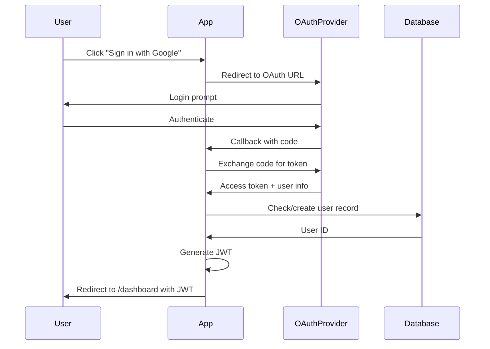

# Advanced Features

Telegram notifications, GitHub issues integration, audio alerts, and other advanced capabilities.

## Telegram Notifications

Keep informed about Ralph's progress via Telegram messages.

### Setup

#### Step 1: Create a Telegram Bot

1. Open Telegram and search for `@BotFather`
2. Send `/newbot` to BotFather
3. Follow prompts to name your bot (e.g., "Ralph WiggumNotifier")
4. BotFather gives you a **bot token**: `123456789:ABCdefGHIjklMNOpqrSTUvwxYZ`
5. Save this token - you'll need it for `TG_BOT_TOKEN`

#### Step 2: Get Your Chat ID

**Option A: Personal Chat**
1. Search for your bot in Telegram and start a conversation
2. Send any message to your bot
3. Visit: `https://api.telegram.org/bot<YOUR_BOT_TOKEN>/getUpdates`
4. Look for `"chat":{"id":123456789}` - that number is your chat ID

**Option B: Group Chat**
1. Add your bot to a group
2. Send a message in the group
3. Visit: `https://api.telegram.org/bot<YOUR_BOT_TOKEN>/getUpdates`
4. Look for `"chat":{"id":-123456789}` (group IDs are negative)

**Option C: Channel**
1. Create a channel in Telegram
2. Add your bot as an administrator
3. Post something to the channel
4. Visit: `https://api.telegram.org/bot<YOUR_BOT_TOKEN>/getUpdates`
5. Look for channel ID (usually starts with `-100`)

#### Step 3: Set Environment Variables

**Shell profile:**
```bash
export TG_BOT_TOKEN="your-bot-token-here"
export TG_CHAT_ID="your-chat-id-here"
```

**Project .env file:**
```bash
TG_BOT_TOKEN=your-bot-token-here
TG_CHAT_ID=your-chat-id-here
```

Then source before running:
```bash
source .env
./scripts/ralph-loop.sh
```

#### Step 4: Test the Connection

```bash
curl -s -X POST "https://api.telegram.org/bot${TG_BOT_TOKEN}/sendMessage" \
  -d chat_id="${TG_CHAT_ID}" \
  -d text="🤖 Ralph Wiggum test message!"
```

You should receive the message in Telegram.

### Notification Types

#### Loop Start

```
🚀 Ralph Loop Started
Mode: build
Branch: main
Specs: 5
```

#### Spec Completed

```
✅ Spec Completed: 003-user-dashboard
Iteration: 3
Summary: Implemented user dashboard with stats widgets and charts
```

#### Consecutive Failures

```
⚠️ Ralph Loop Warning
3 consecutive failures on spec 004-analytics
Check logs for details
```

#### Stuck Specs (NR_OF_TRIES >= 10)

```
🚨 Stuck Spec Alert
specs/007-payments/spec.md has failed 10+ times
Consider splitting into smaller specs
```

#### Loop Finished

```
🏁 Ralph Loop Finished
Iterations: 12
Completed: 4 specs
Branch: main
```

### Audio Notifications (Optional)

Send voice messages instead of text using AI text-to-speech.

#### Get Chutes API Key

1. Visit [chutes.ai](https://chutes.ai)
2. Sign up for an account
3. Generate an API key from dashboard
4. Set environment variable:

```bash
export CHUTES_API_KEY="cpk_your-key-here"
```

#### Enable Audio Notifications

```bash
./scripts/ralph-loop.sh --telegram-audio
```

#### Voice Options

Chutes Kokoro TTS supports multiple voices:

| Voice Code | Description |
|------------|-------------|
| `af_sky` | American Female |
| `af_bella` | American Female |
| `af_sarah` | American Female |
| `am_adam` | American Male |
| `am_michael` | American Male (default) |
| `bf_emma` | British Female |
| `bm_george` | British Male |

To change voice, edit the notifications script:
```bash
# In scripts/lib/notifications.sh, change:
"voice": "am_michael"
# To:
"voice": "af_sarah"
```

### Disabling Notifications

Temporarily disable:
```bash
./scripts/ralph-loop.sh --no-telegram
```

## GitHub Issues Integration

Work on GitHub issues in addition to spec files.

### Configuration

Add to your constitution:

```markdown
---

## GitHub Issues

Work on issues from `your-org/your-repo` in addition to specs. Use `gh` CLI:
  gh issue list --repo your-org/your-repo --state open
  gh issue close <number> --repo your-org/your-repo

Only work on issues approved by @maintainer-name.
```

### Authentication

Authenticate GitHub CLI:
```bash
gh auth login
```

Select:
- GitHub.com (or your enterprise URL)
- Web browser
- Scopes: `repo`, `read:org`, `workflow`

### Working with Issues

Ralph can:
1. List open issues from specified repository
2. Pick issues based on priority/labels
3. Implement fixes/features
4. Close issues when complete

### Example Workflow

```bash
# Check available issues
gh issue list --repo your-org/your-repo --state open --label "bug"

# Ralph will work on approved issues
./scripts/ralph-loop.sh
```

## Completion Logs with Diagrams

Track completed specs with visual diagrams.

### Enable in Constitution

```markdown
---

## Completion Logs

After each spec, create `completion_log/YYYY-MM-DD--HH-MM-SS--spec-name.md` with a brief summary and architecture diagram.
```

### Log Structure

```
completion_log/
├── 2024-01-15--14-30-22--001-user-auth.md
├── 2024-01-15--14-30-22--001-user-auth.png
├── 2024-01-15--14-35-45--002-user-profile.md
└── 2024-01-15--14-35-45--002-user-profile.png
```

### Markdown Log Example

```markdown
# Completion Log: 001-user-auth

**Timestamp:** 2024-01-15 14:30:22
**Spec:** 001-user-auth

## Summary

Implemented OAuth authentication with Google and GitHub providers. Added Passport.js strategies, created users table migration, implemented JWT token generation.

## Architecture



## Files Changed

- `src/auth/passport.js` - OAuth strategies
- `src/models/user.js` - User model
- `src/routes/auth.js` - Authentication endpoints
- `migrations/001-create-users.sql` - Database schema

## Tests Added

- `tests/unit/auth.test.js` - JWT generation/validation
- `tests/integration/oauth.test.js` - Full OAuth flow (mocked)
- `tests/e2e/login.test.js` - Browser login tests
```

### Diagram Generation

The system uses `mermaid-cli` or kroki.io to convert Mermaid diagrams to PNG images.

**With mermaid-cli:**
```bash
npm install -g @mermaid-js/mermaid-cli

# Generate image
mmdc -i diagram.mmd -o output.png
```

**Without mermaid-cli:** Uses kroki.io API (automatic fallback)

## Circuit Breaker Advanced Usage

### Manual Control

```bash
source scripts/lib/circuit_breaker.sh

# Check current status
show_circuit_status

# Reset after fixing issues
reset_circuit_breaker "Fixed blocking database migration"

# View state file directly
cat .circuit_breaker_state
```

### State File Format

```json
{
  "state": "CLOSED",
  "last_change": "2024-01-15T14:30:22Z",
  "consecutive_no_progress": 0,
  "consecutive_same_error": 0,
  "last_progress_loop": 15,
  "total_opens": 2,
  "reason": "Normal operation",
  "current_loop": 15
}
```

### Custom Thresholds

Edit `scripts/lib/circuit_breaker.sh`:

```bash
# Default thresholds
CB_NO_PROGRESS_THRESHOLD=5      # Open after N loops with no file changes
CB_SAME_ERROR_THRESHOLD=3       # Open after N loops with same error
```

Increase for more patience, decrease for quicker halts.

## Custom Notifications

### Send Custom Telegram Messages

```bash
source scripts/lib/notifications.sh

# Text message
send_telegram "🔧 Manual update: Deployed new version to staging"

# With image
send_telegram_image "screenshots/deployment.png" "Staging deployment successful"

# Audio (requires CHUTES_API_KEY)
send_telegram_audio "Deployment completed successfully" "Deployment Update"
```

### Generate Custom Diagrams

```bash
source scripts/lib/notifications.sh

mermaid_code='''
graph LR
    A[User] --> B[Load Balancer]
    B --> C[App Server 1]
    B --> D[App Server 2]
    C & D --> E[Database]
'''

generate_mermaid_image "$mermaid_code" "architecture.png"
send_telegram_image "architecture.png" "System Architecture"
```

## MCP Server Integration

Ralph can use Model Context Protocol (MCP) servers for enhanced capabilities.

### Hosting MCP

Deploy and watch logs:

```javascript
// In your spec or constitution
Available Tools:
- **Hosting MCP**: Deploy to Vercel/Netlify and stream logs
```

### Database MCP

Create databases or run migrations:

```javascript
- **Database MCP**: Create PostgreSQL database, run migration scripts
```

### Browser MCP

Test UI by navigating, clicking, taking screenshots:

```javascript
- **Browser MCP**: Navigate to /login, click sign-in button, screenshot for verification
```

## Advanced Logging

### Log Rotation

Automatically clean old logs:

```bash
# Delete logs older than 7 days
find logs -name "*.log" -mtime +7 -delete

# Compress logs older than 3 days
find logs -name "*.log" -mtime +3 -exec gzip {} \;
```

### Log Analysis

```bash
# Find all completed specs in logs
grep -h "Completion signal detected" logs/*.log | wc -l

# Find failed iterations
grep -h "No completion signal found" logs/*.log | wc -l

# Extract error messages
grep -h "Error\|Exception\|Failed" logs/ralph_*_iter_*_*.log | head -20
```

### Real-Time Log Watching

```bash
# Watch latest session log
tail -f logs/ralph_build_session_$(date +%Y%m%d_%H%M%S).log

# Watch for completion signals
tail -f logs/ralph_build_session_*.log | grep --line-buffered "DONE"
```

## Custom Ralph Loop Variants

### Add Your AI Provider

Create `scripts/ralph-loop-yourprovider.sh`:

```bash
#!/bin/bash
# Ralph Loop for Your AI Provider

set -e
set -o pipefail

SCRIPT_DIR="$(cd "$(dirname "${BASH_SOURCE[0]}")" && pwd)"
PROJECT_DIR="$(dirname "$SCRIPT_DIR")"

source "$SCRIPT_DIR/lib/spec_queue.sh"
source "$SCRIPT_DIR/lib/circuit_breaker.sh"

# Your provider's CLI command
YOUR_CMD="${YOUR_CMD:-your-ai-cli}"

# ... rest of loop logic (copy from ralph-loop.sh and adapt)
```

### Add Custom Pre/Post Hooks

Create `scripts/hooks/pre-iteration.sh`:
```bash
#!/bin/bash
# Runs before each iteration
echo "Pre-iteration: Checking dependencies..."
npm ci --prefer-offline
```

Create `scripts/hooks/post-iteration.sh`:
```bash
#!/bin/bash
# Runs after each iteration
LOG_FILE="$1"
echo "Post-iteration: Analyzing $LOG_FILE"
# Custom analysis or notifications
```

Make executable and source in main loop script.

## Security Considerations

### Environment Variables

Never commit secrets to version control:

```bash
# .gitignore
.env
TG_BOT_TOKEN
TG_CHAT_ID
CHUTES_API_KEY
GH_TOKEN
```

### Telegram Bot Security

- Bot token gives full control - keep it secret
- Never expose in logs or error messages
- Use environment variables only
- Regenerate if compromised via @BotFather

### GitHub Token Security

- Use fine-grained tokens with minimal scopes
- Store in `gh` CLI config, not in files
- Never log token values

## Performance Optimization

### Parallel Spec Processing

For independent specs, run multiple loops:

```bash
# Terminal 1: Work on auth specs
./scripts/ralph-loop.sh 50 &

# Terminal 2: Work on UI specs  
./scripts/ralph-loop.sh 50 &

# Monitor both
jobs
```

### Resource Monitoring

```bash
# Check log file sizes
du -sh logs/

# Find largest iteration logs
ls -lhS logs/ralph_*_iter_*_*.log | head -10

# Count iterations per day
grep -h "LOOP" logs/*.log | wc -l
```

## Troubleshooting Advanced Features

### Telegram Not Working

**Symptom:** No notifications received

**Check:**
```bash
# Test connection
curl -s "https://api.telegram.org/bot${TG_BOT_TOKEN}/getMe"

# Check chat ID
curl -s "https://api.telegram.org/bot${TG_BOT_TOKEN}/getUpdates" | jq '.result[-1].message.chat.id'

# Send test message
curl -s -X POST "https://api.telegram.org/bot${TG_BOT_TOKEN}/sendMessage" \
  -d chat_id="${TG_CHAT_ID}" \
  -d text="Test"
```

### Audio Notifications Failing

**Symptom:** Text messages work, audio doesn't

**Check:**
```bash
# Verify Chutes API key
echo $CHUTES_API_KEY

# Test TTS directly
curl -X POST "https://chutes-kokoro.chutes.ai/speak" \
  -H "Content-Type: application/json" \
  -H "Authorization: Bearer $CHUTES_API_KEY" \
  -d '{"text": "Test", "voice": "am_michael"}' \
  --output test.wav

# Check if audio file created
ls -lh test.wav
```

### GitHub Issues Not Working

**Symptom:** Ralph ignores GitHub issues

**Check:**
```bash
# Verify gh CLI authentication
gh auth status

# Test issue listing
gh issue list --repo your-org/your-repo --state open

# Check constitution has GitHub Issues section
grep -A 5 "GitHub Issues" .specify/memory/constitution.md
```

## Next Steps

After mastering advanced features:
- Review [Troubleshooting](06-troubleshooting.md) for common issues
- Explore custom hook creation for automation
- Consider contributing improvements back to the project
