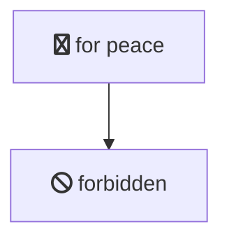
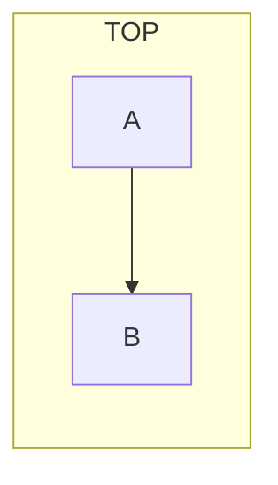
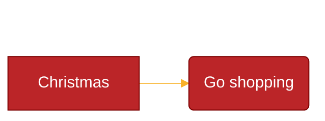

# Mermaid 11.14.0

## Overview

Mermaid is a JavaScript-based diagramming and charting tool that renders Markdown-inspired text definitions to create and modify diagrams dynamically. It supports **30+ diagram types** including flowcharts, sequence diagrams, class diagrams, state diagrams, Gantt charts, entity-relationship diagrams, pie charts, mindmaps, C4 diagrams, block diagrams, timeline, kanban, sankey, radar, venn, treeview, treemap, architecture, ishikawa, use case, quadrant chart, xychart, waveform plot, zenuml, packet, and wardley maps.

The main purpose of Mermaid is to help documentation keep pace with development — "Doc-Rot" is solved by enabling easily modifiable diagrams written as plain text.

## When to Use

Use this skill when:
- Generating diagram code (flowcharts, sequence, class, state, Gantt, ER, pie, mindmap, C4, block, timeline, kanban, sankey, radar, venn, treeview, treemap, architecture, ishikawa, use case, quadrant chart, xychart, waveform plot, zenuml, packet)
- Explaining Mermaid syntax for any diagram type
- Configuring Mermaid rendering (initialize, security levels, themes)
- Customizing diagram appearance via frontmatter config or directives
- Integrating Mermaid into web pages, Markdown, or build tools
- Troubleshooting diagram rendering issues

## Quick Start

### Minimal HTML Page with Mermaid

```html
<!doctype html>
<html lang="en">
  <body>
    <pre class="mermaid">
graph LR
    A --> B
    B --> C
    </pre>
    <script type="module">
      import mermaid from 'https://cdn.jsdelivr.net/npm/mermaid@11/dist/mermaid.esm.min.mjs';
      mermaid.initialize({ startOnLoad: true });
    </script>
  </body>
</html>
```

### Using the API Programmatically

```javascript
import mermaid from 'https://cdn.jsdelivr.net/npm/mermaid@11/dist/mermaid.esm.min.mjs';

mermaid.initialize({ startOnLoad: false });

const { svg } = await mermaid.render('my-graph', `
graph TD
    A --> B
    B --> C
`);
document.getElementById('container').innerHTML = svg;
```

### Validation Without Rendering

```javascript
const result = await mermaid.parse(`sequenceDiagram
    Alice->>Bob: Hello`);
if (result) {
    console.log('Valid diagram:', result.diagramType);
}
```

## Diagram Types Overview

| Diagram Type | Keyword | Description |
|---|---|---|
| Flowchart | `flowchart` / `graph` | Nodes and edges with various shapes and directions |
| Sequence | `sequenceDiagram` | Inter-process interaction over time |
| Class | `classDiagram` | UML class diagrams with relationships |
| State | `stateDiagram-v2` | Finite state machines |
| Gantt | `gantt` | Project timeline / bar charts |
| ER Diagram | `entityRelationshipDiagram` | Entity-relationship modeling |
| Pie Chart | `pie` | Circular statistical graphics |
| Mindmap | `mindmap` | Hierarchical mind maps |
| Git Graph | `gitGraph` | Git branch visualization |
| C4 | `C4Context` / `C4Container` etc. | Software architecture context diagrams |
| Block | `block` | Author-controlled block layouts |
| Timeline | `timeline` | Chronological event timelines |
| Kanban | `kanban` | Kanban board layouts |
| Sankey | `sankey` | Flow/energy diagrams |
| Radar | `radar` | Radar/spider charts |
| Venn | `venn` | Set relationship diagrams |
| XY Chart | `xychart` | Scatter/bar/line charts |
| Quadrant | `quadrantChart` | 2x4 quadrant analysis |
| User Journey | `userJourney` | User experience journeys |
| Requirement | `requirementDiagram` | Software requirement modeling |
| Architecture | `architecture-beta` | Cloud/architecture diagrams (AWS/Azure/GCP) |
| ZenUML | `zenuml` | Simple sequence/interaction diagrams |
| TreeView | `treeView-beta` | Hierarchical tree structures |
| TreeMap | `treemap-beta` | Nested rectangle area charts |
| Ishikawa | `ishikawa-beta` | Fishbone / cause-effect diagrams |
| Use Case | `useCaseDiagram` | UML use case diagrams |
| Use Case | `useCaseDiagram` | UML use case diagrams |
| Waveform | `waveformPlot` | Signal/waveform visualization |
| Packet | `packet` | Binary packet layout diagrams |
| Wardley Map | `wardley-beta` | Value chain strategic maps (v11.14.0+) |

### Flowchart Node Shapes

| Syntax | Shape | Example |
|---|---|---|
| `id` | Rectangle | `A` |
| `id[Text]` | Rounded rect | `id1[Rounded]` |
| `id(Round)` | Round | `id1((Round))` |
| `id([Stadium])` | Stadium | `id1([Stadium])` |
| `id[[Subroutine]]` | Subroutine | `id1[[Subroutine]]` |
| `id[(Database)]` | Cylinder | `id1[(DB)]` |
| `id{Diamond}` | Decision | `id1{Decision?}` |
| `id{{Hexagon}}` | Hexagon | `id1{{Hex}}` |
| `id>Input]` | Asymmetric | `id>Input]` |
| `id[/Parallelogram/]` | Parallelogram | `id[/Data/]` |
| `A[/Trapezoid\]` | Trapezoid | `A[/Top\]` |
| `id(((Double circle)))` | Double circle | `id1(((Circle)))` |

### Flowchart Directions

`TB` (top-down), `TD` (top-down same), `BT` (bottom-top), `RL` (right-left), `LR` (left-right)

### Flowchart Interaction

Requires `securityLevel='loose'`:

### Flowchart Icons

FontAwesome icons: `fa:fa-twitter`, `fab:fab-react`, etc. Requires FA CSS or registered icon packs.


### Subgraph Direction Override

Subgraphs can override parent direction:


## Configuration & Theming

Mermaid has 4 configuration sources (applied in order):

1. **Default config** — built-in defaults
2. **Site config** — via `mermaid.initialize()` (affects all diagrams)
3. **Frontmatter config** — YAML block at top of diagram (v10.5.0+)
4. **Directives** — inline `%%{init: {...}}%%` comments (deprecated, use frontmatter)

### Initialize API

```javascript
mermaid.initialize({
    startOnLoad: true,       // Auto-render <pre class="mermaid"> elements
    theme: 'base',           // default | neutral | dark | forest | base
    securityLevel: 'strict', // strict | antiscript | loose | sandbox
    fontFamily: 'trebuchet ms, verdana, arial',
    logLevel: 5,             // 1=debug, 2=info, 3=warn, 4=error, 5=fatal-only
    look: 'neo',             // neo | classic | handDrawn (v11.x+)
    layout: 'dagre',         // dagre | elk
    maxTextSize: 9000,
    handDrawnSeed: 0,        // Seed for handDrawn look reproducibility
});
```

### Layout Algorithms

| Algorithm | Description |
|---|---|
| `dagre` (default) | Classic layout, good balance of simplicity and clarity |
| `elk` | Advanced layout for complex diagrams, reduces edge crossings |

ELK support must be added when integrating Mermaid for sites/apps that want ELK layout.

### Looks

| Look | Description |
|---|---|
| `neo` (default) | Modern clean appearance |
| `classic` | Traditional Mermaid style |
| `handDrawn` | Sketch-like, hand-drawn quality |

Select a look in frontmatter: `config: { look: handDrawn }`

### Security Levels

| Level | HTML Tags | Click Events | Rendering |
|---|---|---|---|
| `strict` (default) | Encoded | Disabled | Normal |
| `antiscript` | Allowed (except `<script>`) | Enabled | Normal |
| `loose` | Allowed | Enabled | Normal |
| `sandbox` | Isolated in iframe | Blocked | Sandboxed iframe |

### Frontmatter Config Example



### Available Themes

| Theme | Description |
|---|---|
| `default` | Default light theme (auto-derived colors) |
| `neutral` | Black & white, print-friendly |
| `dark` | Dark mode compatible |
| `forest` | Green-shade themed |
| `base` | **Only modifiable theme** — customize via `themeVariables` |

### Key Theme Variables

| Variable | Default | Description |
|---|---|---|
| `primaryColor` | `#fff4dd` | Base color, others derived from it |
| `primaryTextColor` | auto | Text in primary-colored nodes |
| `primaryBorderColor` | auto-derived | Border for primary nodes |
| `lineColor` | auto-derived | Default link/edge color |
| `fontFamily` | `trebuchet ms, verdana, arial` | Font family |
| `fontSize` | `16px` | Base font size |
| `noteBkgColor` | `#fff5ad` | Note background |
| `errorBkgColor` | tertiaryColor | Error message background |

Only the **base** theme supports `themeVariables` customization. Hex colors only (not color names).

### mermaid.run() API

```javascript
mermaid.initialize({ startOnLoad: false });

// Render all .mermaid elements
await mermaid.run();

// Render specific selector
await mermaid.run({ querySelector: '.my-diagrams' });

// Render specific nodes
await mermaid.run({
    nodes: [document.getElementById('graph1'), document.getElementById('graph2')]
});

// Suppress errors
await mermaid.run({ suppressErrors: true });
```

## Installation

### npm / yarn / pnpm

```bash
npm install mermaid        # or
yarn add mermaid           # or
pnpm add mermaid
```

Requirements: Node >= 16

### CDN

```
https://cdn.jsdelivr.net/npm/mermaid@11/dist/
```

### Mermaid Tiny

For ~half the size (no mindmap, architecture, KaTeX, or lazy loading):
https://github.com/mermaid-js/mermaid/tree/develop/packages/tiny

## Ecosystem Tools

- **Mermaid Live Editor**: https://mermaid.live — Online editor and playground
- **Mermaid CLI** (`mmdc`): Command-line rendering to SVG/PNG
- **GitHub Actions**: Auto-render diagrams in CI
- **Markdown integrations**: Works with VS Code, Obsidian, Docusaurus, MkDocs, etc.

## Advanced Topics

For detailed syntax reference on each diagram type, see the reference files:

- [`references/01-flowchart.md`](references/01-flowchart.md) — Flowchart syntax, node shapes, edges, subgraphs, new v11.3+ shapes
- [`references/02-sequence-diagram.md`](references/02-sequence-diagram.md) — Sequence diagram actors, messages, participants, grouping
- [`references/03-class-diagram.md`](references/03-class-diagram.md) — Class diagrams with members, relationships, generics
- [`references/04-state-diagram.md`](references/04-state-diagram.md) — State machines, composite states, transitions
- [`references/05-gantt-chart.md`](references/05-gantt-chart.md) — Gantt charts with dates, durations, sections
- [`references/06-other-diagrams.md`](references/06-other-diagrams.md) — ER, pie, mindmap, gitgraph, C4, block, timeline, kanban, sankey, radar, venn, and more
- [`references/07-configuration-theming.md`](references/07-configuration-theming.md) — Full configuration reference, directives, theming variables, security
- [`references/08-setup-api.md`](references/08-setup-api.md) — API usage, rendering, TypeScript interfaces, webpack integration
- [`references/09-accessibility-icons-math.md`](references/09-accessibility-icons-math.md) — Accessibility (accTitle/accDescr), icon packs, FontAwesome, KaTeX math, layout algorithms

## References

- Official documentation: https://mermaid.js.org/
- GitHub repository: https://github.com/mermaid-js/mermaid
- Live editor: https://mermaid.live
- CDN: https://www.jsdelivr.com/package/npm/mermaid
