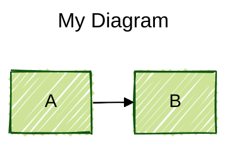
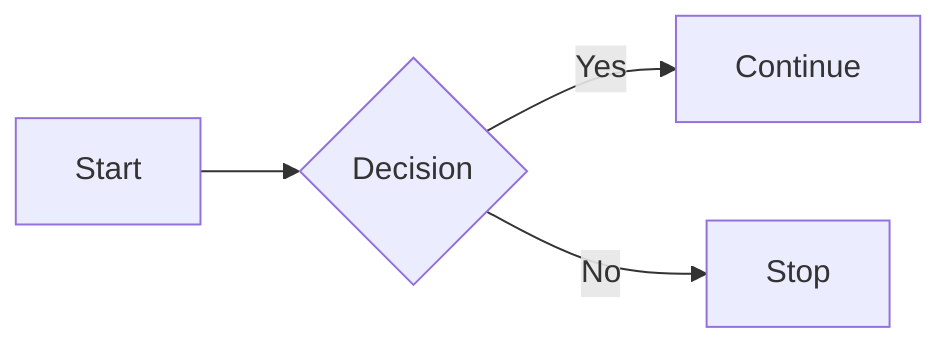
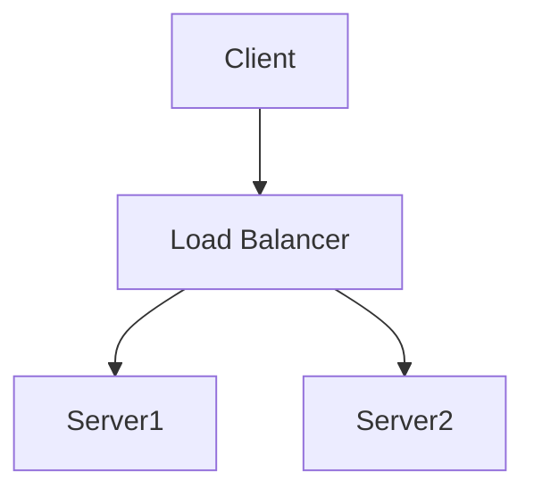
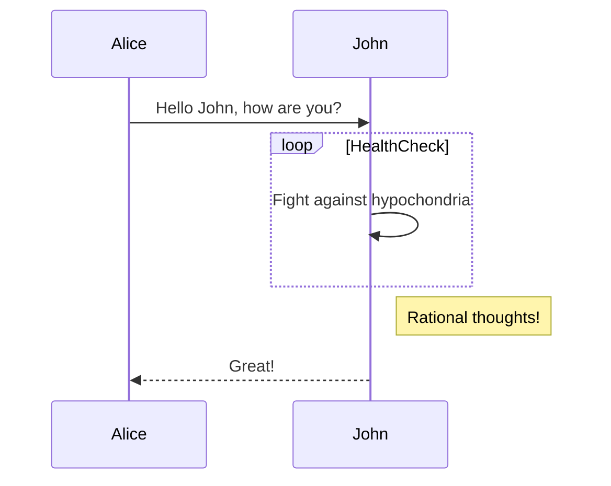
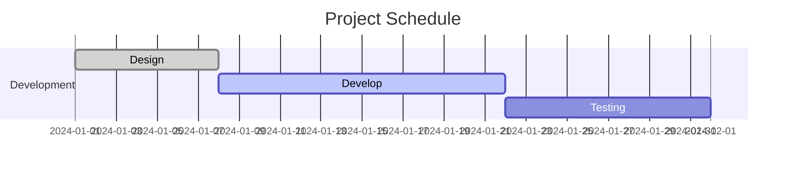

# Mermaid 11.14.0

## Overview

Mermaid is a JavaScript-based diagramming and charting tool that renders diagrams
from Markdown-inspired text definitions. It addresses the "Doc-Rot" problem by
enabling easily modifiable diagrams that can be made part of production scripts
and documentation workflows. Diagrams are rendered as SVG in the browser, with
optional PNG export.

Mermaid 11.14.0 is the current stable release on npm. It supports over 28 diagram
types, multiple themes, frontmatter configuration, layout algorithm selection
(dagre/ELK), visual looks (classic/handDrawn), and integrates natively with
GitHub, GitLab, Obsidian, VS Code, and many other platforms via markdown code
fences.

## When to Use

- Creating diagrams inline in Markdown documentation (GitHub, GitLab, Notion, Obsidian)
- Generating flowcharts, sequence diagrams, Gantt charts, or class diagrams from text
- Embedding diagrams in HTML pages via CDN or npm package
- Building visual documentation that stays in sync with code
- Prototyping system architecture, ER models, or user journey maps
- Creating project timelines, git branching visualizations, or mindmaps

## Core Concepts

Mermaid is composed of three parts:

1. **Deployment** — How Mermaid is loaded and rendered (Live Editor, CDN, npm, plugins)
2. **Syntax** — The Markdown-inspired text definitions for each diagram type
3. **Configuration** — Themes, layout algorithms, fonts, security levels, and rendering options

Every diagram definition begins with a declaration of the diagram type keyword
(e.g., `flowchart`, `sequenceDiagram`, `gantt`), followed by the diagram content.
Line comments use `%%` prefix.

### Diagram Types at a Glance

Mermaid 11.14.0 supports these diagram types:

- **Flowchart** (`flowchart` / `graph`) — nodes, edges, subgraphs, styling
- **Sequence Diagram** (`sequenceDiagram`) — actor interactions over time
- **Gantt Chart** (`gantt`) — project schedules and timelines
- **Class Diagram** (`classDiagram`) — UML class structures
- **State Diagram** (`stateDiagram-v2`) — state machines and transitions
- **Pie Chart** (`pie`) — proportional data visualization
- **Git Graph** (`gitGraph`) — git commit/branch history
- **C4 Diagram** (`C4Context`, `C4Container`, etc.) — system architecture
- **Mindmap** (`mindmap`) — hierarchical information organization
- **Entity Relationship** (`erDiagram`) — database entity models
- **User Journey** (`journey`) — user workflow steps
- **Block Diagram** (`block`) — layout-controlled component diagrams
- **Architecture** (`architecture-beta`) — cloud/CI-CD service topology
- **Quadrant Chart** (`quadrantChart`) — 2-axis data plotting
- **Timeline** (`timeline`) — chronological event sequences
- **Kanban** (`kanban`) — workflow stage boards
- **Requirement Diagram** (`requirementDiagram`) — software requirements
- **Radar Chart** (`radar`) — multi-variable data comparison
- **Sankey Diagram** (`sankey`) — flow/proportion visualization
- **Venn Diagram** (`venn`) — set overlap visualization
- **Treemap** (`treemap`) — hierarchical tree visualization
- **Tree View** (`tree`) — folder/structure trees
- **Wardley Map** (`wardley`) — strategic positioning maps
- **XY Chart** (`xychart-beta`) — scatter/line/bar charts
- **Packet Diagram** (`packet`) — network packet structure
- **Ishikawa Diagram** (`ishikawa`) — fishbone/cause-effect analysis
- **Event Modeling** (`eventDiagram`) — domain event flows
- **ZenUML** (`zenuml`) — alternative sequence diagram syntax

### Frontmatter Configuration

Mermaid supports YAML frontmatter for per-diagram configuration:



### Themes

Five built-in themes: `default`, `neutral`, `dark`, `forest`, `base`.
Only `base` is customizable via `themeVariables`.

### Layout Algorithms

- **dagre** (default) — classic layout, good balance of simplicity and clarity
- **elk** — advanced Eclipse Layout Kernel for complex diagrams (requires separate loading)

### Visual Looks

- **classic** — the original Mermaid appearance
- **handDrawn** — sketch-like, informal style

## Usage Examples

### Inline in Markdown (GitHub, GitLab, Obsidian)

Wrap diagram code in a `mermaid` fenced code block:

````markdown

````

### HTML Page via CDN

```html
<!doctype html>
<html>
<body>
  <pre class="mermaid">
    graph LR
      A --> B --> C
  </pre>
  <script type="module">
    import mermaid from 'https://cdn.jsdelivr.net/npm/mermaid@11/dist/mermaid.esm.min.mjs';
    mermaid.initialize({ startOnLoad: true });
  </script>
</body>
</html>
```

### Simple Flowchart



### Sequence Diagram



### Gantt Chart



## Advanced Topics

**Flowcharts and Graphs**: Nodes, edges, subgraphs, shapes, styling, animations → [Flowcharts](reference/01-flowcharts.md)

**Sequence Diagrams**: Participants, messages, activations, loops, notes, half-arrows → [Sequence Diagrams](reference/02-sequence-diagrams.md)

**Gantt Charts**: Tasks, milestones, vertical markers, exclusions, date formats → [Gantt Charts](reference/03-gantt-charts.md)

**Class and State Diagrams**: UML class structures, state machines, composite states → [Class and State Diagrams](reference/04-class-state-diagrams.md)

**Pie, Git Graph, and Journey Diagrams**: Proportional charts, git history, user workflows → [Pie, Git Graph, Journey](reference/05-pie-git-journey.md)

**C4 and Architecture Diagrams**: System context, containers, cloud architecture → [C4 and Architecture](reference/06-c4-architecture.md)

**Block, Mindmap, and Kanban Diagrams**: Layout-controlled blocks, hierarchical maps, workflow boards → [Block, Mindmap, Kanban](reference/07-block-mindmap-kanban.md)

**Timeline, Quadrant, and Radar Charts**: Chronological timelines, 2-axis plotting, multi-variable comparison → [Timeline, Quadrant, Radar](reference/08-timeline-quadrant-radar.md)

**ER, Requirement, and Sankey Diagrams**: Entity models, requirements tracking, flow visualization → [ER, Requirement, Sankey](reference/09-er-requirement-sankey.md)

**Venn, Treemap, Tree View, Wardley Maps**: Set overlap, hierarchical trees, strategic maps → [Venn, Treemap, Tree, Wardley](reference/10-venn-treemap-tree-wardley.md)

**Packet, Ishikawa, Event Modeling, XY Charts**: Network packets, fishbone analysis, domain events, data charts → [Packet, Ishikawa, Event, XY](reference/11-packet-ishikawa-event-xy.md)

**ZenUML Sequence Diagrams**: Alternative sequence diagram syntax with annotators → [ZenUML](reference/12-zenuml.md)

**Configuration and Theming**: Frontmatter, directives, themes, theme variables, security levels → [Configuration and Theming](reference/13-configuration-theming.md)
