# Flowcharts and Graphs

Flowcharts are composed of **nodes** (geometric shapes) and **edges** (arrows or lines). The `flowchart` keyword is preferred over the legacy `graph` keyword, though both work.

## Direction

Declare flow direction with a keyword after `flowchart`:

- `TB` — Top to bottom (default)
- `TD` — Top-down (same as TB)
- `BT` — Bottom to top
- `RL` — Right to left
- `LR` — Left to right

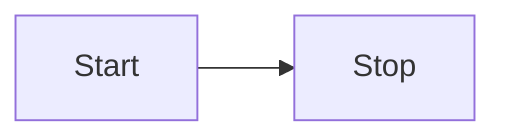

## Node Shapes

### Basic Shapes (bracket syntax)

- **Default (rectangle)**: `id` or `id[Text]`
- **Rounded**: `id(Text)`
- **Stadium**: `id([Text])`
- **Subroutine**: `id([[Text]])`
- **Cylinder (database)**: `id[(Text)]`
- **Circle**: `id((Text))`
- **Double circle**: `id(((Text)))`
- **Rhombus (decision)**: `id{Text}`
- **Hexagon**: `id{{Text}}`
- **Parallelogram**: `id[/Text/]` or `id[\Text\]`
- **Trapezoid**: `id[/Text\]`
- **Trapezoid alt**: `id[\Text/]`
- **Asymmetric**: `id>Text]`

### Expanded Shapes (v11.3.0+)

Mermaid 11 introduced 30+ new shapes via the `@{ shape: ... }` syntax:

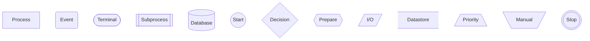

**Available shapes and aliases:**

- `rect` / `process` / `proc` — Standard process
- `rounded` / `event` — Event (rounded rectangle)
- `stadium` / `terminal` / `pill` — Terminal point
- `subproc` / `subprocess` / `framed-rectangle` — Subprocess
- `cyl` / `cylinder` / `database` / `db` — Database
- `circle` / `circ` — Start (circle)
- `sm-circ` / `small-circle` / `start` — Small start
- `diamond` / `decision` / `question` / `diam` — Decision
- `hex` / `hexagon` / `prepare` — Prepare conditional
- `lean-r` / `lean-right` / `in-out` — Data input/output
- `lean-l` / `lean-left` / `out-in` — Data output/input
- `datastore` / `data-store` — Data store
- `trap-b` / `trapezoid` / `priority` — Priority action
- `trap-t` / `trapezoid-top` / `manual` — Manual operation
- `dbl-circ` / `double-circle` — Stop
- `fr-circ` / `framed-circle` / `stop` — Stop
- `fork` / `join` — Fork/Join
- `f-circ` / `filled-circle` / `junction` — Junction
- `doc` / `document` — Document
- `docs` / `documents` / `stacked-document` — Multi-document
- `st-rect` / `stacked-rectangle` / `procs` — Multi-process
- `cloud` — Cloud
- `notch-rect` / `card` — Card
- `delay` — Delay (half-rounded)
- `h-cyl` / `horizontal-cylinder` / `das` — Direct access storage
- `lin-cyl` / `lined-cylinder` / `disk` — Disk storage
- `curv-trap` / `curved-trapezoid` / `display` — Display
- `div-rect` / `divided-process` — Divided process
- `tri` / `triangle` / `extract` — Extract
- `win-pane` / `window-pane` / `internal-storage` — Internal storage
- `flip-tri` / `flipped-triangle` / `manual-file` — Manual file
- `sl-rect` / `sloped-rectangle` / `manual-input` — Manual input
- `lin-doc` / `lined-document` — Lined document
- `lin-rect` / `lined-process` / `shaded-process` — Lined process
- `notch-pent` / `notched-pentagon` / `loop-limit` — Loop limit
- `bow-rect` / `bow-tie-rectangle` / `stored-data` — Stored data
- `tag-doc` / `tagged-document` — Tagged document
- `tag-rect` / `tagged-process` — Tagged process
- `cross-circ` / `crossed-circle` / `summary` — Summary
- `brace` / `brace-l` / `comment` — Comment
- `brace-r` — Comment right
- `braces` — Comment both sides
- `hourglass` / `collate` — Collate
- `bolt` / `lightning-bolt` / `com-link` — Communication link
- `flag` / `paper-tape` — Paper tape
- `text` — Text block
- `bang` — Bang
- `odd` — Odd shape

## Links Between Nodes

### Arrow Types

- `-->` — Solid line with arrowhead
- `---` — Open link (no arrow)
- `-.->` — Dotted line with arrow
- `-.-` — Dotted line without arrow
- `==>` — Thick line with arrow
- `===` — Thick line without arrow
- `~~~` — Invisible link (for layout control)
- `--o` — Circle edge
- `--x` — Cross edge
- `o--o` — Multi-directional circle
- `<-->` — Bidirectional
- `x--x` — Multi-directional cross

### Text on Links

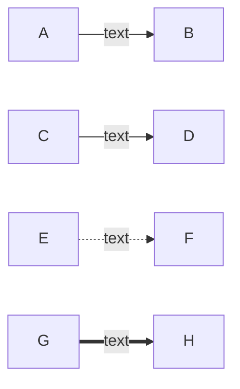

### Link Length

Add extra dashes to make links span more ranks:

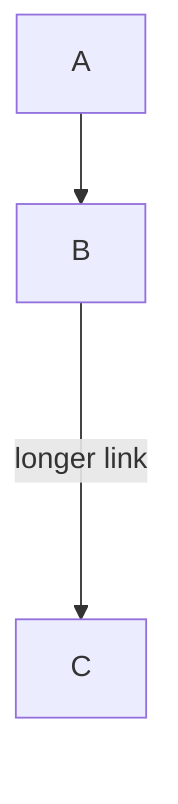

### Chaining Links

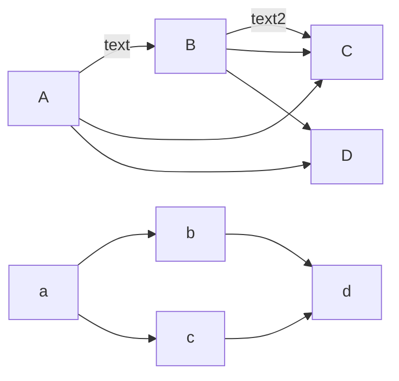

## Edge IDs and Animations (v11+)

Assign IDs to edges with `@` prefix, then animate them:

Or via classDef:

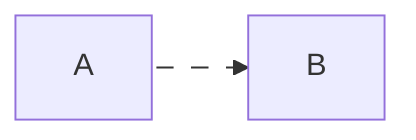

## Subgraphs

Group nodes into subgraphs with optional direction override:

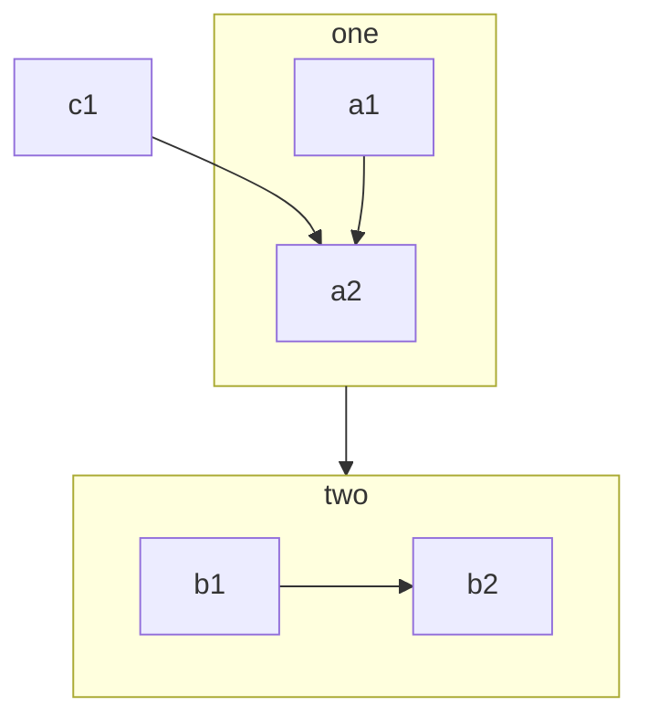

With explicit ID and title:

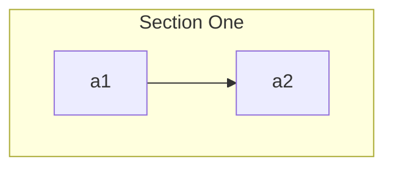

Direction override within subgraph:

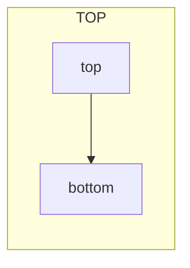

> **Note**: If any subgraph node links to the outside, the subgraph inherits the parent graph's direction.

## Markdown Strings

Use backticks for markdown-formatted labels (requires `htmlLabels: false`):

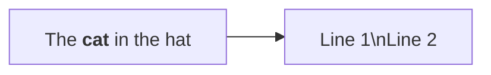

Auto-wrap can be disabled with `markdownAutoWrap: false`.

## Interaction

Bind click events to nodes (requires `securityLevel: 'loose'`):

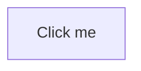

## Styling and Classes

Apply styles using `style` or `classDef`/`class`:

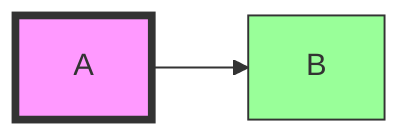

## FontAwesome Icons

Prefix text with `fa:` for icons:

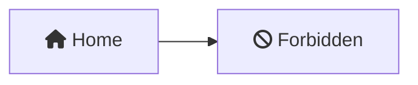

Also supports `fab:`, `fal:`, `far:`, `fas:` prefixes.

## Special Characters

Wrap text in quotes to handle special characters:

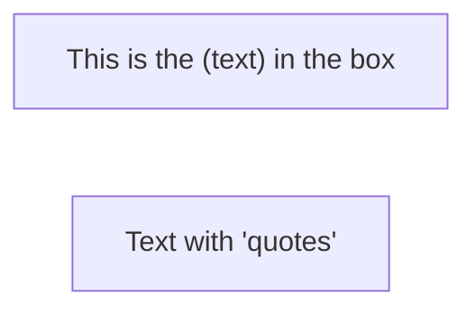

Use entity codes: `#quot;`, `#35;` (for #), etc.

> **Warning**: The word `end` in lowercase breaks flowcharts. Use `End`, `END`, or quotes `"end"`.
> **Warning**: Starting a node with `o` or `x` creates circle/cross edges. Add a space or capitalize.
