# Flowcharts

> **Source:** https://github.com/mermaid-js/mermaid/blob/mermaid%4011.14.0/docs/syntax/flowchart.md
> **Loaded from:** SKILL.md (via progressive disclosure)

## Basic Syntax

Flowcharts are composed of **nodes** (geometric shapes) and **edges** (arrows or lines).

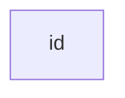

### Direction

| Value | Description |
|-------|-------------|
| `TB` | Top to bottom |
| `TD` | Top-down (same as TB) |
| `BT` | Bottom to top |
| `RL` | Right to left |
| `LR` | Left to right |

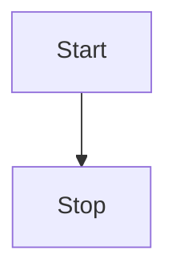

### Node Shapes

| Shape | Syntax | Example |
|-------|--------|---------|
| Rectangle (default) | `id[text]` or just `id` | `A[Process]` |
| Rounded | `id(text)` | `B(Start)` |
| Stadium | `id([text])` | `C([Database])` |
| Subroutine | `id[[text]]` | `D[[Subroutine]]` |
| Cylinder | `id[(text)]` | `E[(DB)]` |
| Circle | `id((text))` | `F((Start))` |
| Rhombus/Decision | `id{text}` | `G{Yes/No?}` |
| Hexagon | `id{{text}}` | `H{{Prepare}}` |
| Parallelogram | `id[/text/]` or `\text\` | `I[/Input/]` |
| Trapezoid | `A[/text\]` or `B[\text/]` | — |
| Double circle | `id(((text)))` | `J(((End)))` |

### Unicode & Markdown in Labels

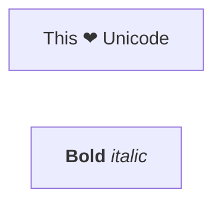

## Expanded Node Shapes (v11.3.0+)

Mermaid supports 30+ semantic shapes via the `@{ shape: ... }` syntax:

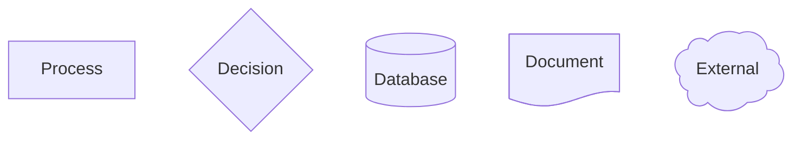

Key shapes: `rect`, `rounded`, `stadium`, `subproc`, `cyl`, `circle`, `diamond`, `hex`, `lean-r`, `lean-l`, `trap-b`, `trap-t`, `flip-tri`, `sl-rect`, `hourglass`, `bolt`, `brace`, `braces`, `lin-rect`, `div-rect`, `docs`, `procs`, `st-rect`, `tag-rect`, `tag-doc`, `lin-doc`, `fr-rect`, `bow-rect`, `notch-rect`, `curv-trap`, `das`, `lin-cyl`, `tri`, `win-pane`, `f-circ`, `notch-pent`, `flag`, `cross-circ`, `text`, `odd`.

### Icon & Image Shapes (v11.3.0+)

```mermaid
flowchart TD
    A@{ icon: "fa:user", form: "square", label: "User", pos: "t", h: 60 }
    B@{ img: "https://example.com/logo.png", label: "Logo", h: 60, constraint: "on" }
```

## Edges & Links

### Arrow Types

| Syntax | Description |
|--------|-------------|
| `---` | Open line (no arrow) |
| `-->` | Dotted with arrow |
| `-->` | Solid with arrow |
| `-x` / `--x` | Cross at end |
| `-)` / `--)` | Open/async arrow |
| `-.->` | Dotted line |
| `==>` | Thick line |
| `--o` / `--x` | Circle/cross edge |
| `<-->` | Bidirectional |

### Text on Edges

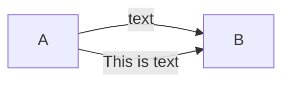

### Edge IDs & Animation (v11.10.0+)

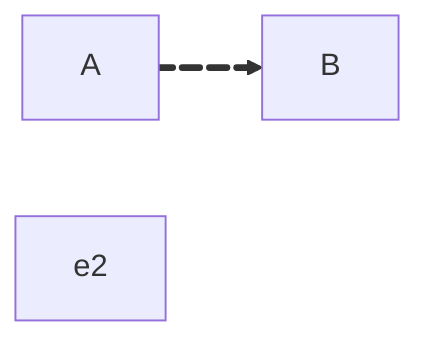

### Minimum Link Length

Add extra dashes for longer links: `----` (2 ranks), `-----` (3 ranks). Use `===` or `-. ` for thick/dotted variants.

## Subgraphs

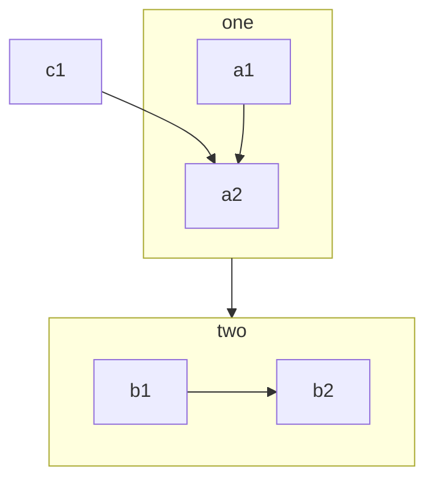

Subgraph direction can be set with `direction TB` inside. If any node links to the outside, the subgraph inherits the parent direction.

## Styling & Classes

### classDef

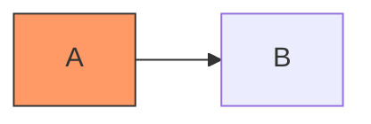

### style statement

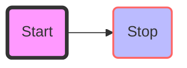

### linkStyle

```
linkStyle 3 stroke:#ff3,stroke-width:4px,color:red;
linkStyle 1,2,7 color:blue;
```

### FontAwesome Icons

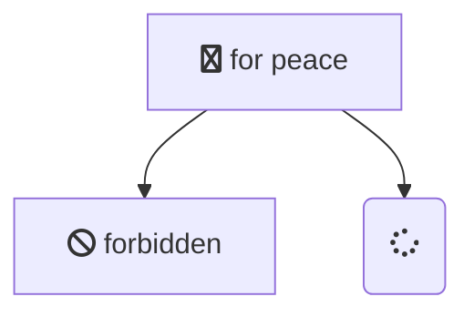

Register custom packs via `mermaid.registerIconPacks()`. Use prefix `fak:` for Font Awesome custom kits.

## Interaction (securityLevel: 'loose')


## Markdown Strings (htmlLabels: false)

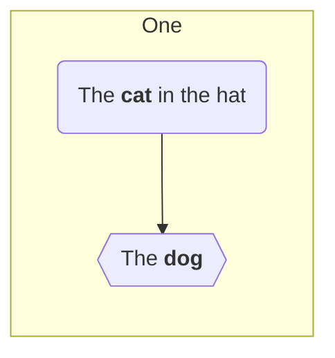

Text auto-wraps; use `<br>` for manual breaks or set `markdownAutoWrap: false`.

## Renderer

Default: dagre. Alternative: elk (better for large/complex diagrams).

```yaml
config:
  flowchart:
    defaultRenderer: "elk"
```

ELK options:
- `considerModelOrder`: `"NONE"` | `"NODES_AND_EDGES"` | `"PREFER_EDGES"` | `"PREFER_NODES"`
- `cycleBreakingStrategy`: `"GREEDY"` | `"DEPTH_FIRST"` | `"INTERACTIVE"` | `"MODEL_ORDER"` | `"GREEDY_MODEL_ORDER"`
- `mergeEdges`: boolean
- `forceNodeModelOrder`: boolean
- `nodePlacementStrategy`: `"SIMPLE"` | `"NETWORK_SIMPLEX"` | `"LINEAR_SEGMENTS"` | `"BRANDES_KOEPF"`
