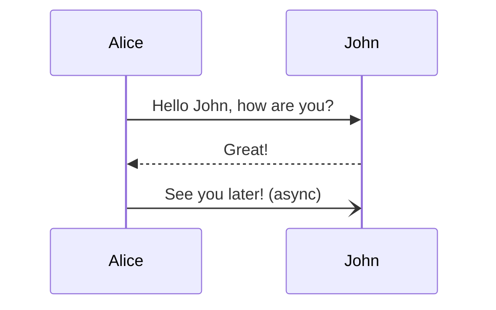
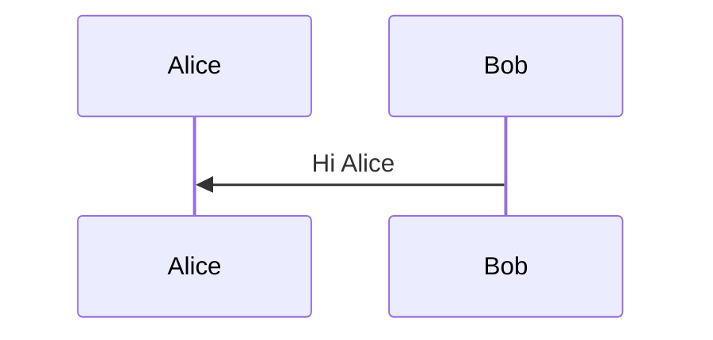
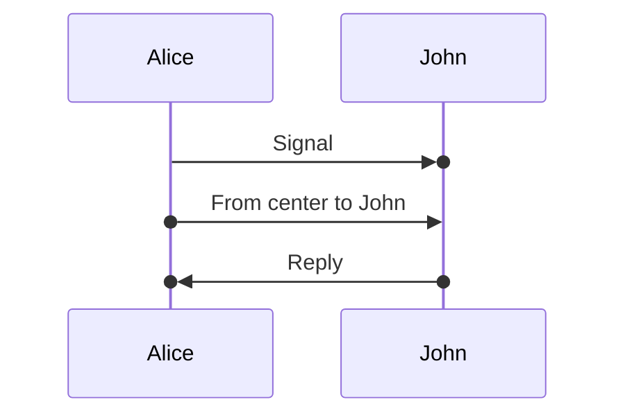
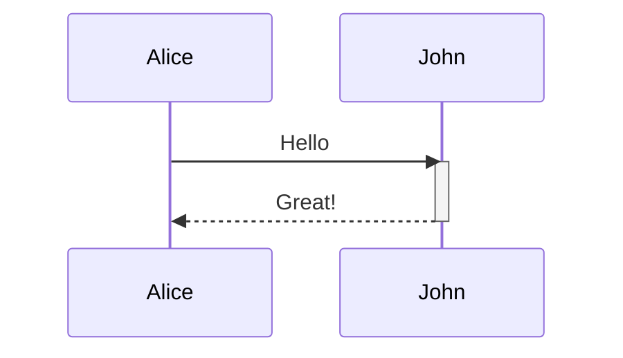
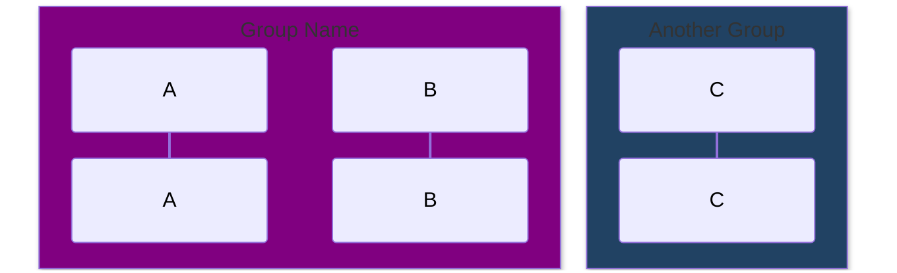
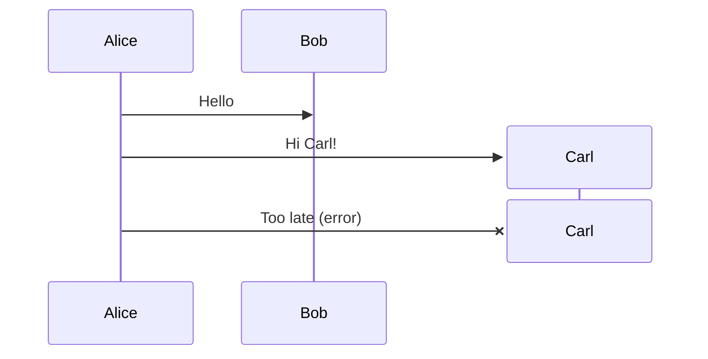
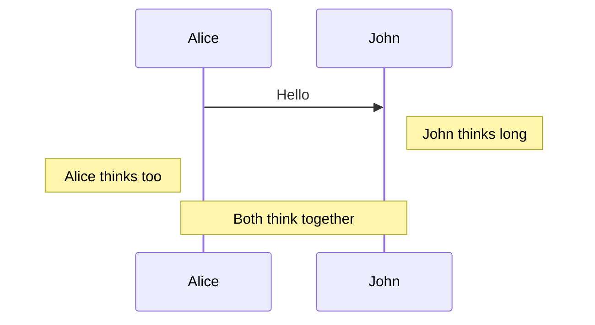

# Sequence Diagrams

> **Source:** https://github.com/mermaid-js/mermaid/blob/mermaid%4011.14.0/docs/syntax/sequenceDiagram.md
> **Loaded from:** SKILL.md (via progressive disclosure)

## Basic Syntax



## Participants

### Basic Participants



### Actor Types

| Type | Syntax | Description |
|------|--------|-------------|
| `participant` | `participant Alice` | Rectangle box |
| `actor` | `actor Alice` | Stick figure |
| Boundary | `participant A@{ "type" : "boundary" }` | UI boundary |
| Control | `participant A@{ "type" : "control" }` | Control element |
| Entity | `participant A@{ "type" : "entity" }` | External entity |
| Database | `participant A@{ "type" : "database" }` | Database symbol |
| Collections | `participant A@{ "type" : "collections" }` | Cylinder storage |
| Queue | `participant A@{ "type" : "queue" }` | Queue symbol |

### Aliases

```mermaid
sequenceDiagram
    participant A as Alice
    participant J as John
    API@{ "type": "boundary" } as Public API
    DB@{ "type": "database", "alias": "User DB" }
```

External alias (`as`) takes precedence over inline `"alias"` field.

## Messages

### Arrow Types

| Syntax | Description |
|--------|-------------|
| `->` | Solid, no arrow |
| `-->` | Dotted, no arrow |
| `->>` | Solid with arrowhead |
| `-->>` | Dotted with arrowhead |
| `-x` | Solid cross (error/return) |
| `--x` | Dotted cross |
| `-)` | Solid open (async) |
| `--)` | Dotted open (async) |
| `<<->>` | Bidirectional solid (v11.0.0+) |
| `<<-->>` | Bidirectional dotted (v11.0.0+) |
| `-\|` / `-\\` etc. | Half-arrows (v11.12.3+) |

### Central Connections (v11.12.3+)



## Activations



Shortcut: append `+` (activate) or `-` (deactivate) to arrow.

## Grouping / Boxes



Use `box transparent Label` for transparent background.

## Actor Creation & Destruction (v10.3.0+)



Only the recipient can be created; both sender and recipient can be destroyed.

## Notes


