# Sequence Diagrams

Sequence diagrams show how processes operate with one another and in what order.

## Participants

Participants are declared implicitly (by appearing in messages) or explicitly:

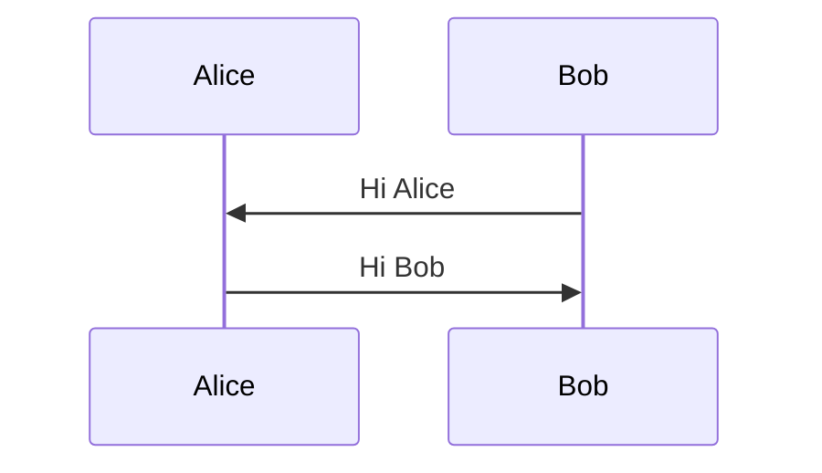

### Actor Symbol

Use `actor` instead of `participant` for the stick-figure symbol:

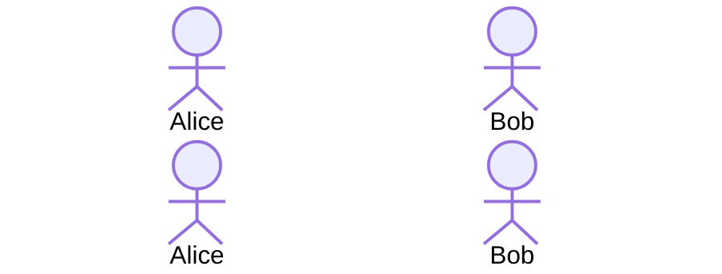

### Participant Types (JSON config syntax)

Specify UML participant stereotypes using `@{ "type": "..." }`:

- `boundary` — Boundary symbol
- `control` — Control symbol (circle with tail)
- `entity` — Entity symbol (circle)
- `database` — Database symbol (cylinder)
- `collections` — Collections symbol
- `queue` — Queue symbol

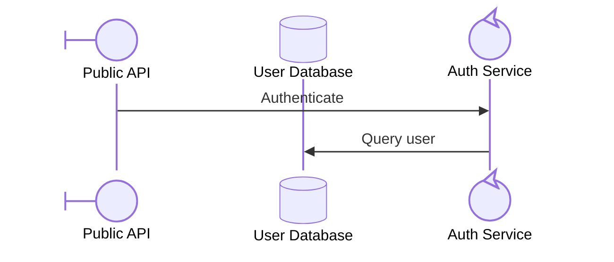

### Aliases

Define short identifiers with display labels using `as`:

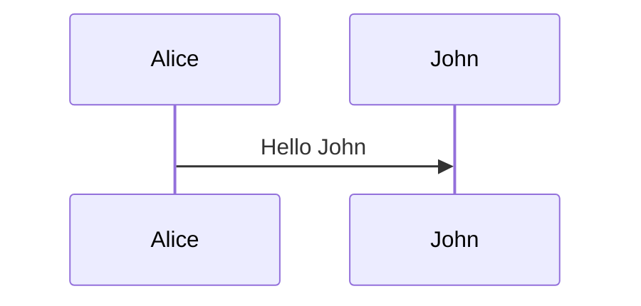

Inline alias in config object:

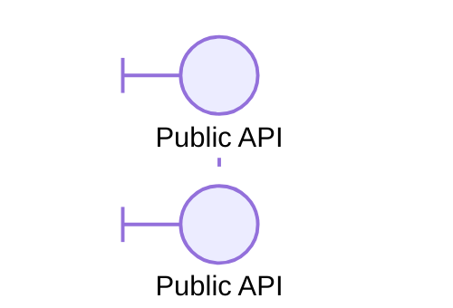

When both inline and external alias are provided, **external takes precedence**.

### Actor Creation and Destruction (v10.3.0+)

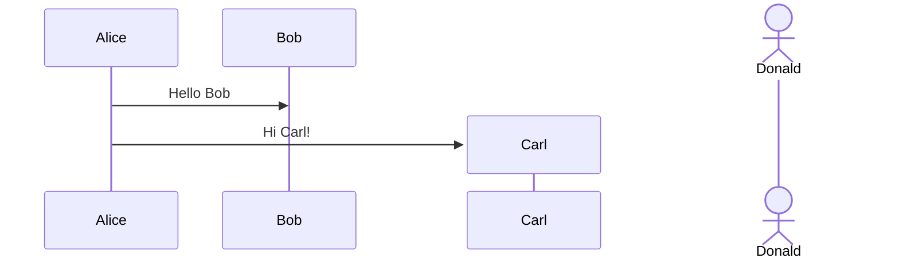

### Grouping / Box

Group participants in colored boxes:

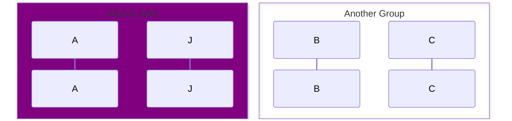

Use `box transparent <name>` if the group name is a color keyword.

## Messages

### Arrow Types

**Standard:**

- `->` — Solid line, no arrowhead
- `-->` — Dotted line, no arrowhead
- `->>` — Solid line with arrowhead
- `-->>` — Dotted line with arrowhead
- `-x` — Solid line with cross at end
- `--x` — Dotted line with cross
- `-)` — Solid line with open arrow (async)
- `--)` — Dotted line with open arrow

**Bidirectional (v11.0.0+):**

- `<<->>` — Solid bidirectional
- `<<-->>` — Dotted bidirectional

**Half-Arrows (v11.12.3+):**

- `-\|` / `--\|` — Top half arrowhead
- `-\|/` / `--\|/` — Bottom half arrowhead
- `/\|-` / `/\|--` — Reverse top half
- `\\-` / `\\--` — Reverse bottom half
- `-\\` / `--\\` — Top stick half
- `-//` / `--//` — Bottom stick half
- `//-` / `//--` — Reverse top stick half

### Central Connections (v11.12.3+)

Use `()` for central lifeline connections:

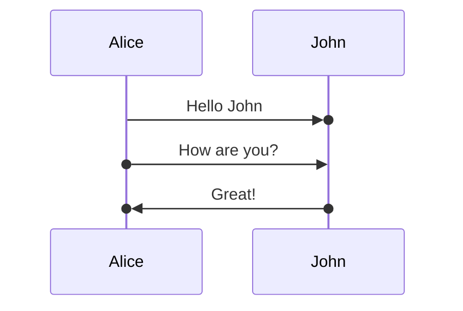

## Activations

Show when an actor is active:

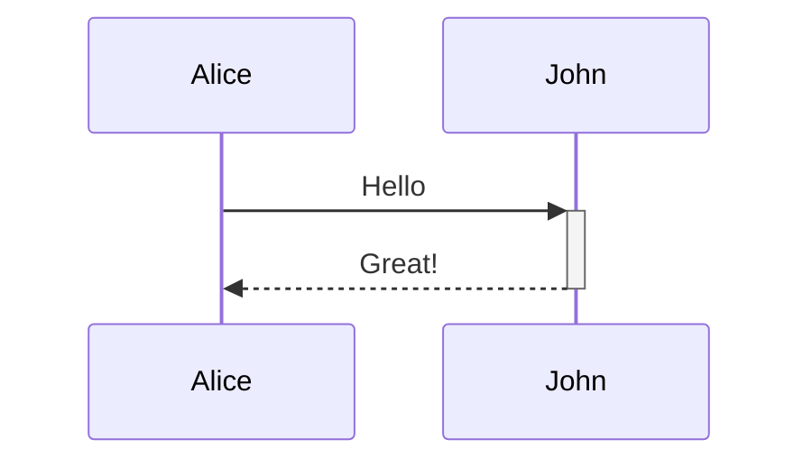

Or with explicit activate/deactivate:

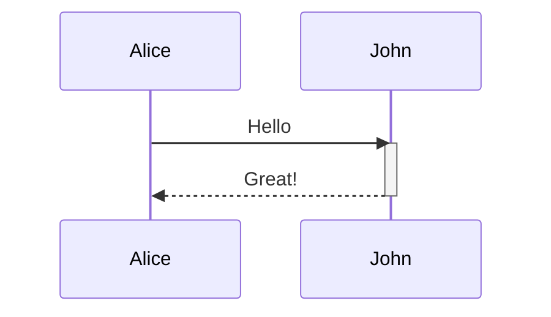

Activations stack for the same actor.

## Notes

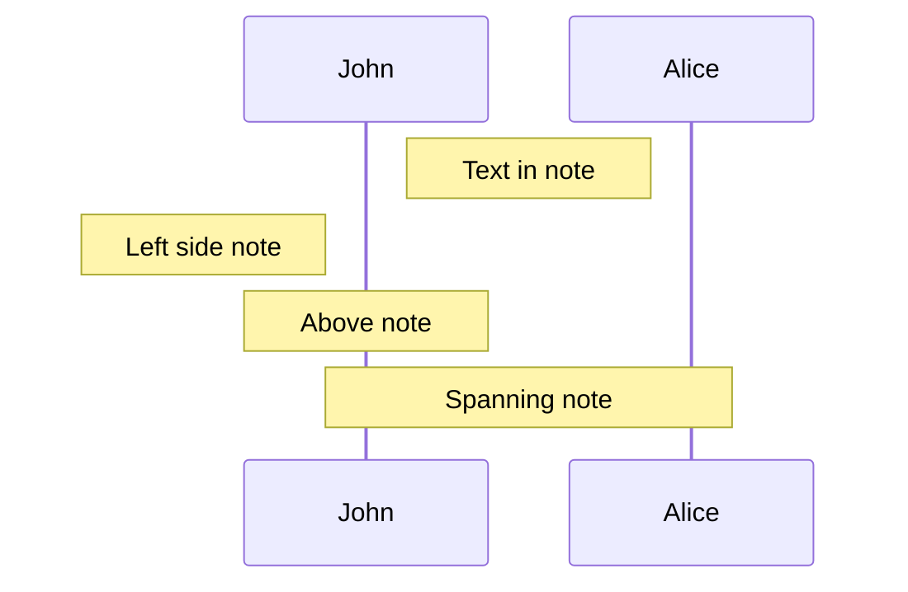

Use ` ` for line breaks in notes and messages.

## Loops, Alt, Parallel, Critical

### Loop

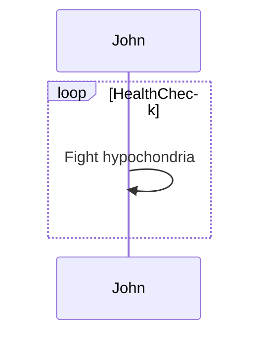

### Alt / Else

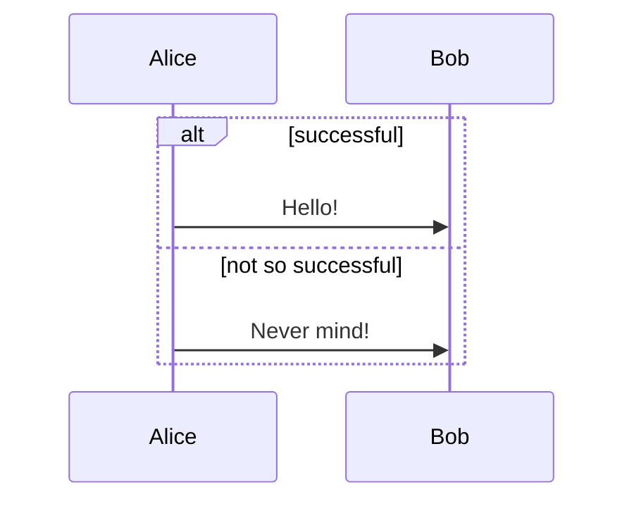

### Optional

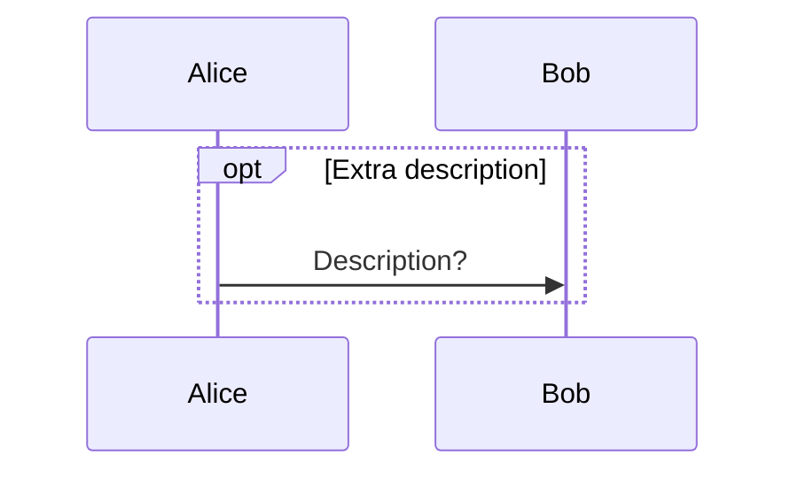

### Parallel

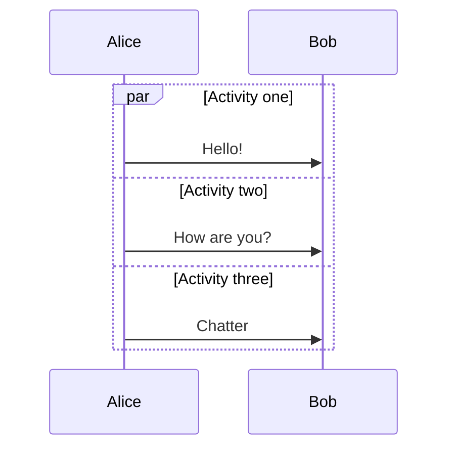

### Critical Region

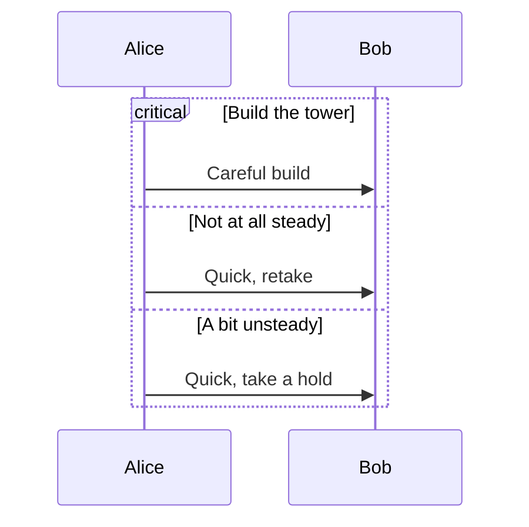

### Break

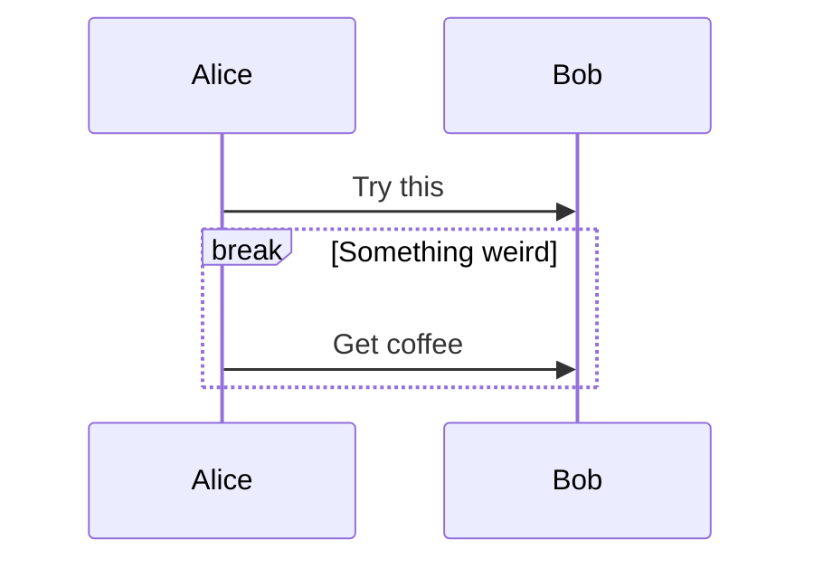

## Styling

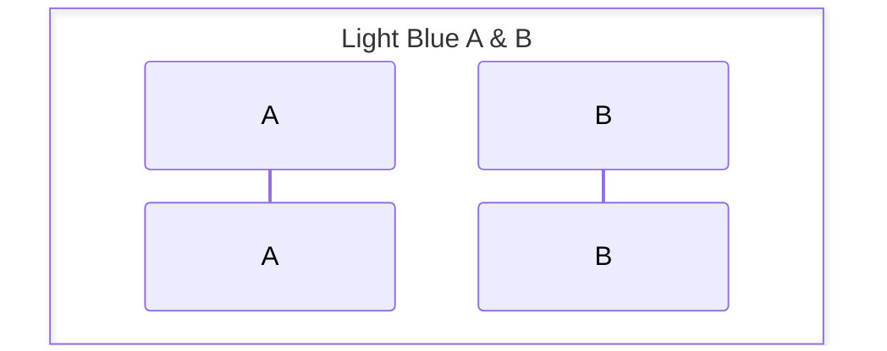

## Configuration

- `mirrorActors` — Mirror actors on right side of diagram
- `actorMargin` — Margin around actors
- `messageMargin` — Margin around messages
- `boxMargin` — Margin around boxes
- `boxTextMargin` — Margin inside box text
- `activateDuration` — Animation duration for activations
- `alignMessagesTitle` — Alignment of message titles
- `showActivationNumbers` — Show activation order numbers
