# Class & State Diagrams

> **Source:** https://github.com/mermaid-js/mermaid/blob/mermaid%4011.14.0/docs/syntax/classDiagram.md, docs/syntax/stateDiagram.md
> **Loaded from:** SKILL.md (via progressive disclosure)

## Class Diagrams

### Basic Class Definition

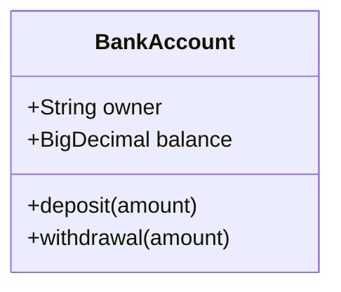

Or with braces:

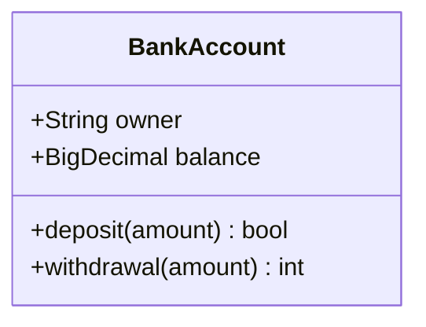

### Visibility & Classifiers

| Prefix | Meaning |
|--------|---------|
| `+` | Public |
| `-` | Private |
| `#` | Protected |
| `~` | Package/Internal |

| Suffix | Meaning |
|--------|---------|
| `*` | Abstract method |
| `$` | Static (method or field) |

### Generic Types

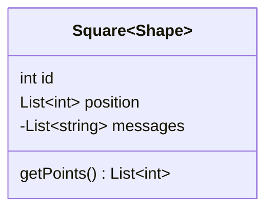

Nested generics supported; commas in generic args not supported.

### Relationships

| Syntax | Relationship |
|--------|-------------|
| `<\|--` | Inheritance |
| `*--` | Composition |
| `o--` | Aggregation |
| `-->` | Association |
| `--` | Link (solid) |
| `..>` | Dependency |
| `..\|>` | Realization |
| `..` | Link (dashed) |

With labels:
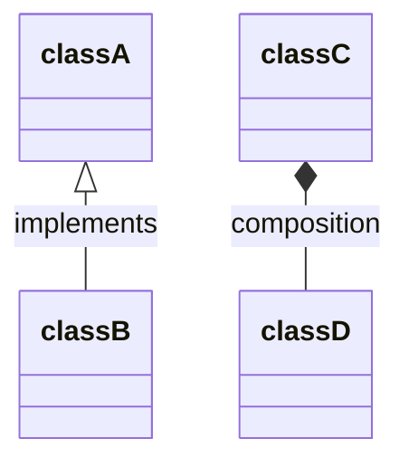

### Two-way Relations

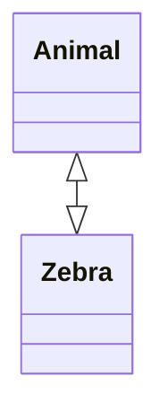

Combines relation type (`<\|`, `*`, `o`, `>`, `<`, `\|>`) with link type (`--` solid, `..` dashed).

### Lollipop Interfaces

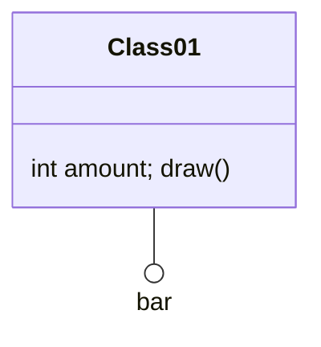

### Namespace

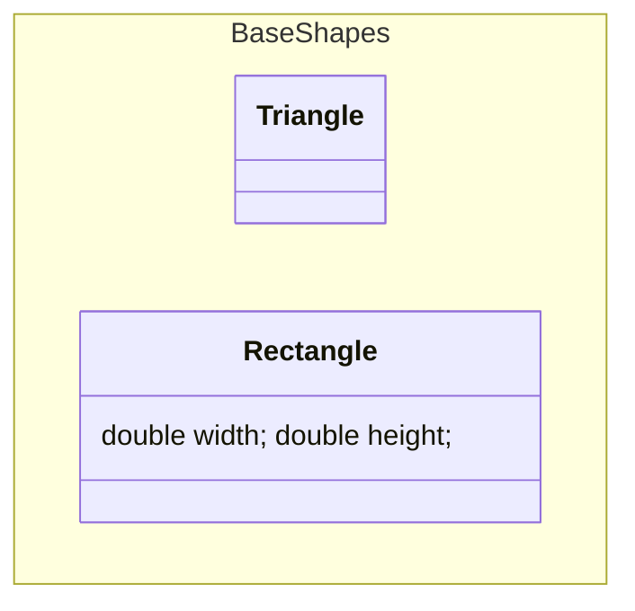

## State Diagrams (v2)

### Basic States & Transitions

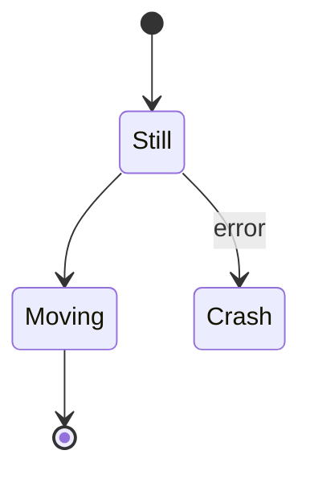

### State Declaration Styles

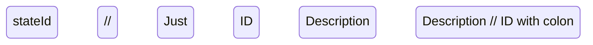

### Composite States

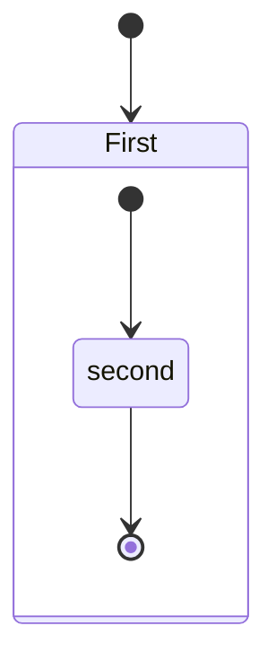

Nested composite states supported to arbitrary depth.

### Choice & Fork/Join

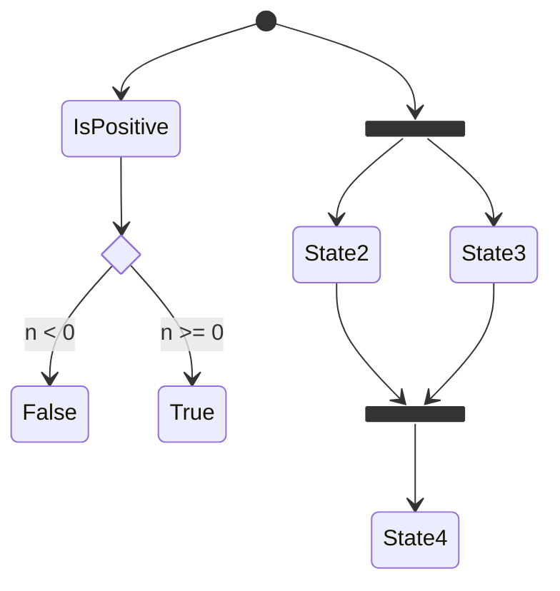

### Concurrency

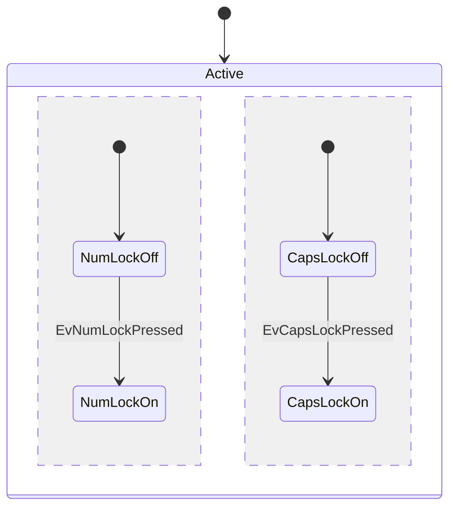

### Notes

```mermaid
stateDiagram-v2
    State1: The state with a note
    note right of State1
        Important info!
    end note
    note left of State2 : Left note
```

### Direction

```mermaid
stateDiagram
    direction LR
    [*] --> A --> B --> C
```

### Styling (classDef)

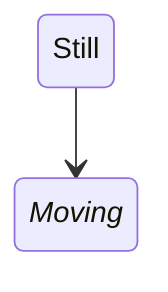

Limitations: cannot apply to start/end states or composite states.

### Comments

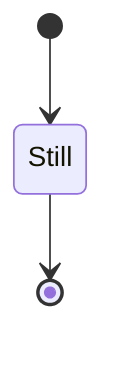
