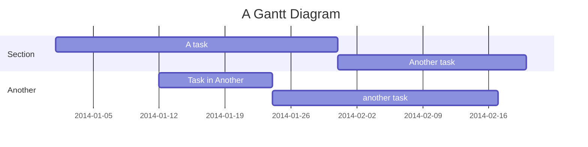

# Gantt Charts

Gantt charts illustrate project schedules with time on the x-axis and tasks on the y-axis.

## Basic Syntax



## Title

Optional string displayed at the top of the chart:

```
title Adding GANTT diagram functionality to mermaid
```

## Date Format

`dateFormat` defines the input format. Default is `YYYY-MM-DD`. Supported tokens:

- `YYYY` — 4-digit year
- `YY` — 2-digit year
- `M MM` — Month number (1-12)
- `MMM MMMM` — Month name
- `D DD` — Day of month
- `Do` — Day with ordinal (1st-31st)
- `H HH` — 24-hour time
- `h hh` — 12-hour time (with a/A)
- `X` — Unix timestamp
- `x` — Unix ms timestamp

Output format controlled by `axisFormat`.

## Excludes

Skip specific dates from duration calculations:

```
excludes weekends
excludes 2014-01-10,2014-01-11
excludes sunday
```

Weekend start day configuration (v11.0.0+):

```
weekend friday    %% Fri-Sat weekend
weekend saturday  %% Sat-Sun weekend (default)
```

## Sections

Divide the chart into groups:

```
section Development
    Design task :a1, 2014-01-01, 5d
section Testing
    Test task   :a2, after a1, 3d
```

## Task Metadata

Tasks use colon-separated syntax: `title : metadata`

Metadata items are comma-separated. Valid tags (must come first): `active`, `done`, `crit`, `milestone`.

### Duration Units

- `ms` — Milliseconds
- `s` — Seconds
- `m` — Minutes
- `h` — Hours
- `d` — Days
- `w` — Weeks
- `M` — Months
- `y` — Years

Decimal values supported (e.g., `1.5d`).

### Task Reference Patterns

```
id, startDate, endDate        %% explicit dates
id, startDate, length         %% start + duration
id, after otherId, length     %% relative start + duration
id, after otherId, endDate    %% relative start + explicit end
id, startDate, until otherId  %% start until another task begins (v10.9.0+)
```

Multiple `after` references:

```
cherry :active, c, after b a, 1d   %% starts after both b and a finish
```

## Milestones

Single-point-in-time markers with `milestone` tag:

```mermaid
gantt
  dateFormat HH:mm
  axisFormat %H:%M
  Initial milestone : milestone, m1, 17:49, 2m
  Task A : 10m
  Final milestone : milestone, m2, 18:08, 4m
```



## Vertical Markers

Visual reference lines across the entire chart:

```mermaid
gantt
  dateFormat HH:mm
  axisFormat %H:%M
  Deadline : vert, v1, 17:30
  Task A : 3m
  Task B : 8m
```

## Bar Charts via Gantt

Use `dateFormat X` with Unix timestamps for bar charts:

```mermaid
gantt
  title Git Issues - days since last update
  dateFormat  X
  axisFormat %s
  section Issue19062
    71   : 0, 71
  section Issue19401
    36   : 0, 36
```



## Configuration

- `useWidth` — Chart width
- `numberSectionStyles` — Number of alternating section styles
- `barHeight` — Height of each task bar
- `barGap` — Gap between bars
- `topPadding` — Top padding
- `rightPadding` — Right padding
- `leftPadding` — Left padding
- `gridLineStartPadding` — Grid line start offset
- `tileHeight` — Grid tile height
- `labelSize` — Label font size
- `labelWidth` — Label column width
- `axisFormat` — X-axis date format
- `topAxis` — Show axis on top
- `dark` — Dark mode toggle
- `padding` — Overall padding
- `stackInstances` — Stack overlapping instances
- `displayModes` — Display mode options
- `ignoreTimeZone` — Ignore timezone adjustments
