# Class and State Diagrams

## Class Diagrams

UML class diagrams describe system structure showing classes, attributes, operations, and relationships.

### Defining Classes

Two ways to define a class:

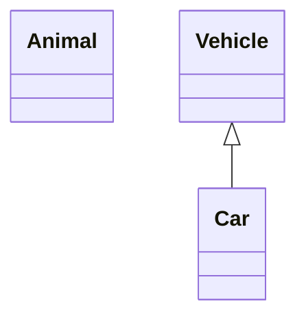

Class labels with special characters:

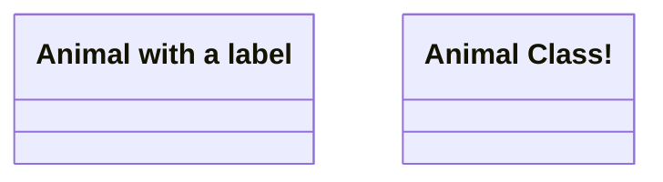

### Members

Members are defined using `:` (one at a time) or `{}` (grouped):

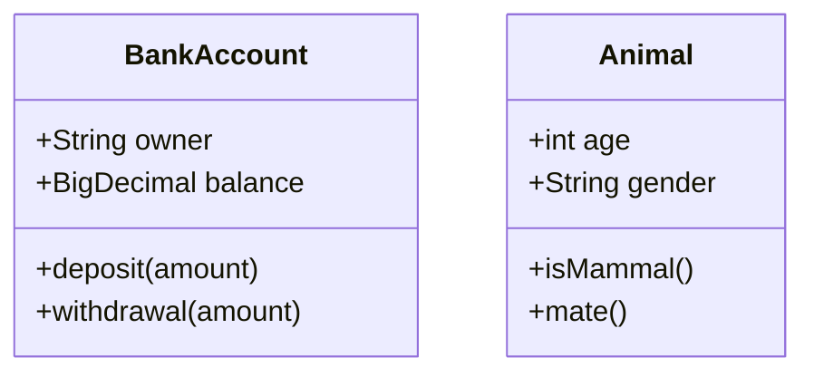

Members with `()` are treated as methods; all others as attributes.

Visibility prefixes: `+` public, `-` private, `#` protected, `~` package/internal.

Static members use underlining in the label.

### Stereotypes

Add stereotypes with `<<stereotype>>`:

```mermaid
classDiagram
  <<interface>> Drawable
  class Shape{
    <<abstract>>
    +draw()
  }
```

### Relationships

- `<|--` — Inheritance (extension)
- `*--` — Composition
- `o--` — Aggregation
- `-->` — Association (directed)
- `--` — Association (undirected)
- `<..` — Dependency

With labels:

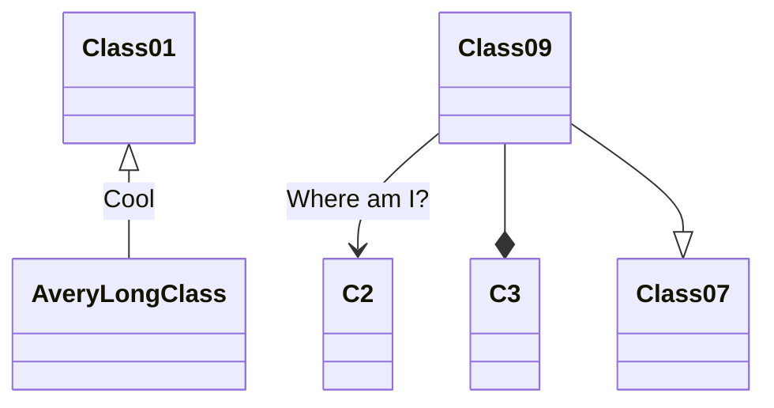

Multiplicity on relationships:

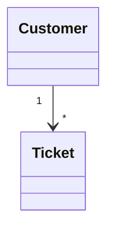

### Notes

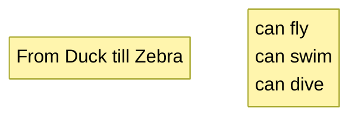

## State Diagrams

State diagrams describe system behavior through states and transitions. Use `stateDiagram-v2` for the modern renderer (recommended). Legacy `stateDiagram` is still supported.

### Basic Syntax

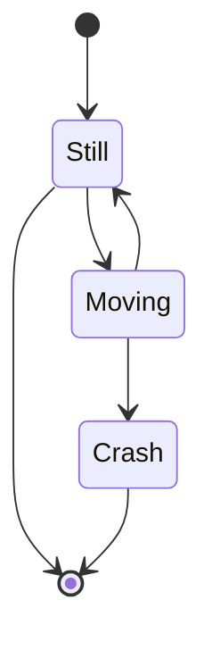

`[*]` represents start (when arrow points away) and stop (when arrow points to).

### States

Define states by id, with description, or using the `state` keyword:

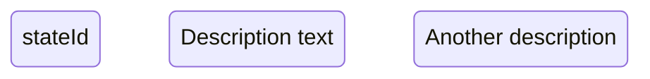

### Transitions

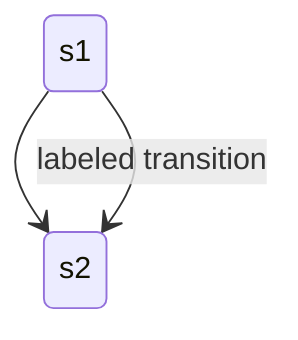

### Composite States

States within states using `state` keyword with `{}`:

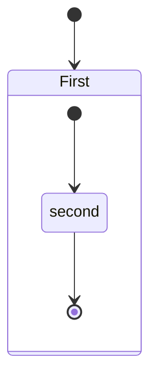

Multiple nesting levels supported.

### Choice Points (fork/join)

```mermaid
stateDiagram-v2
  direction LR
  [*] --> StartState
  StartState --> {choicePoint}
  {choicePoint} --> State1: choice 1
  {choicePoint} --> State2: choice 2
```

### Parallel States (fork/join)

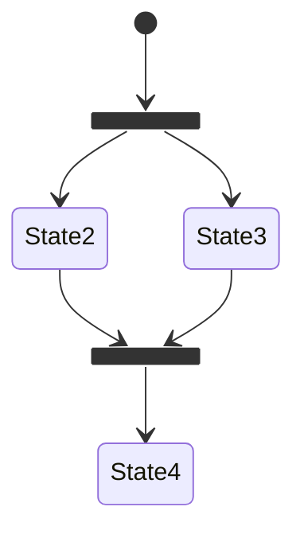

### History States

```mermaid
stateDiagram-v2
  state H1 <<history>>
  state H2 <<history>>
```

### Notes on States

```mermaid
stateDiagram-v2
  note right of state1 : Note text here
```
