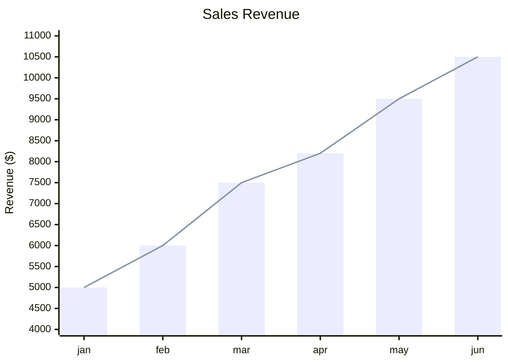
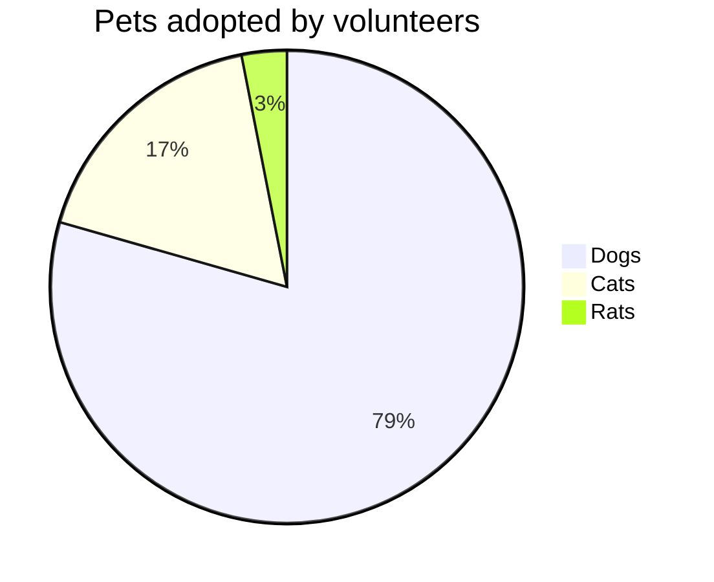
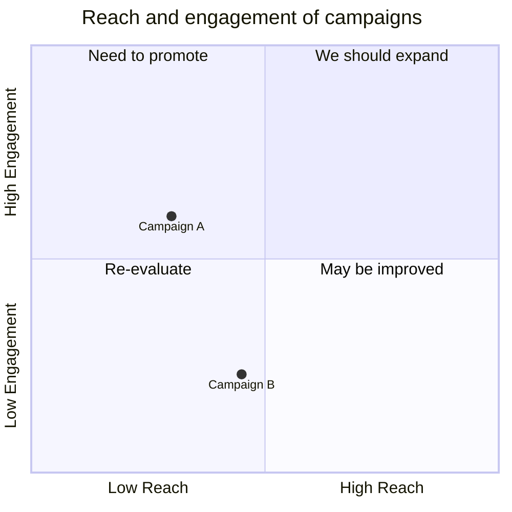
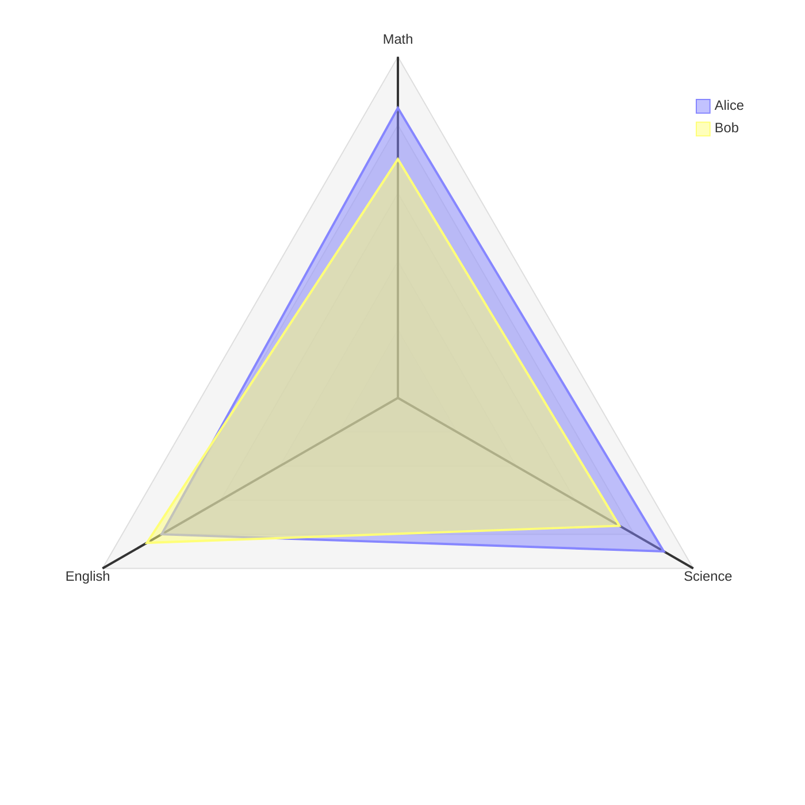
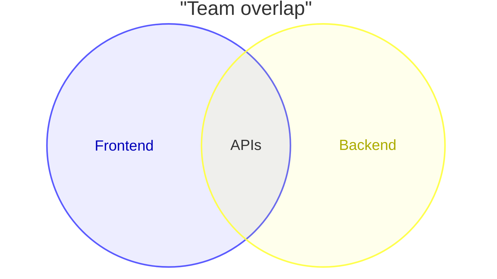
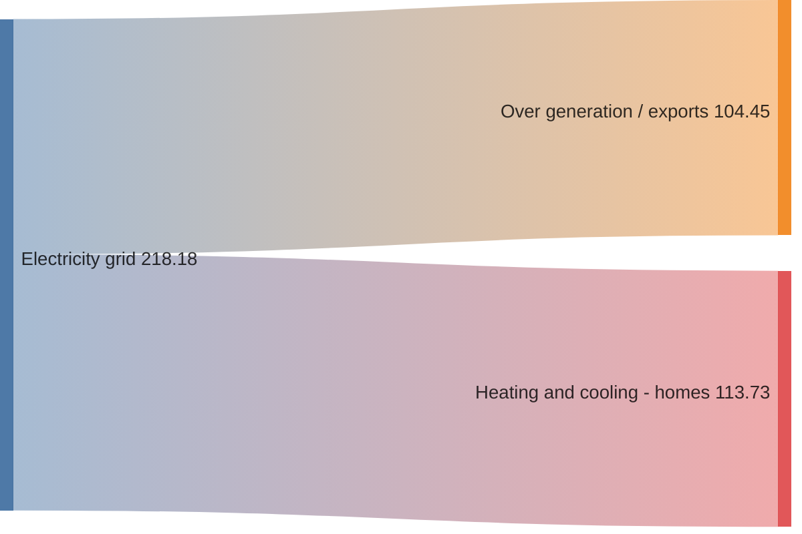

# Data Charts

> **Source:** https://github.com/mermaid-js/mermaid/blob/mermaid%4011.14.0/docs/syntax/xyChart.md, docs/syntax/pie.md, docs/syntax/quadrantChart.md, docs/syntax/radar.md, docs/syntax/venn.md, docs/syntax/packet.md
> **Loaded from:** SKILL.md (via progressive disclosure)

## XY Chart

### Basic Syntax



### Configuration

| Parameter | Default | Description |
|-----------|---------|-------------|
| `width` | 700 | Chart width |
| `height` | 500 | Chart height |
| `chartOrientation` | 'vertical' | 'vertical' or 'horizontal' |
| `showDataLabel` | false | Show value on bar |
| `showDataLabelOutsideBar` | false | Label outside bar |

### Theme Variables (xyChart)

`backgroundColor`, `titleColor`, `dataLabelColor`, `xAxisLabelColor`, `xAxisTitleColor`, `xAxisTickColor`, `xAxisLineColor`, `yAxisLabelColor`, `yAxisTitleColor`, `yAxisTickColor`, `yAxisLineColor`, `plotColorPalette`.

Set colors:
```yaml
config:
  themeVariables:
    xyChart:
      plotColorPalette: '#000000, #0000FF, #00FF00, #FF0000'
```

## Pie Chart

### Basic Syntax



### Configuration

| Parameter | Default | Description |
|-----------|---------|-------------|
| `textPosition` | 0.75 | Label position (0=center, 1=edge) |

Values must be positive numbers > 0. Use `showData` to display values.

## Quadrant Chart

### Basic Syntax



Point coordinates are in range 0–1.

### Configuration

| Parameter | Default | Description |
|-----------|---------|-------------|
| `chartWidth` | 500 | Chart width |
| `chartHeight` | 500 | Chart height |
| `xAxisPosition` | 'top' | 'top' or 'bottom' |
| `yAxisPosition` | 'left' | 'left' or 'right' |
| `pointRadius` | 5 | Point circle radius |

### Theme Variables (quadrant)

`quadrant1Fill`, `quadrant2Fill`, `quadrant3Fill`, `quadrant4Fill`, `quadrant1TextFill`, `quadrantPointFill`, `quadrantXAxisTextFill`, `quadrantYAxisTextFill`, `quadrantTitleFill`, etc.

### Point Styling

```
Point A: [0.9, 0.0] radius: 12
Point B: [0.8, 0.1] color: #ff3300, radius: 10
```

## Radar Diagram (v11.6.0+)

### Basic Syntax



### Configuration

| Parameter | Default | Description |
|-----------|---------|-------------|
| `width` / `height` | 600 | Chart dimensions |
| `curveTension` | 0.17 | Rounded curve tension |
| `showLegend` | true | Show legend |
| `graticule` | circle | 'circle' or 'polygon' |
| `ticks` | 5 | Number of concentric rings |

### Curve Syntax

```
curve id["Label"]{1, 2, 3}
curve id{ axis1: 20, axis2: 10 }  // key-value pairs
```

Supports `cScale${i}` theme variables for per-curve colors (0–12).

## Venn Diagrams (v11.12.3+)

### Basic Syntax



### Features

- `set A["Label"]:20` — size via `:N` suffix
- `text A1["React"]` — text nodes inside sets
- `style A fill:#ff6b6b` — per-set styling (`fill`, `color`, `stroke`, `stroke-width`, `fill-opacity`)

## Packet Diagram (v11.0.0+)

### Basic Syntax

```mermaid
packet
0-15: "Source Port"
16-31: "Destination Port"
32-63: "Sequence Number"
106: "URG"
+16: "Next Field"
```

Bit ranges (`0-15`) or auto-increment (`+N`). Mix and match.

## Sankey Diagram (v10.3.0+)

### Syntax

CSV format: `source,target,value` per line.



Empty lines allowed for visual grouping. Must have exactly 3 columns.
