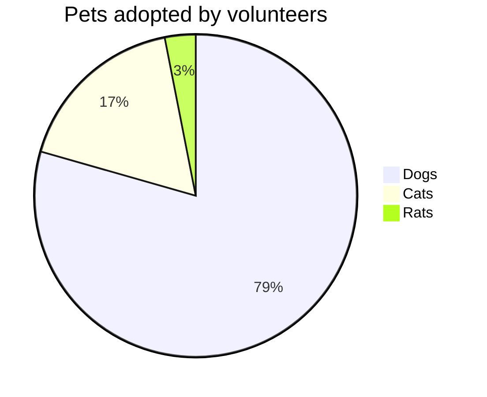
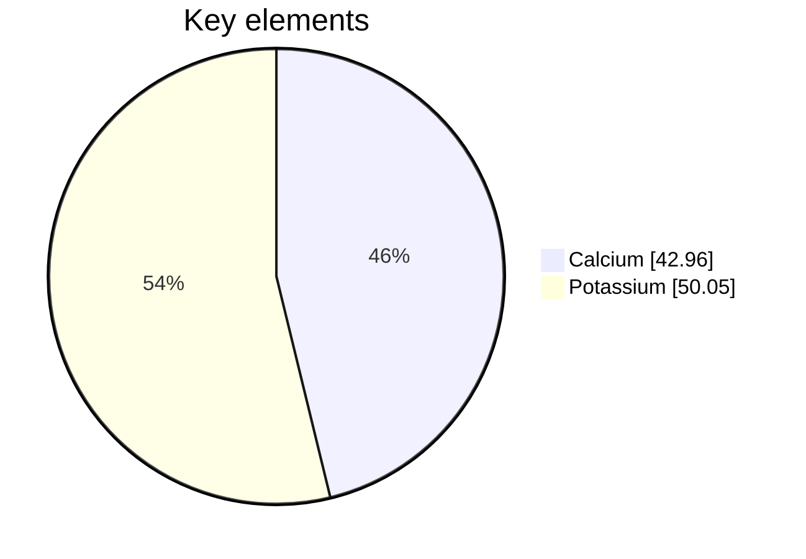
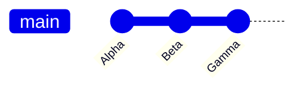
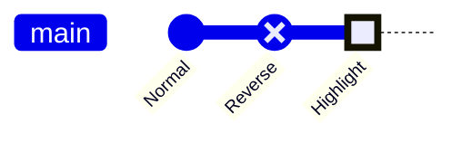
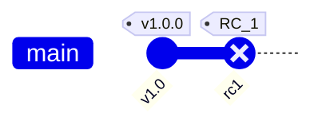
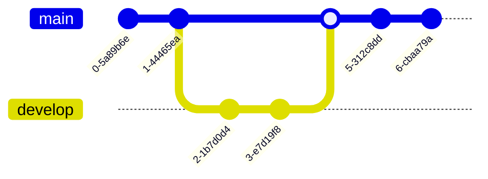
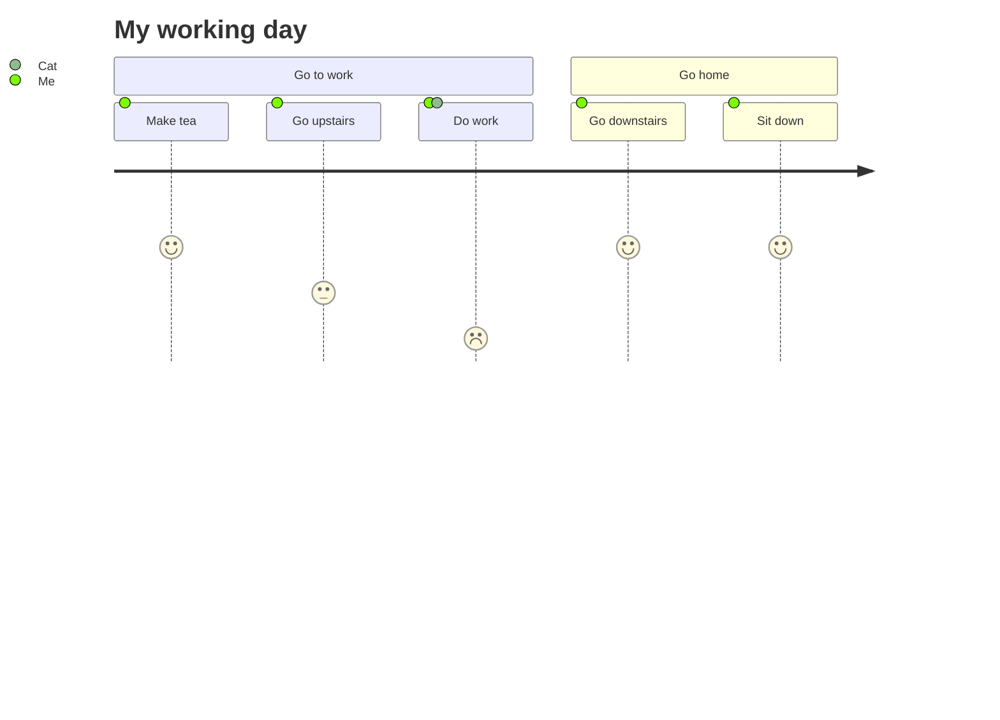

# Pie Charts, Git Graphs, and User Journeys

## Pie Charts

Proportional data visualization with circular slices.

### Basic Syntax

- `showData` — Render actual values after legend text (optional)
- `title <text>` — Chart title (optional)
- Values must be **positive numbers > 0**
- Slices ordered clockwise in definition order

### Configuration

- `textPosition` — Axial position of labels (0.0 center to 1.0 edge), default `0.75`

## Git Graph Diagrams

Visualize git commit history and branching strategies.

### Basic Operations

- `commit` — New commit on current branch
- `branch <name>` — Create and switch to new branch
- `checkout <name>` / `switch <name>` — Switch to existing branch
- `merge <name>` — Merge branch into current
- `cherry-pick <id>` — Cherry-pick a commit
- `reset <type>` — Reset (types: `soft`, `hard`, `mixed`)

Default branch is `main`.

### Custom Commit IDs

### Commit Types

- `NORMAL` — Solid circle (default)
- `REVERSE` — Crossed solid circle
- `HIGHLIGHT` — Filled rectangle

### Tags

### Full Example

## User Journey Diagrams

Describe user workflows at a high level, revealing areas for improvement.

### Syntax

- `title` — Optional title
- `section` — Groups related tasks (required)
- Task syntax: `Task name: <score>: <comma-separated actors>`
- Score is a number between **1 and 5** inclusive
