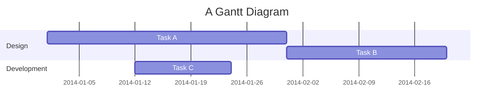
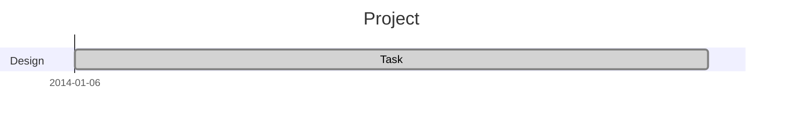
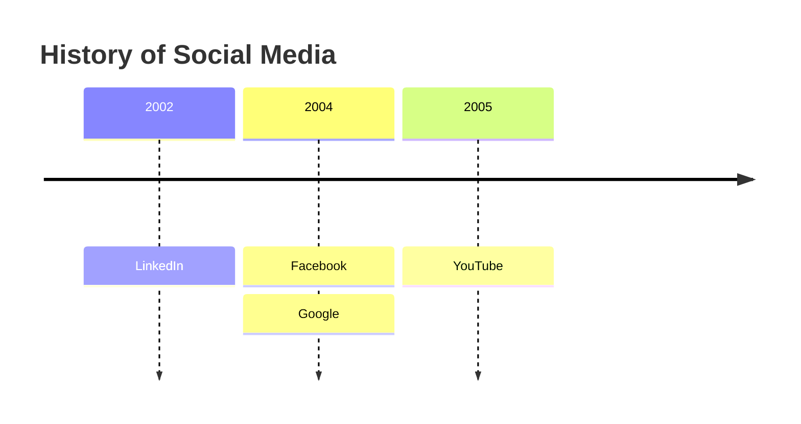
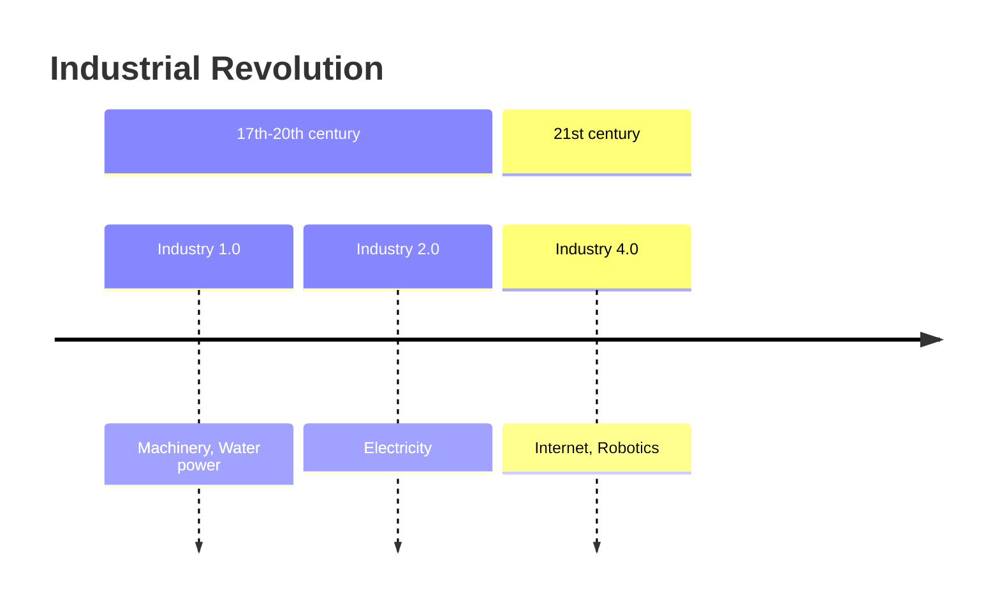
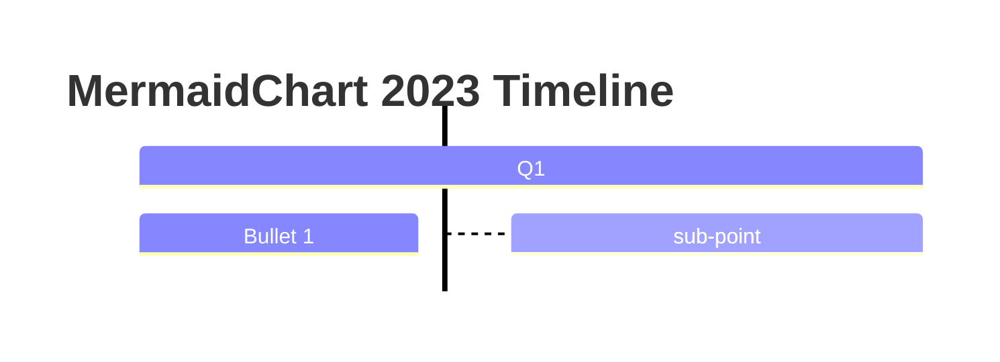
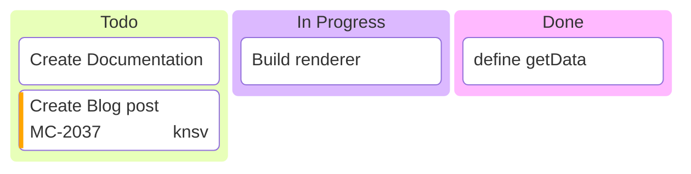
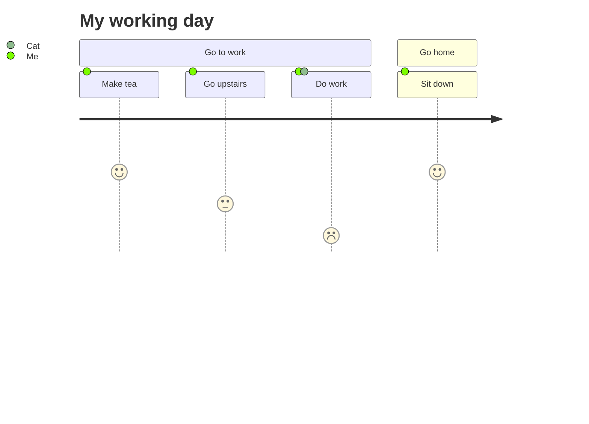
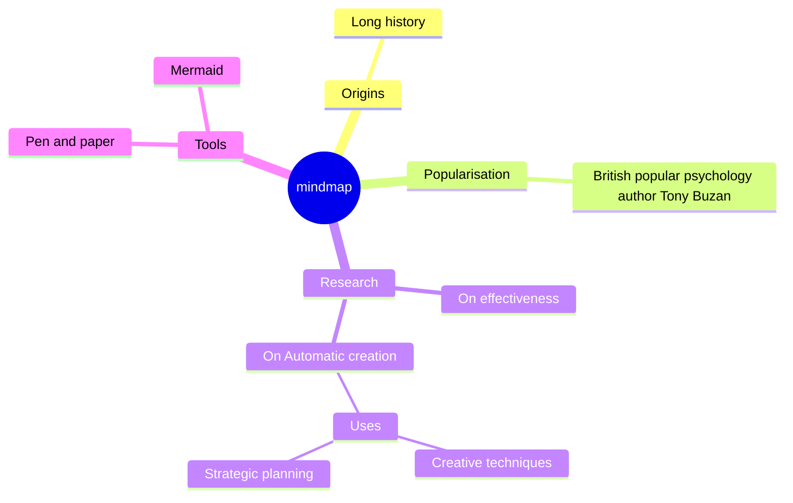
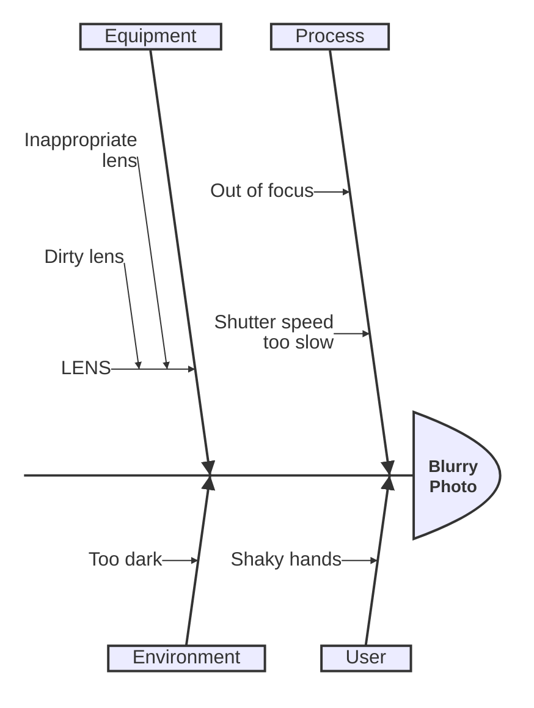

# Process & Timeline Diagrams

> **Source:** https://github.com/mermaid-js/mermaid/blob/mermaid%4011.14.0/docs/syntax/gantt.md, docs/syntax/timeline.md, docs/syntax/kanban.md, docs/syntax/userJourney.md, docs/syntax/mindmap.md, docs/syntax/ishikawa.md
> **Loaded from:** SKILL.md (via progressive disclosure)

## Gantt Charts

### Basic Syntax



### Task Metadata

Format: `Task name :status, id, start, end/length`

| Status | Meaning |
|--------|---------|
| (none) | Future/normal |
| `done` | Completed |
| `active` | In progress |
| `crit` | Critical path |
| `milestone` | Instant in time |

### Duration Units

| Unit | Suffix | Example |
|------|--------|---------|
| Milliseconds | `ms` | `500ms` |
| Seconds | `s` | `30s` |
| Minutes | `m` | `30m` |
| Hours | `h` | `4h` |
| Days | `d` | `3d` |
| Weeks | `w` | `2w` |
| Months | `M` | `1M` |
| Years | `y` | `1y` |

### Date Dependencies

- `after taskID` — starts after another task ends
- `until taskID` — ends when another task starts (v10.9.0+)
- Multiple: `after A B C` — waits for all listed tasks

### Configuration



`excludes` accepts `YYYY-MM-DD`, day names ("sunday"), or "weekends". Weekend default: Sat+Sun; set to Friday+Saturday with `weekend friday`.

### Milestones & Vertical Markers

```mermaid
gantt
    dateFormat HH:mm
    Initial milestone : milestone, m1, 17:49, 2m
    Task A : 10m
    Final vert : vert, v2, 17:58, 4m
```



### Compact Mode

```yaml
---
displayMode: compact
---
gantt
    title A Gantt Diagram
    section Section
    A task :a1, 2014-01-01, 30d
    Another task :a2, 2014-01-20, 25d
```

## Timeline Diagram

### Basic Syntax



### Sections



### Direction (v11.14.0+)



## Kanban Diagram

### Basic Syntax



### Task Metadata

| Key | Values |
|-----|--------|
| `assigned` | Assignee name |
| `ticket` | Ticket number (linked via `ticketBaseUrl`) |
| `priority` | 'Very High', 'High', 'Low', 'Very Low' |

### Configuration

```yaml
---
config:
  kanban:
    ticketBaseUrl: 'https://jira/browse/#TICKET#'
---
```

## User Journey Diagram

### Syntax



Score is 1–5. Actors are comma-separated names.

## Mindmap

### Syntax

Indentation defines hierarchy.



### Shapes

| Shape | Syntax |
|-------|--------|
| Square | `id[I am a square]` |
| Rounded | `id(I am rounded)` |
| Circle | `id((I am circle))` |
| Bang | `id))I am a bang((` |
| Cloud | `id)I am a cloud(` |
| Hexagon | `id{{I am hex}}` |
| Default | `idText` |

Icons: `::icon(fa fa-book)` after a node.

## Ishikawa / Fishbone Diagram (v11.12.3+)



First line = problem/event. Indentation = cause hierarchy.
