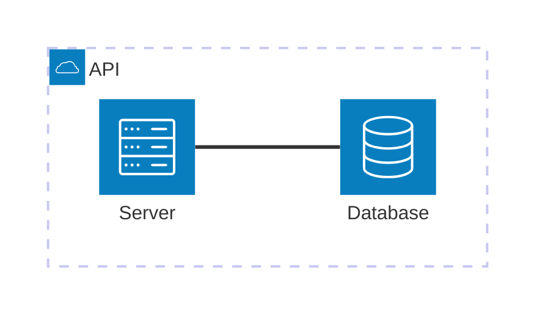
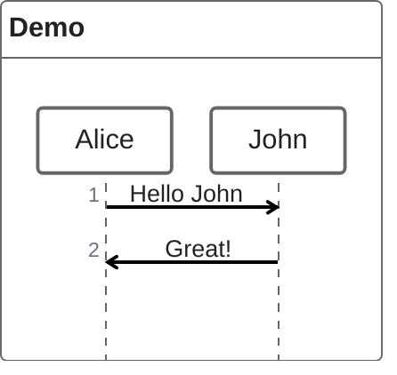
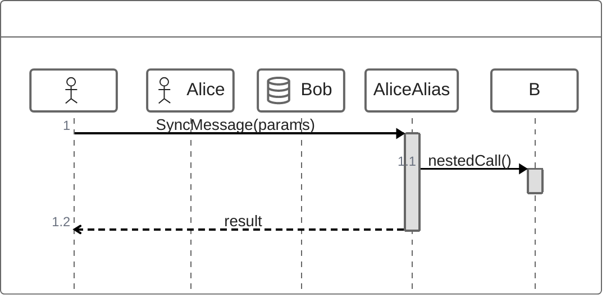
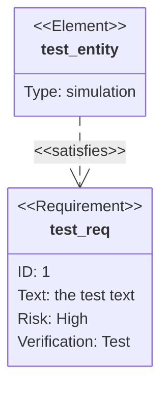

# Architecture, C4 & Specialized Diagrams

> **Source:** https://github.com/mermaid-js/mermaid/blob/mermaid%4011.14.0/docs/syntax/architecture.md, docs/syntax/c4.md, docs/syntax/zenuml.md, docs/syntax/wardley.md, docs/syntax/requirementDiagram.md
> **Loaded from:** SKILL.md (via progressive disclosure)

## Architecture Diagrams (v11.1.0+)

### Basic Syntax



### Building Blocks

| Block | Syntax | Description |
|-------|--------|-------------|
| Group | `group id(icon)[Title]` | Container for services |
| Service | `service id(icon)[Title] in group` | Individual node |
| Edge | `svc:DIR -- DIR:svc` | Connection between services |
| Junction | `junction id (in group)` | 4-way edge split point |

### Edge Syntax

```
serviceId{group}:T -- B:otherService
```

- Direction after colon: `L`, `R`, `T`, `B`
- Arrows: `<` before direction (left), `>` after direction (right)
- Group modifier: `service{group}` for edges from group boundary

### Icons

Built-in: `cloud`, `database`, `disk`, `internet`, `server`.
Custom: register via `mermaid.registerIconPacks()` — use `pack-name:icon-name` format (e.g., `logos:aws-lambda`).

### Configuration

```yaml
config:
  architecture:
    randomize: true  # v11.14.0+
```

## C4 Diagrams

C4 diagrams follow [C4-PlantUML syntax](https://github.com/plantuml-stdlib/C4-PlantUML). Five chart types:

| Type | Keyword |
|------|---------|
| System Context | `C4Context` |
| Container | `C4Container` |
| Component | `C4Component` |
| Dynamic | `C4Dynamic` |
| Deployment | `C4Deployment` |

### Elements

| Element | Keyword | Description |
|---------|---------|-------------|
| Person | `Person(alias, "label", "desc")` | External user |
| System | `System(alias, "label", "desc")` | Application system |
| SystemDb | `SystemDb(...)` | System with database |
| System_Ext | `System_Ext(...)` | External system |
| Container | `Container(alias, "label", "tech", "desc")` | App container |
| Boundary | `Boundary(alias, "label")` | Logical grouping |
| Enterprise_Boundary | `Enterprise_Boundary(...)` | Organizational boundary |

### Relationships

```mermaid
C4Context
  Rel(customer, system, "Uses")
  BiRel(system, db, "Reads/Writes")
  Rel_U(system, queue, "Sends messages")
```

Directional variants: `Rel`, `BiRel`, `Rel_U`, `Rel_D`, `Rel_L`, `Rel_R`, `Rel_Back`.

### Styling

```mermaid
UpdateElementStyle(person, $fontColor="red", $bgColor="grey")
UpdateRelStyle(customer, system, $textColor="blue", $lineColor="blue")
UpdateLayoutConfig($c4ShapeInRow="3", $c4BoundaryInRow="1")
```

C4 diagrams use fixed style (no theme customization).

## ZenUML

A different syntax for sequence diagrams.



### Participants



### Message Types

| Type | Syntax | Description |
|------|--------|-------------|
| Sync | `A.Method()` | Blocking call |
| Async | `A->B: message` | Fire-and-forget |
| Creation | `new A(params)` | Create object |
| Reply | `a = A.Call()` or `return result` | Return value |

## Wardley Maps (v11.14.0+)

```mermaid
wardley-beta
title Tea Shop Value Chain

anchor Business [0.95, 0.63]
component Cup of Tea [0.79, 0.61]
component Tea [0.63, 0.81]
component Kettle [0.43, 0.35]

Business -> Cup of Tea
Cup of Tea -> Tea
Cup of Tea -> Hot Water
Hot Water -> Kettle

evolve Kettle 0.62
note "Standardising power allows evolution" [0.30, 0.49]
```

Axes: Y = visibility (0=infra, 1=user-facing), X = evolution (0=genesis, 1=commodity).
Coordinates use OWM format: `[visibility, evolution]` (not x,y).

## Requirement Diagram

Follows SysML v1.6.



### Relationship Types

`contains`, `copies`, `derives`, `satisfies`, `verifies`, `refines`, `traces`.

### Requirement Types

`requirement`, `functionalRequirement`, `interfaceRequirement`, `performanceRequirement`, `physicalRequirement`, `designConstraint`.

Risk: `Low`, `Medium`, `High`. Verification: `Analysis`, `Inspection`, `Test`, `Demonstration`.
