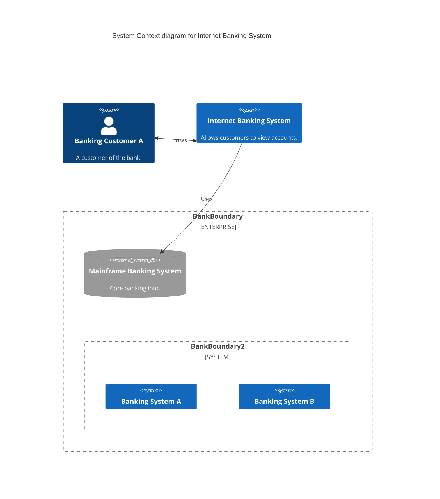
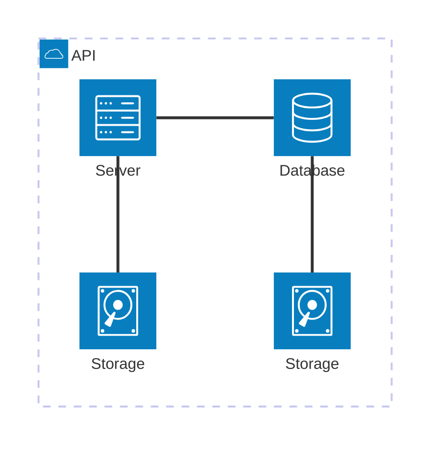

# C4 and Architecture Diagrams

## C4 Diagrams

C4 model diagrams for system architecture. Compatible with plantUML C4 syntax.

Five diagram types:

- `C4Context` — System context
- `C4Container` — Container diagram
- `C4Component` — Component diagram
- `C4Dynamic` — Dynamic (interaction) diagram
- `C4Deployment` — Deployment diagram

### Elements

**Persons:**

```
Person(alias, label, ?descr)
Person_Ext(alias, label, ?descr)
```

**Systems:**

```
System(alias, label, ?descr)
SystemDb(alias, label, ?descr)
SystemQueue(alias, label, ?descr)
System_Ext(alias, label, ?descr)
SystemDb_Ext(alias, label, ?descr)
SystemQueue_Ext(alias, label, ?descr)
```

**Containers:**

```
Container(alias, label, ?techn, ?descr)
ContainerDb / ContainerQueue / Container_Ext / etc.
```

**Components:**

```
Component(alias, label, ?techn, ?descr)
ComponentDb / ComponentQueue / Component_Ext / etc.
```

**Nodes (deployment):**

```
Node(alias, label, ?type, ?descr)
Deployment_Node(...)  %% full name
Node_L / Node_R       %% left/right aligned
```

**Boundaries:**

```
Boundary(alias, label, ?type)
Enterprise_Boundary(alias, label)
System_Boundary(alias, label)
Container_Boundary(alias, label)
```

### Relationships

```
Rel(from, to, label, ?techn, ?descr)
BiRel(from, to, label)           %% bidirectional
Rel_U / Rel_D / Rel_L / Rel_R    %% directional placement
Rel_Back                         %% backward relationship
```

### Styling

```
UpdateElementStyle(element, $fontColor="red", $bgColor="grey", $borderColor="red")
UpdateRelStyle(from, to, $textColor="blue", $lineColor="blue", $offsetX="5", $offsetY="-10")
UpdateLayoutConfig($c4ShapeInRow="3", $c4BoundaryInRow="1")
```

### Example



## Architecture Diagrams (v11.1.0+)

Show cloud/CI-CD service topology with icons and directional edges.

### Building Blocks

**Groups:**

```
group {id}({icon})[{title}] (in {parentId})?
```

**Services:**

```
service {id}({icon})[{title}] (in {groupId})?
```

**Edges:**

```
{serviceId}:{T|B|L|R} {<}?--{>}? {T|B|L|R}:{serviceId}
```

Directional anchors: `T` (top), `B` (bottom), `L` (left), `R` (right).

**Junctions:**

```
junction {id}
```

### Example



### Available Icons

Common icons include: `cloud`, `database`, `disk`, `server`, `lambda`, `queue`, `cache`, `monitoring`, `network`, `storage`, `user`, `lock`, `gear`, `globe`, `mobile`, `desktop`, `tablet`, `printer`, `camera`, `microphone`, `cpu`, `ram`, `hdd`, `ssd`, `firewall`, `router`, `switch`, `loadbalancer`, `cdn`, `dns`, `email`, `search`, `analytics`, `ml`, `ai`, `container`, `kubernetes`, `docker`, `git`, `pipeline`, `deploy`, `test`, `build`, `security`, `compliance`.
