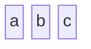
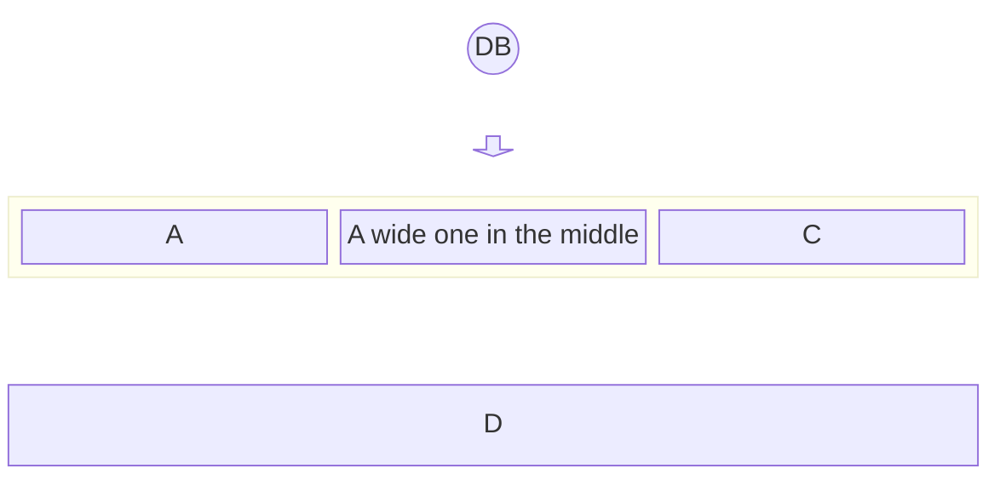
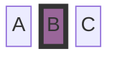
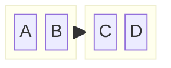
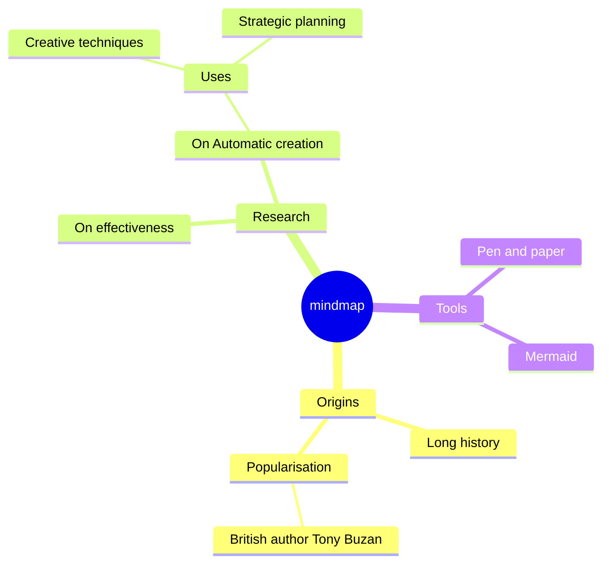
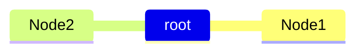
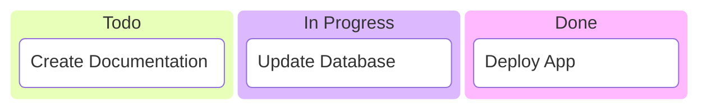
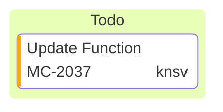

# Block Diagrams, Mindmaps, and Kanban

## Block Diagrams

Layout-controlled component diagrams where the author has full control over shape positioning. Unlike flowcharts, block diagrams do not use automatic layout algorithms — blocks are placed exactly where you define them.

### Basic Structure

Produces three blocks in a horizontal row.

### Columns

Define column count:

### Block Shapes

- `id` — Default block
- `id["label"]` — Block with label
- `id(("cylinder"))` — Cylinder shape
- `id<["label"]>(direction)` — Arrow block (direction: `up`, `down`, `left`, `right`)
- `space` — Empty space placeholder

### Styling

### Nested Blocks

## Mindmaps

Hierarchical information organization using indentation-based syntax.

### Basic Syntax

Indentation defines hierarchy levels:

### Node Shapes

- `id` — Default (square)
- `id[label]` — Square
- `id(label)` — Rounded square
- `id((label))` — Circle
- `id))label((` — Bang
- `id)label(` — Cloud

### Icons

Attach icons with `::icon(fa fa-icon-name)`:

## Kanban Diagrams

Visual workflow boards with columns and tasks.

### Basic Syntax

### Task Metadata

Use `@{ ... }` for task metadata:

Supported metadata keys:

- `assigned` — Task owner
- `ticket` — Issue/ticket number
- `priority` — `Very High`, `High`, `Low`, `Very Low`
