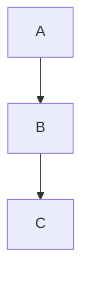

# API & Integration

> **Source:** https://github.com/mermaid-js/mermaid/blob/mermaid%4011.14.0/docs/config/usage.md, docs/intro/getting-started.md, docs/config/setup/mermaid/interfaces/Mermaid.md
> **Loaded from:** SKILL.md (via progressive disclosure)

## JavaScript API

### Import & Initialize

```javascript
import mermaid from 'mermaid';

mermaid.initialize({
  startOnLoad: true,
  theme: 'default',
  securityLevel: 'strict',
  fontFamily: 'trebuchet ms, verdana, arial',
  logLevel: 'warn',
});
```

### Render All Elements

```javascript
// Renders all elements with class="mermaid"
await mermaid.run();

// Custom selector
await mermaid.run({ querySelector: '.my-diagrams' });

// Suppress parse errors
await mermaid.run({ suppressErrors: true });

// Specific nodes
await mermaid.run({
  nodes: [document.getElementById('diagram1'), document.getElementById('diagram2')]
});

// Query selector list
await mermaid.run({
  nodes: document.querySelectorAll('.mermaid-diagram')
});
```

### Programmatic Render

```javascript
const { svg, bindFunctions } = await mermaid.render(
  'my-graph-id',
  'graph TD; A-->B'
);

// Insert into DOM
document.getElementById('container').innerHTML = svg;

// Bind functions (for click handlers, etc.)
if (bindFunctions) {
  bindFunctions(document.getElementById('container'));
}
```

### Parse Only (Validation)

```javascript
const result = await mermaid.parse('graph TD; A-->B');
// Returns: { diagramType: 'flowchart', ... } or false if suppressErrors

try {
  const result = await mermaid.parse('invalid syntax');
} catch (e) {
  // Handle parse error
}
```

### Parse Error Handler

```javascript
mermaid.setParseErrorHandler((err, hash) => {
  console.error('Parse error:', err);
});
```

## Mermaid Interface Methods

| Method | Signature | Description |
|--------|-----------|-------------|
| `initialize()` | `(config: MermaidConfig) => void` | Set configuration (call before run) |
| `run()` | `(options: RunOptions) => Promise<void>` | Render diagrams in document |
| `render()` | `(id, text, svgContainer?) => Promise<RenderResult>` | Render single diagram |
| `parse()` | `(text, options?) => Promise<ParseResult \| false>` | Validate syntax only |
| `detectType()` | `(text, config?) => string` | Detect diagram type from text |
| `registerExternalDiagrams()` | `(diagrams, opts?) => Promise<void>` | Register custom diagram types |
| `registerIconPacks()` | `(iconLoaders) => void` | Register icon packs (iconify) |
| `registerLayoutLoaders()` | `(loaders) => void` | Register layout engines (e.g., ELK) |
| `setParseErrorHandler()` | `(handler) => void` | Set custom error callback |
| `contentLoaded()` | `() => void` | Callback when page loaded |

## RenderResult

```typescript
interface RenderResult {
  svg: string;          // SVG markup
  diagramType: string;  // e.g., 'flowchart', 'sequence'
  bindFunctions?: (element: Element) => void;  // Bind click handlers
}
```

## CDN Usage

```html
<script type="module">
  import mermaid from 'https://cdn.jsdelivr.net/npm/mermaid@11/dist/mermaid.esm.min.mjs';
  mermaid.initialize({ startOnLoad: true });
</script>
```

## Markdown Integration

### GitHub / GitLab

Native support — use `mermaid` code blocks:

````markdown

````

### Static Site Generators

Most SSGs (Hugo, Jekyll, Next.js, Nuxt) support Mermaid via plugins or the JS API.

```javascript
// Next.js example
import mermaid from 'mermaid';
import { useEffect, useRef } from 'react';

export default function Diagram({ code }) {
  const ref = useRef(null);

  useEffect(() => {
    mermaid.initialize({ startOnLoad: false });
    mermaid.run({ nodes: [ref.current] });
  }, [code]);

  return <pre ref={ref} className="mermaid">{code}</pre>;
}
```

### Mermaid CLI

```bash
# Install
npm install -g @mermaid-js/mermaid-cli

# Render to PNG
mmdc -i input.mmd -o output.png

# Render to SVG
mmdc -i input.mmd -o output.svg

# With config file
mmdc -i input.mmd -o output.png -c config.json

# Batch
mmdc -i ./diagrams/*.mmd -o ./output/
```

Input format (`.mmd`):



### Mermaid Live Editor

Visit [https://mermaid.live](https://mermaid.live) for:
- Real-time preview
- Configuration panel
- Export to PNG/SVG/Markdown
- Load from GitHub Gists

Gist format: `code.mmd` file + optional `config.json`.

### Mermaid Chart

[https://mermaid.ai](https://mermaid.ai/) — web-based editor with:
- AI-assisted diagramming
- Collaboration & multi-user editing
- Cloud storage
- Plugins for VS Code, JetBrains, ChatGPT, PowerPoint, Word

## Tiny Mermaid

Smaller bundle (~half size) via [mermaid-tiny](https://github.com/mermaid-js/mermaid/tree/develop/packages/tiny).

Trade-offs: no mindmap, no architecture, no KaTeX rendering, no lazy loading.

```javascript
import mermaid from 'mermaid/tinymce';
```

## Community Integrations

- [Mermaid CLI](https://github.com/mermaid-js/mermaid-cli) — Command-line rendering
- [Mermaid Live Editor](https://mermaid.live) — Interactive editor
- [Mermaid Chart](https://mermaid.ai) — Collaborative editor
- VS Code extensions (various)
- JetBrains IDE plugins
- ChatGPT plugin
- PowerPoint / Word plugins
