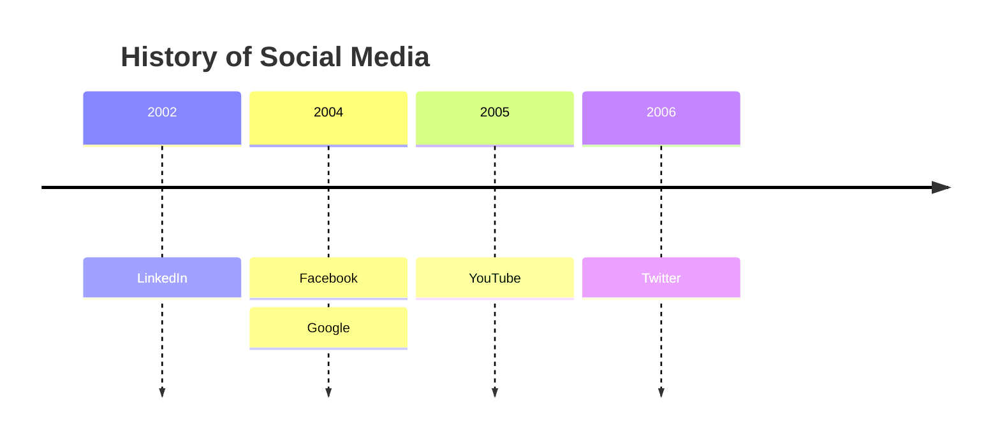
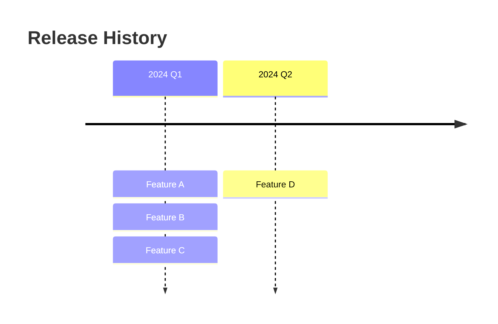
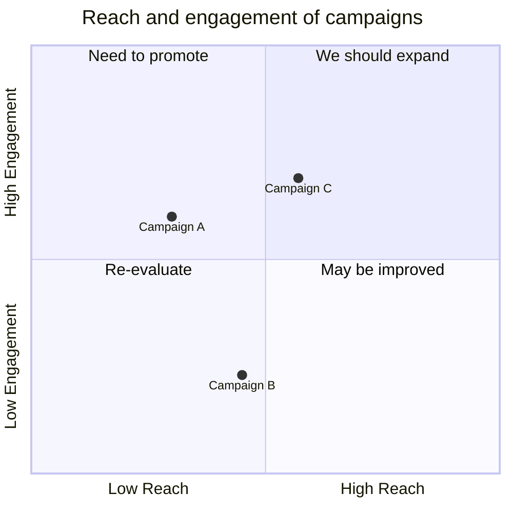

# Timeline, Quadrant Charts, and Radar Charts

## Timeline Diagrams

Chronological event sequences organized by time periods.

### Basic Syntax



- `title` — Optional chart title
- Each line: `{time period} : {event}` or multiple events per period with additional `:`
- Both time periods and events are plain text (not limited to numbers)

### Multiple Events Per Period



## Quadrant Charts

Two-axis data plotting divided into four quadrants.

### Basic Syntax



### Axis Labels

- `x-axis <left text> --> <right text>` — Both labels
- `x-axis <text>` — Left label only
- `y-axis <bottom text> --> <top text>` — Both labels
- `y-axis <text>` — Bottom label only

### Points

- Format: `Point Name: [x, y]`
- x and y values range from **0 to 1**

## Radar Charts

Multi-variable data comparison using radial axes.

### Basic Syntax

```mermaid
radar
  title Skill Assessment
  axis Speed, Strength, Agility, Endurance, Accuracy
  alice: [85, 70, 90, 60, 75]
  bob: [70, 85, 65, 80, 90]
```

- `title` — Optional chart title
- `axis` — Comma-separated axis names
- Each data series: `name: [value1, value2, ...]`
- Values typically 0-100

### Configuration

- `max` — Maximum axis value (default: 100)
- `min` — Minimum axis value (default: 0)
- `size` — Chart size in pixels
