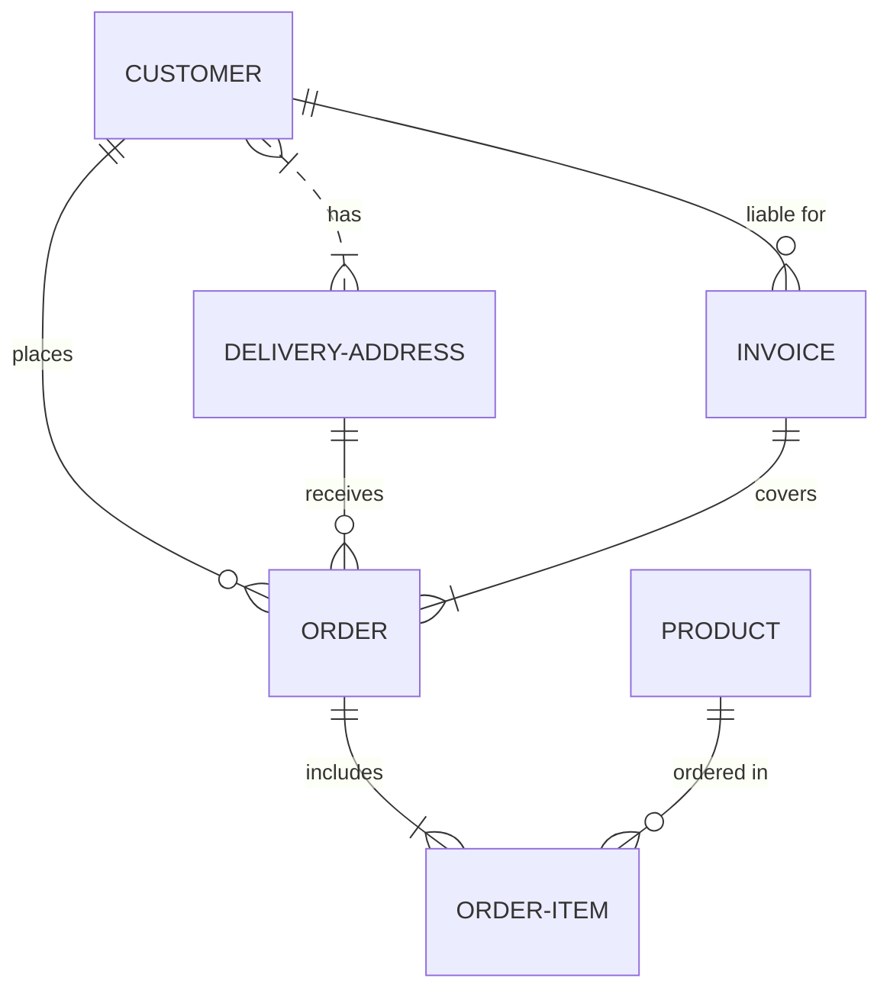
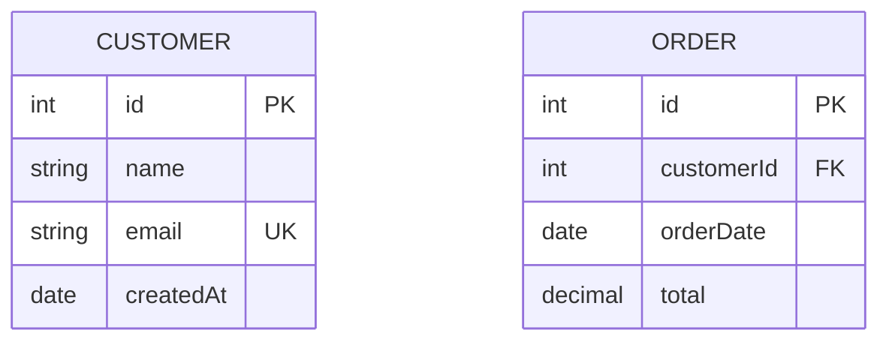
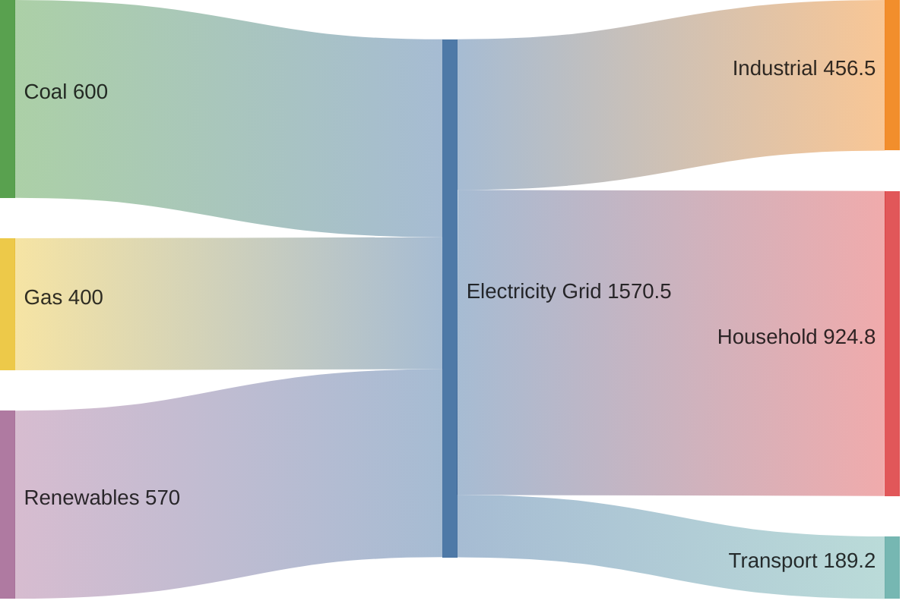

# ER Diagrams, Requirement Diagrams, and Sankey Diagrams

## Entity Relationship Diagrams

Database entity models with relationships and attributes.

### Basic Syntax



### Relationship Types

- `||--o{` — One to many (mandatory one)
- `}|..|{` — Zero or many to zero or many
- `||--||` — One to one
- `}o--o{` — Zero or many to zero or many
- `||--|{` — One to many (optional many)
- `}|--||` — Many to one

Cardinality symbols: `||` (one), `}{` (many), `o|` (zero or one), `0{` (zero or many).

Line styles: `--` (solid), `..` (dotted).

### Entity Attributes



Attribute types: `int`, `string`, `date`, `datetime`, `decimal`, `bool`.

Keys: `PK` (primary key), `FK` (foreign key), `UK` (unique key).

## Requirement Diagrams

Software requirements tracking with hierarchies and traceability.

### Basic Syntax

```mermaid
requirementDiagram
  requirement userAuth {
    id: 1
    name: User Authentication
    description: Users must be able to authenticate
    type: functional
  }

  functionalRequirement login {
    id: 2
    name: Login
    description: Users can login with email and password
  }

  userAuth <- traces-to - login
```

### Element Types

- `requirement` — Generic requirement
- `functionalRequirement` — Functional requirement
- `performanceRequirement` — Performance requirement
- `designConstraint` — Design constraint
- `interfaceRequirement` — Interface requirement
- `physicalRequirement` — Physical requirement
- `designRequirement` — Design requirement

### Relationships

- `traces-to` — Traces to
- `derived-from` — Derived from
- `satisfies` — Satisfies
- `conflicts` — Conflicts with

Syntax: `elementA <- traces-to - elementB` or `elementA --> elementB`.

### Containment

```mermaid
requirementDiagram
  requirement systemReq { id: 1 }
  container subsystem {
    requirement subReq1 { id: 2 }
    requirement subReq2 { id: 3 }
  }
  systemReq <-- contains -- subsystem
```

## Sankey Diagrams

Flow and proportion visualization showing how values move between categories.

### Basic Syntax



- Source,Target,Value format (comma-separated)
- Values are numeric
- Node names can contain spaces
- Flows are rendered proportionally to their values
