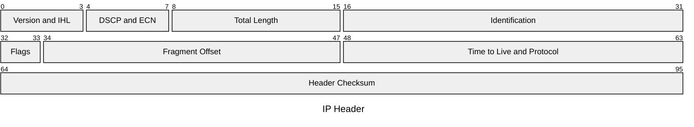
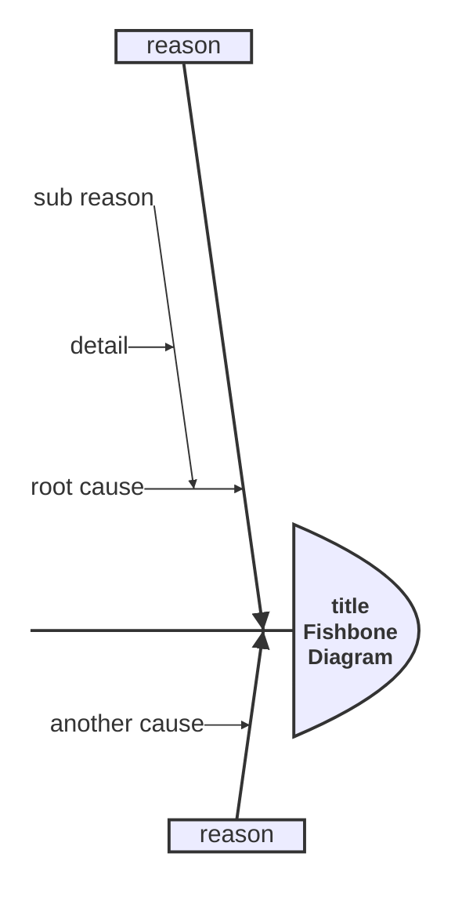
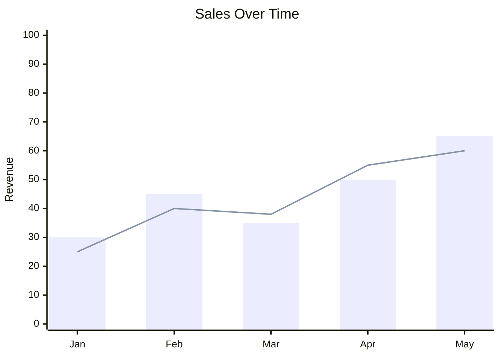

# Packet Diagrams, Ishikawa Diagrams, Event Modeling, and XY Charts

## Packet Diagrams

Network packet structure visualization.

### Basic Syntax



- Format: `startBit-endBit: "Field Name"`
- Bits are 0-indexed
- Fields render as proportional segments

## Ishikawa Diagrams (Fishbone / Cause-Effect)

Root cause analysis diagrams.

### Basic Syntax



- Indentation defines hierarchy
- Top-level items are main categories (bones)
- Nested items are sub-causes

## Event Modeling Diagrams

Domain event flow visualization.

### Basic Syntax

```mermaid
eventDiagram
  title Event Storming Example
  domainEvent OrderPlaced
  command PlaceOrder
  command PlaceOrder --> OrderPlaced
  policy If OrderPlaced then SendConfirmation
```

- `domainEvent` — Domain events (typically past tense)
- `command` — Commands (imperative)
- `policy` — Business policies/rules
- Relationships with `-->`

## XY Charts (Beta)

Scatter, line, and bar charts.

### Basic Syntax



- `title` — Chart title
- `x-axis` — Categories (string array) or numeric range
- `y-axis` — Label and range (`min --> max`)
- `bar` — Bar series
- `line` — Line series
- `circle` — Scatter/point series

### Multiple Series

```mermaid
xychart-beta
  title "Comparison"
  x-axis [Q1, Q2, Q3, Q4]
  y-axis "Value" 0 --> 100
  bar [40, 60, 55, 70]
  bar [30, 50, 45, 65]
  line [35, 55, 50, 68]
```


