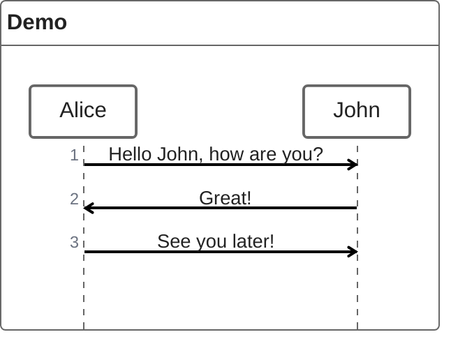
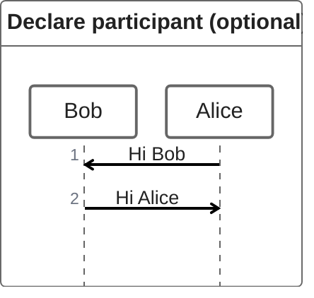
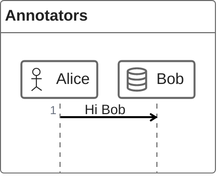

# ZenUML Sequence Diagrams

ZenUML provides an alternative syntax for sequence diagrams with different participant declaration and annotator support.

## Basic Syntax

## Participants

Declare participants explicitly to control display order:

## Annotators

Use `@AnnotatorName` to assign UML symbols to participants:

Available annotators include: `Actor`, `Boundary`, `Control`, `Entity`, `Database`, `Collections`, `Queue`, and others matching standard UML participant stereotypes.

## Differences from Standard Sequence Diagrams

- Uses `zenuml` keyword instead of `sequenceDiagram`
- Participants declared as simple names (no `participant` keyword required)
- Annotators use `@Name` prefix syntax
- Message arrow syntax is similar but not identical to standard sequence diagrams
