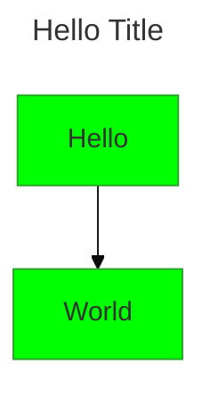
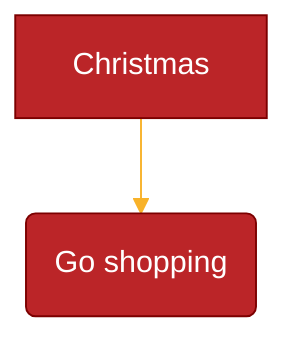
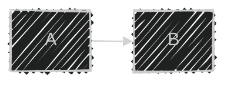

# Configuration and Theming

## Configuration Sources

Mermaid configuration comes from three sources, applied in order:

1. **Default configuration** — Built-in defaults
2. **Site-level (`siteConfig`)** — Set via `mermaid.initialize()`, applies to all diagrams
3. **Diagram-level** — Frontmatter config (v10.5.0+) or directives (deprecated)

## Frontmatter Config (Recommended)

YAML block at the top of diagram code:



The entire mermaid configuration (except secure configs) can be overridden.

## Directives (Deprecated since v10.5.0)

Legacy `%%{init: { ... }}%%` syntax. Use frontmatter instead:

```
%%{init: { "theme": "forest", "fontFamily": "monospace" } }%%
graph LR
  A --> B
```

## mermaid.initialize()

Site-wide configuration (called once):

```javascript
mermaid.initialize({
  startOnLoad: true,
  theme: 'default',
  securityLevel: 'strict',
  fontFamily: 'trebuchet ms, verdana, arial',
  fontSize: 16,
});
```

### Key Initialize Options

- `startOnLoad` — Auto-render on page load (boolean)
- `theme` — Theme name (string)
- `securityLevel` — Trust level: `'strict'`, `'antiscript'`, `'loose'`, `'sandbox'`
- `logLevel` — Logging: 0 (fatal), 1 (error), 2 (warn), 3 (info), 4 (debug), 5 (trace)
- `fontFamily` — Font stack
- `fontSize` — Font size in pixels
- `htmlLabels` — Use HTML labels (boolean)
- `flowchart` — Flowchart-specific config
- `sequence` — Sequence diagram config
- `gantt` — Gantt chart config

## mermaid.run() (v10+)

Preferred API for complex integrations:

```javascript
mermaid.initialize({ startOnLoad: false });

// Render specific elements
await mermaid.run({
  querySelector: '.my-diagrams',
});

// Render specific nodes
await mermaid.run({
  nodes: [document.getElementById('diagram1')],
});

// Suppress errors
await mermaid.run({
  suppressErrors: true,
});
```

## Themes

Five built-in themes:

- **default** — Standard Mermaid colors
- **neutral** — Black and white, print-friendly
- **dark** — Dark mode compatible
- **forest** — Green shades
- **base** — Minimal, the only customizable theme

### Customizing Themes

Use `base` theme with `themeVariables`:



### Theme Variables

**General:**

- `darkMode` — Affects derived color calculations (boolean)
- `background` — Background color (default: `#f4f4f4`)
- `fontFamily` — Font family
- `fontSize` — Font size
- `primaryColor` — Node background (default: `#fff4dd`)
- `primaryTextColor` — Text on primary nodes
- `secondaryColor` — Derived from primary
- `tertiaryColor` — Derived from primary
- `lineColor` — Edge/line color
- `textColor` — General text color
- `noteBkgColor` — Note background
- `noteTextColor` — Note text color
- `errorBkgColor` — Error message background

**Flowchart-specific:**

- `nodeBorder` — Node border color
- `clusterBkg` — Subgraph background
- `clusterBorder` — Subgraph border
- `defaultLinkColor` — Default edge color
- `titleColor` — Title text color
- `edgeLabelBackground` — Edge label background
- `nodeTextColor` — Text inside nodes

**Sequence diagram-specific:**

- `actorBkg` — Actor background
- `actorBorder` — Actor border
- `actorTextColor` — Actor text
- `signalColor` — Signal line color
- `activationBkgColor` — Activation bar fill
- `activationBorderColor` — Activation bar border
- `labelBoxBkgColor` — Label box fill
- `sequenceNumberColor` — Sequence number color

**Pie diagram-specific:**

- `pie1` through `pie12` — Slice colors
- `pieTitleTextSize` / `pieTitleTextColor` — Title styling
- `pieSectionTextSize` / `pieSectionTextColor` — Section label styling
- `pieStrokeColor` / `pieStrokeWidth` — Slice borders
- `pieOuterStrokeColor` / `pieOuterStrokeWidth` — Outer circle border
- `pieOpacity` — Slice opacity (default: 0.7)

> **Note**: The theming engine only recognizes hex colors (`#ff0000`), not color names (`red`).

## Security Levels

- **strict** (default) — HTML tags encoded, click disabled
- **antiscript** — HTML allowed except `<script>`, click enabled
- **loose** — Full HTML and click enabled
- **sandbox** — Rendering in sandboxed iframe (beta)

```javascript
mermaid.initialize({ securityLevel: 'loose' });
```

## Layout Configuration



- `layout` — `dagre` (default) or `elk`
- `look` — `classic` (default) or `handDrawn`
- ELK node placement strategies: `SIMPLE`, `NETWORK_SIMPLEX`, `LINEAR_SEGMENTS`, `BRANDES_KOEPF` (default)
