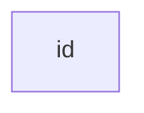
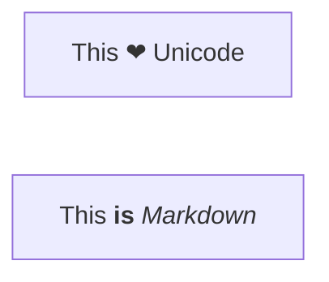
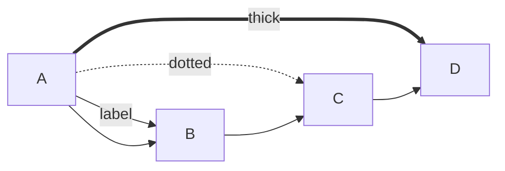
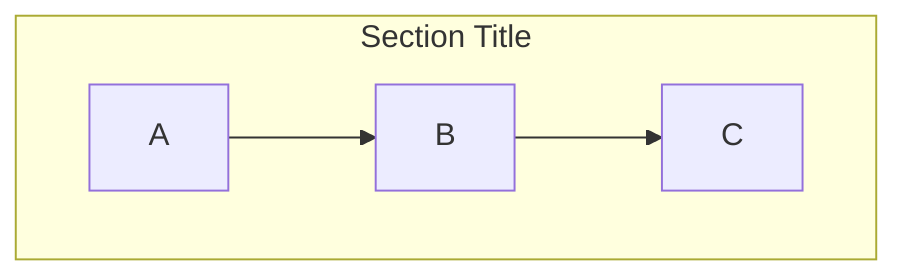
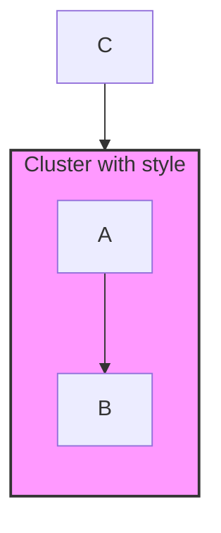
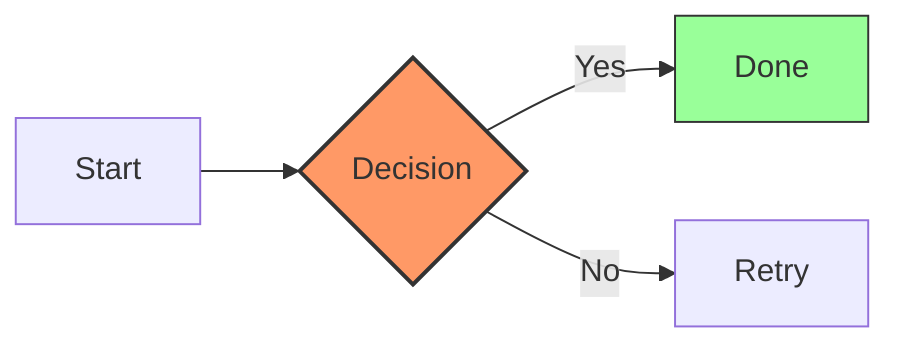
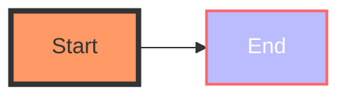
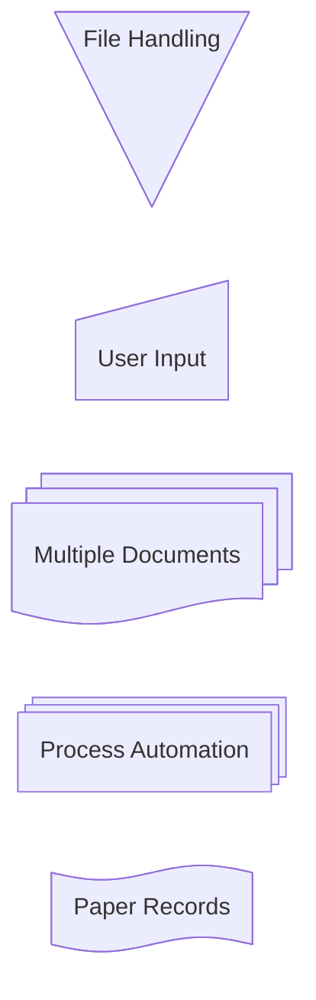

# Flowchart Syntax

Flowcharts are composed of **nodes** (geometric shapes) and **edges** (arrows or lines).

## Basic Structure

Directions: `TB` (top-down), `TD` (top-down same as TB), `BT` (bottom-top), `RL` (right-left), `LR` (left-right)

> Tip: `graph` can be used instead of `flowchart`.

> Warning: The word "end" in all lowercase breaks flowcharts. Use "End" or "END".
> Warning: "o" or "x" as first letter of a connected node creates circle/cross edges. Add space before (e.g., "dev--- ops").

## Node Shapes

| Syntax | Shape | Example |
|---|---|---|
| `id` | Rectangle (default) | `A` |
| `id[Text]` | Rounded rectangle | `id1[This is text]` |
| `id(Round)` | Round edges | `id1(This is round)` |
| `id([Stadium])` | Stadium | `id1([Stadium shape])` |
| `id[[Subroutine]]` | Subroutine | `id1[[Subroutine]]` |
| `id[(Database)]` | Cylinder/Database | `id1[(Database)]` |
| `id((Circle))` | Circle | `id1((Circle text))` |
| `id{Diamond}` | Rhombus/Decision | `id1{{Decision?}}` |
| `id{{Hexagon}}` | Hexagon | `id1{{Hexagon}}` |
| `id1>Input]` | Asymmetric (lean right) | `id1>Input text]` |
| `id1[/Parallelogram/]` | Parallelogram | `id1[/Data/]` |
| `id1[\\Parallelogram alt\]` | Parallelogram alt | `B[\\Text\]` |
| `A[/Trapezoid\\]` | Trapezoid | `A[/Christmas\\]` |
| `B[\\Trapezoid alt/]` | Trapezoid alt | `B[\\Go shopping/]` |
| `id1(((Double circle)))` | Double circle | `id1(((Double)))` |

### Unicode & Markdown in Labels

## Edges (Connections)

| Syntax | Arrow Type |
|---|---|
| `A --> B` | Solid arrow |
| `A --- B` | Dashed line |
| `A ==> B` | Thick arrow |
| `A -.-> B` | Dotted line |
| `A -.- B` | Dotted with space |
| `A ~~> B` | Curved arrow |
| `A == Link == B` | Bidirectional thick |
| `A <===> B` | Bidirectional solid |
| `A <== B` | Left-pointing arrow |
| `A ==> B` | Right-pointing arrow |
| `A -- Text --> B` | Labeled edge |
| `A -.->|label| B` | Dotted with label |
| `A == Label == B` | Thick bidirectional label |

### Arrowhead Types

Append to the arrow head: `o` (circle), `x` (cross), `o-x` (combined)

## Subgraphs

Subgraphs can be nested and styled:

## Styling Nodes & Edges

### Class-based Styling

### Inline Styling

## New Shapes in v11.3.0+

Mermaid introduced 30+ new shapes using the `@{ shape: name }` syntax:

### Shape Reference Table (v11.3.0+)

| Shape Name | Short Name | Description |
|---|---|---|
| `rect` | `proc`, `process`, `rectangle` | Standard process |
| `rounded` | `event` | Event/rounded rectangle |
| `stadium` | `pill`, `terminal` | Terminal point |
| `subproc` | `framed-rectangle`, `subroutine` | Subprocess |
| `cyl` | `cylinder`, `database`, `db` | Database storage |
| `circle` | `circ`, `start`, `small-circle` | Start point |
| `diamond` | `decision`, `question` | Decision step |
| `hex` | `hexagon`, `prepare` | Prepare/condition |
| `cloud` | — | Cloud shape |
| `bolt` | `com-link`, `lightning-bolt` | Communication link |
| `brace` / `brace-r` / `braces` | — | Comment/curly brace |
| `doc` / `document` | — | Document |
| `docs` / `st-doc` / `stacked-document` | — | Multiple documents |
| `lin-cyl` / `disk` | — | Disk storage |
| `h-cyl` / `das` | — | Direct access storage |
| `lin-rect` / `shaded-process` | — | Lined process |
| `st-rect` / `procs` / `processes` | — | Multiple processes |
| `div-rect` / `div-proc` | — | Divided process |
| `bow-rect` / `stored-data` | — | Stored data |
| `tag-rect` / `tag-proc` | — | Tagged process |
| `lin-doc` / `lined-document` | — | Lined document |
| `notch-rect` / `card` / `notched-rectangle` | — | Card shape |
| `curv-trap` / `display` | — | Curved trapezoid/display |
| `notch-pent` / `loop-limit` | — | Loop limit step |
| `sl-rect` / `manual-input` | — | Manual input |
| `trap-t` / `inv-trapezoid` / `manual` | — | Manual task |
| `trap-b` / `priority` / `trapezoid` | — | Priority action |
| `flip-tri` / `manual-file` | — | Manual file |
| `tri` / `extract` | — | Extraction |
| `fork` / `join` | — | Fork/join in process flow |
| `win-pane` / `internal-storage` | — | Internal storage |
| `f-circ` / `filled-circle`, `junction` | — | Junction point |
| `cross-circ` / `summary` | — | Summary |
| `tag-doc` / `tagged-document` | — | Tagged document |
| `delay` / `half-rounded-rectangle` | — | Delay |
| `odd` | — | Odd shape |
| `text` / `text-block` | — | Text block |

Usage: `Node@{ shape: name, label: "Text" }`
