# Sequence Diagram Syntax

A Sequence diagram shows how processes operate with one another and in what order.

## Basic Example

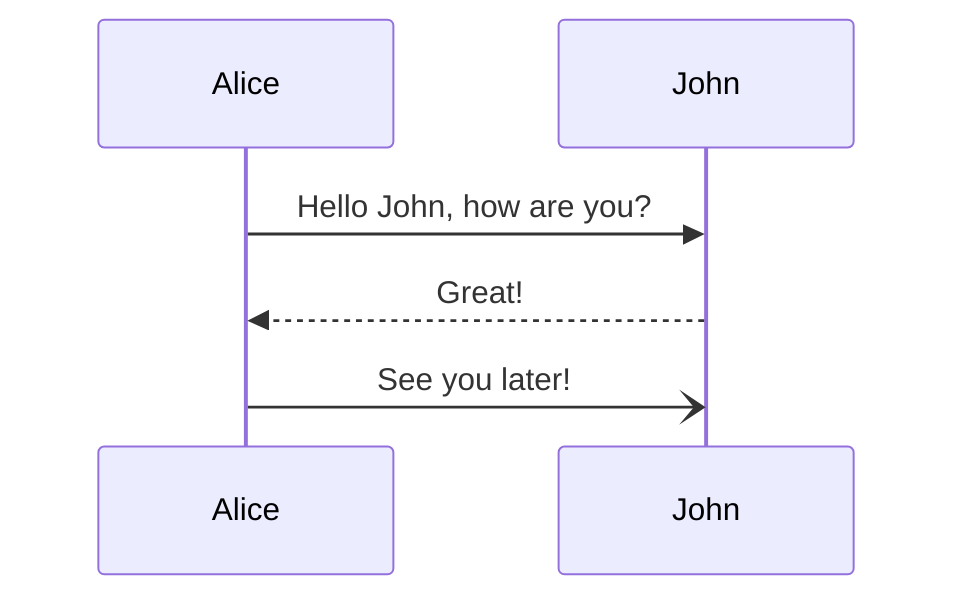

> Warning: The word "end" could break the diagram. Use parentheses, quotes, or brackets to enclose it.

## Participants

### Implicit Participants

Participants render in order of appearance in messages:

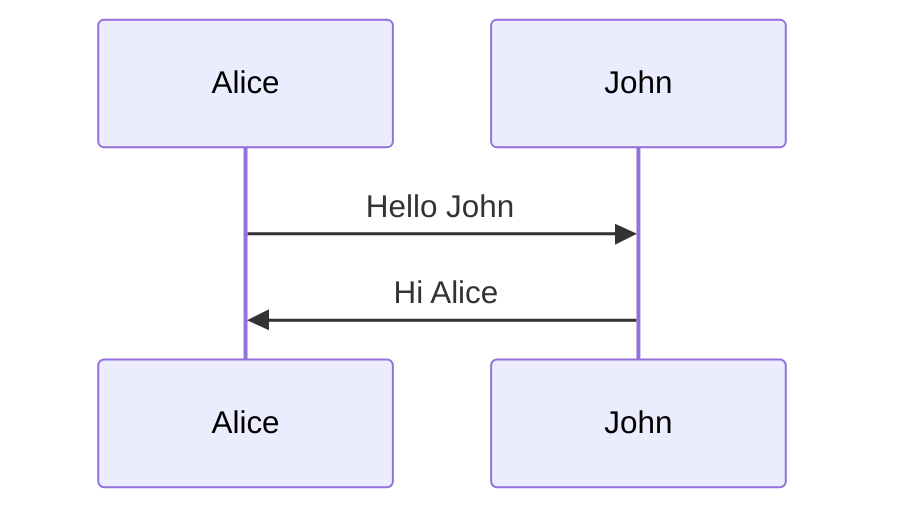

### Explicit Participant Declaration

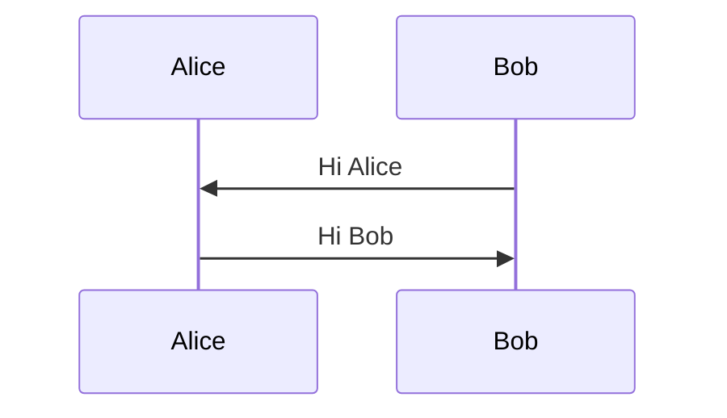

### Actor Types

Use `actor` keyword for actor symbols instead of rectangles:

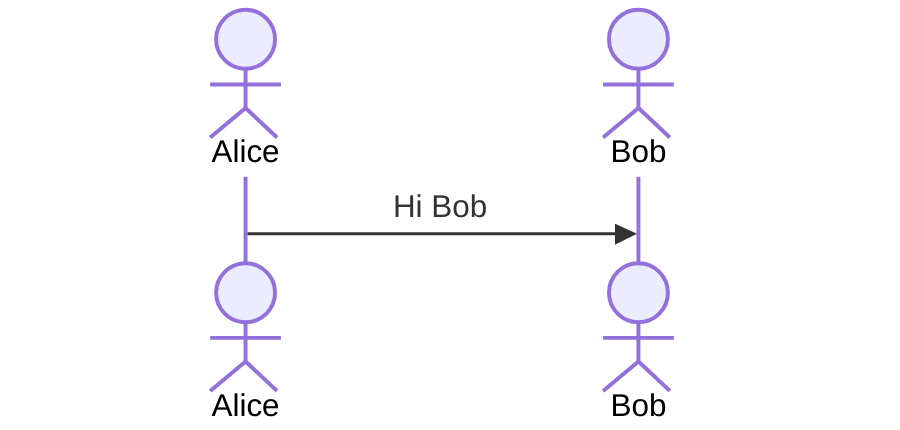

### Participant Stereotypes (v10+)

Use JSON configuration for specialized participant shapes:

| Type | Syntax |
|---|---|
| Boundary | `participant Alice@{ "type" : "boundary" }` |
| Control | `participant Alice@{ "type" : "control" }` |
| Entity | `participant Alice@{ "type" : "entity" }` |
| Database | `participant Alice@{ "type" : "database" }` |
| Collections | `participant Alice@{ "type" : "collections" }` |
| Queue | `participant Alice@{ "type" : "queue" }` |

### Aliases

**External alias syntax:**
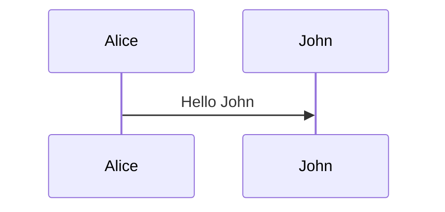

**Inline alias syntax:**
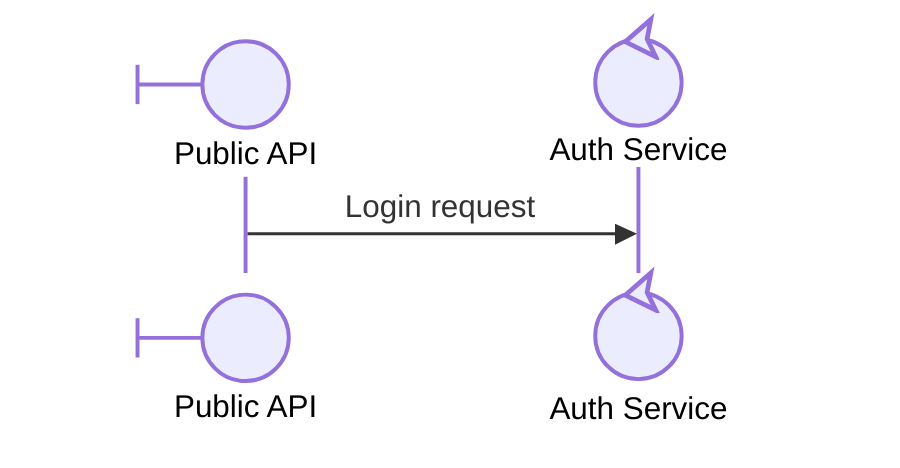

**Combined (external alias takes precedence):**
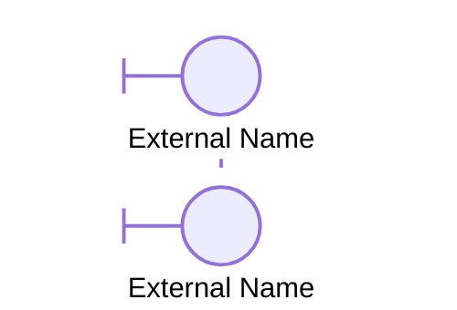

### Actor Creation & Destruction (v10.3.0+)

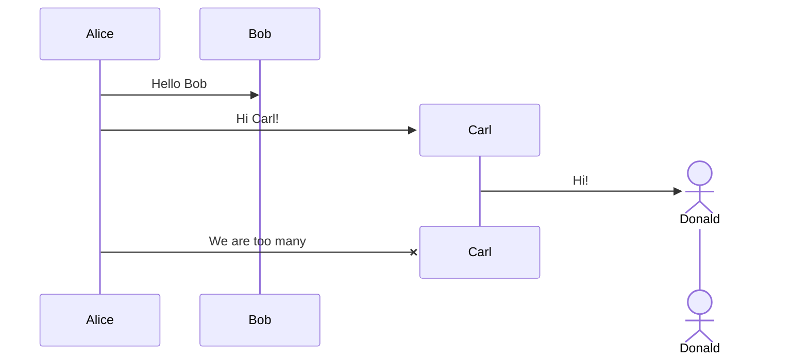

## Messages

| Syntax | Type |
|---|---|
| `A->>B: msg` | Solid open arrow (async) |
| `A->B: msg` | Solid filled arrow |
| `A-->>B: msg` | Dashed open arrow |
| `A-->B: msg` | Dashed filled arrow |
| `A->>B` | Arrow without text |
| `A-)B: msg` | Dotted open arrow (async) |
| `A->)B: msg` | Dotted filled arrow |
| `A-x>>B: msg` | Cross return arrow |
| `A--)B: msg` | Dashed cross return |
| `A Note right of B: text` | Note on right |
| `A Note left of B: text` | Note on left |
| `Note right of B: text` | Note without participant |
| `Note over A,B: text` | Note over both participants |

### Notes

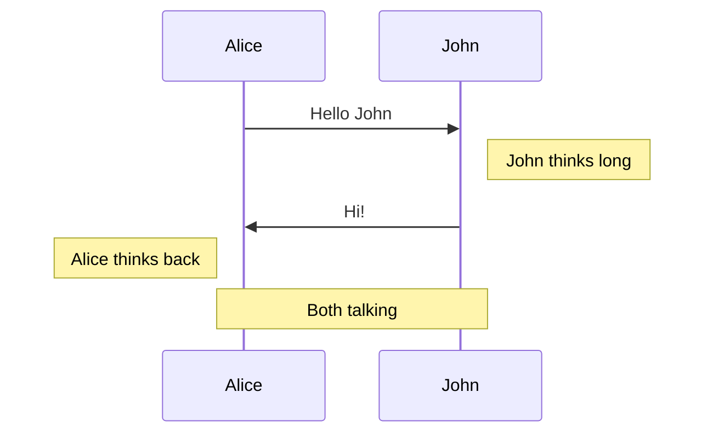

## Grouping / Boxes

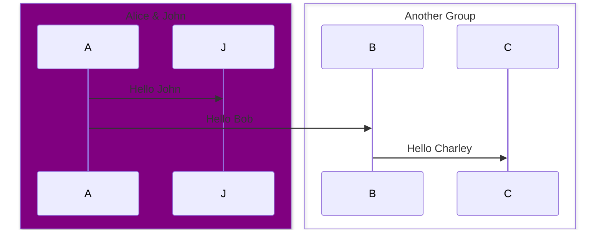

Box colors: `box Purple Title`, `box rgb(33,66,99)`, `box rgba(33,66,99,0.5)`, `box transparent Title`

## Auto-Activate / Deactivate

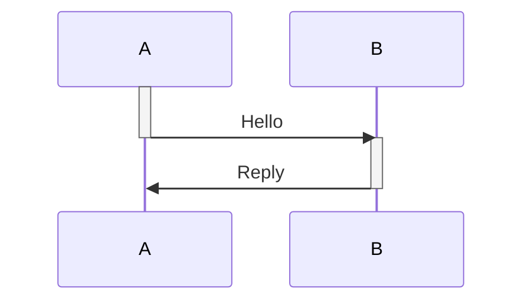

Multiple activations (nesting):

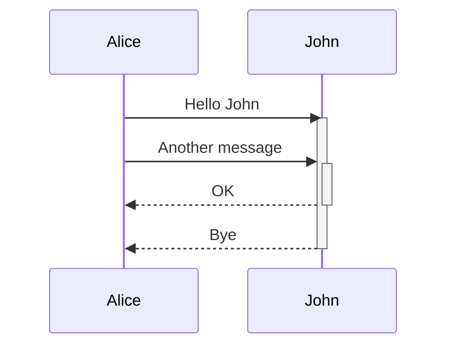

## Self-References

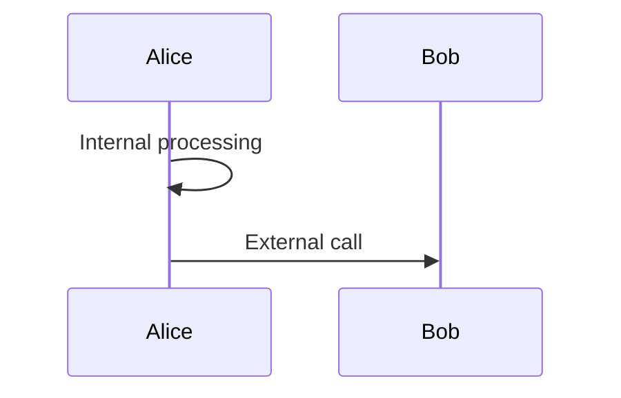

## Sequence Numbers

Enable with config: `sequence: { showSequenceNumbers: true }`

## Wrapping Long Messages

Enable with config: `sequence: { wrap: true }`
