# Sequence Diagram Syntax

A Sequence diagram shows how processes operate with one another and in what order.

## Basic Example

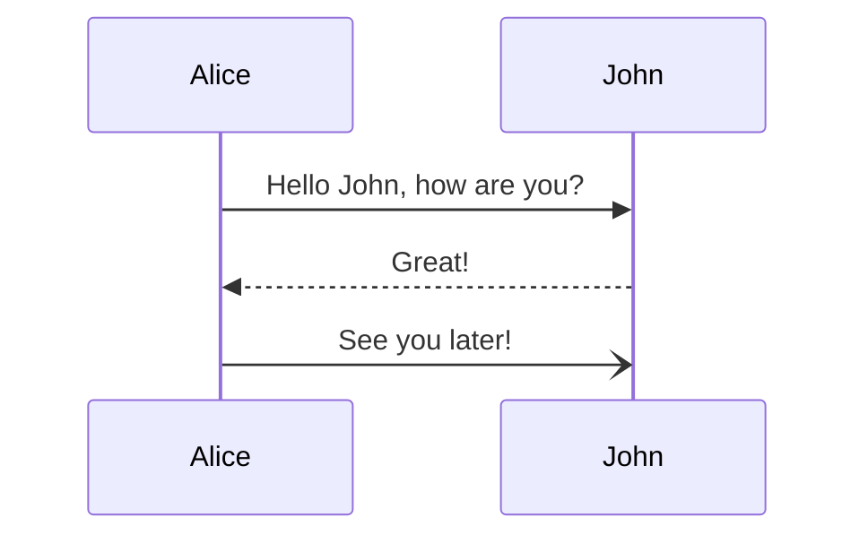

> Warning: The word "end" could break the diagram. Use parentheses, quotes, or brackets to enclose it.

## Participants

### Implicit Participants

Participants render in order of appearance in messages:

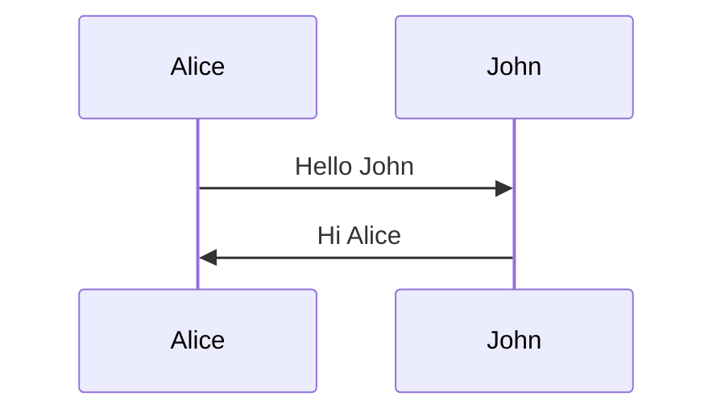

### Explicit Participant Declaration

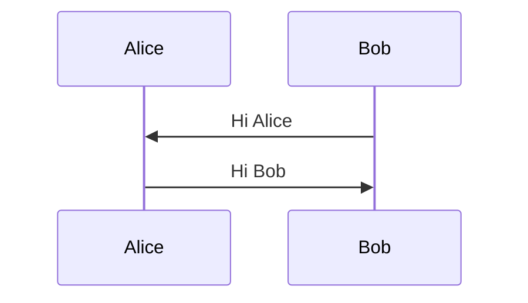

### Actor Types

Use `actor` keyword for actor symbols instead of rectangles:

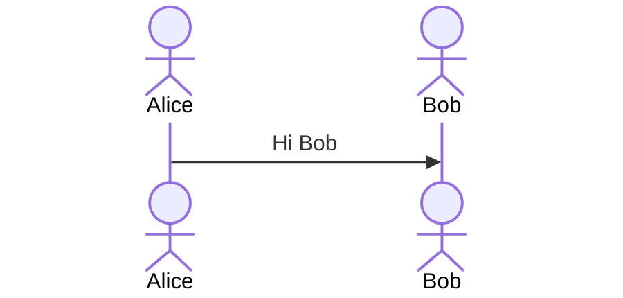

### Participant Stereotypes (v10+)

Use JSON configuration for specialized participant shapes:

| Type | Syntax |
|---|---|
| Boundary | `participant Alice@{ "type" : "boundary" }` |
| Control | `participant Alice@{ "type" : "control" }` |
| Entity | `participant Alice@{ "type" : "entity" }` |
| Database | `participant Alice@{ "type" : "database" }` |
| Collections | `participant Alice@{ "type" : "collections" }` |
| Queue | `participant Alice@{ "type" : "queue" }` |

### Aliases

**External alias syntax:**
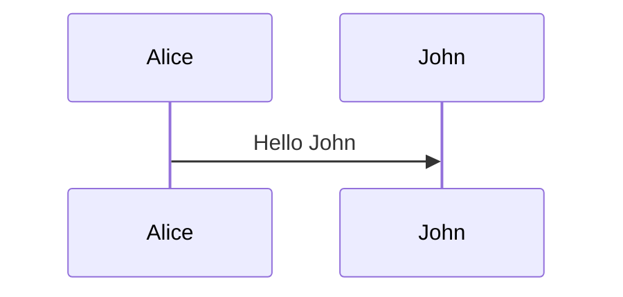

**Inline alias syntax:**
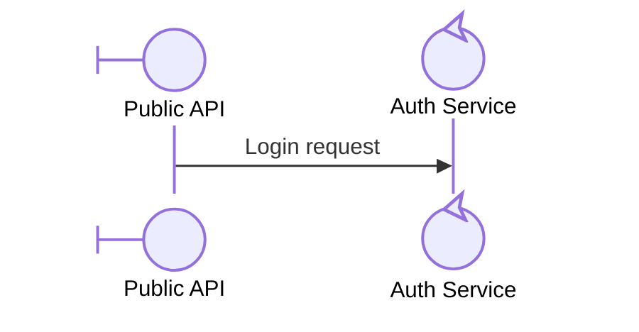

**Combined (external alias takes precedence):**
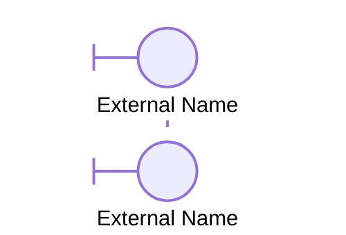

### Actor Creation & Destruction (v10.3.0+)

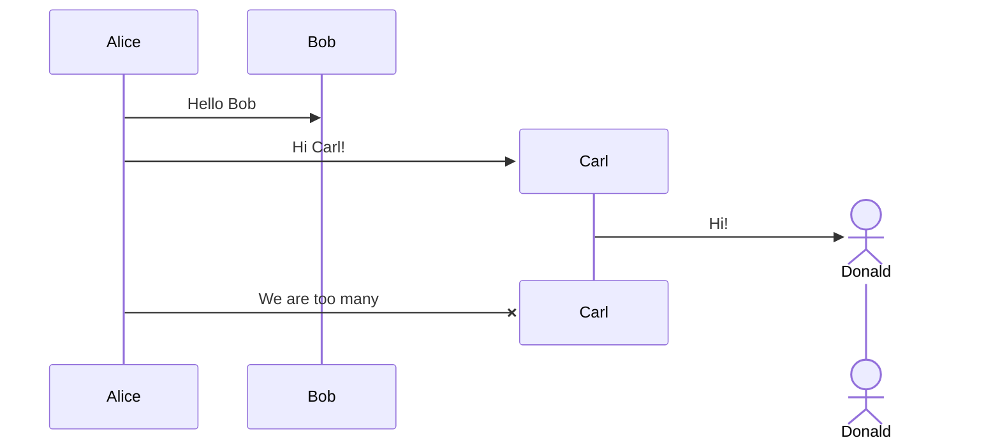

### Autonumber

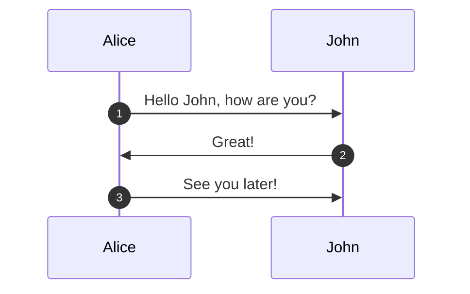

Autonumber can be customized with a range: `autonumber 10 5` (start at 10, increment by 5).

## Messages

| Syntax | Type |
|---|---|
| `A->>B: msg` | Solid open arrow (async) |
| `A->B: msg` | Solid filled arrow |
| `A-->>B: msg` | Dashed open arrow |
| `A-->B: msg` | Dashed filled arrow |
| `A->>B` | Arrow without text |
| `A-)B: msg` | Dotted open arrow (async) |
| `A->)B: msg` | Dotted filled arrow |
| `A-x>>B: msg` | Cross return arrow |
| `A--)B: msg` | Dashed cross return |

### Self-References

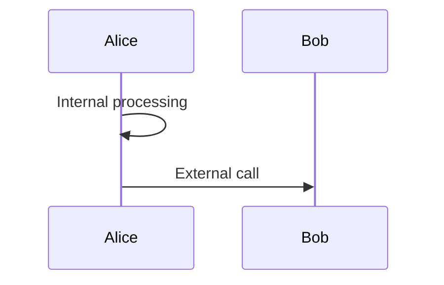

### Central Connections (v11.12.3+)

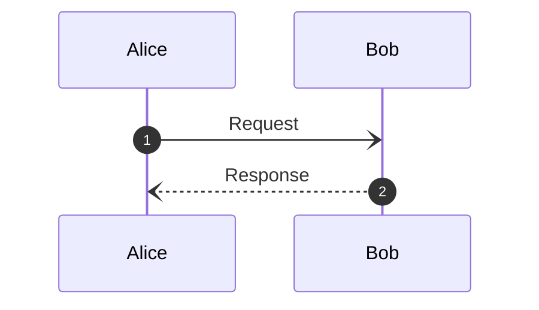

## Notes

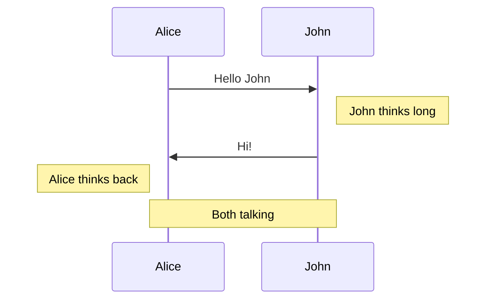

| Syntax | Position |
|---|---|
| `Note right of B: text` | Right side of participant |
| `Note left of B: text` | Left side of participant |
| `Note over A,B: text` | Spanning both participants |
| `A Note right of B: text` | From participant A, positioned right of B |

## Loops

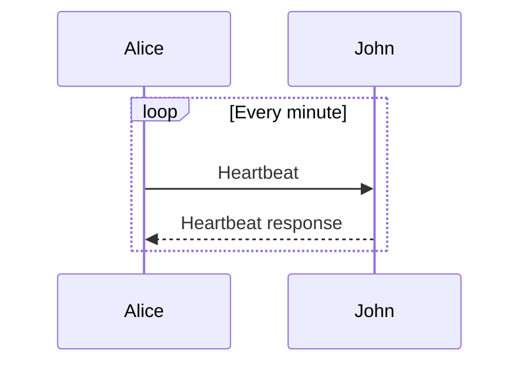

Can include condition: `loop if healthy`.

## Alt (Conditional)

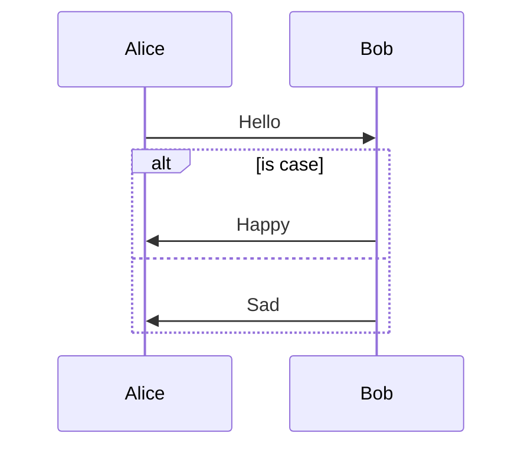

Multiple `else` branches supported:
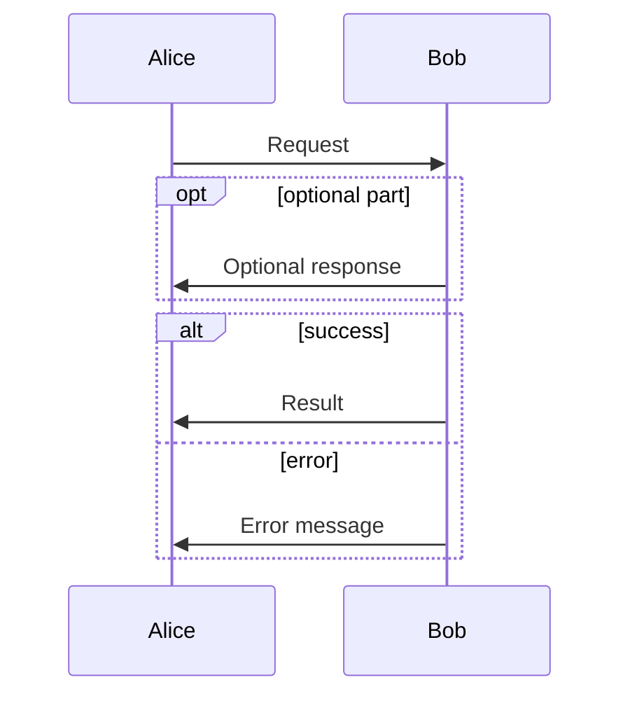

## Parallel (par)

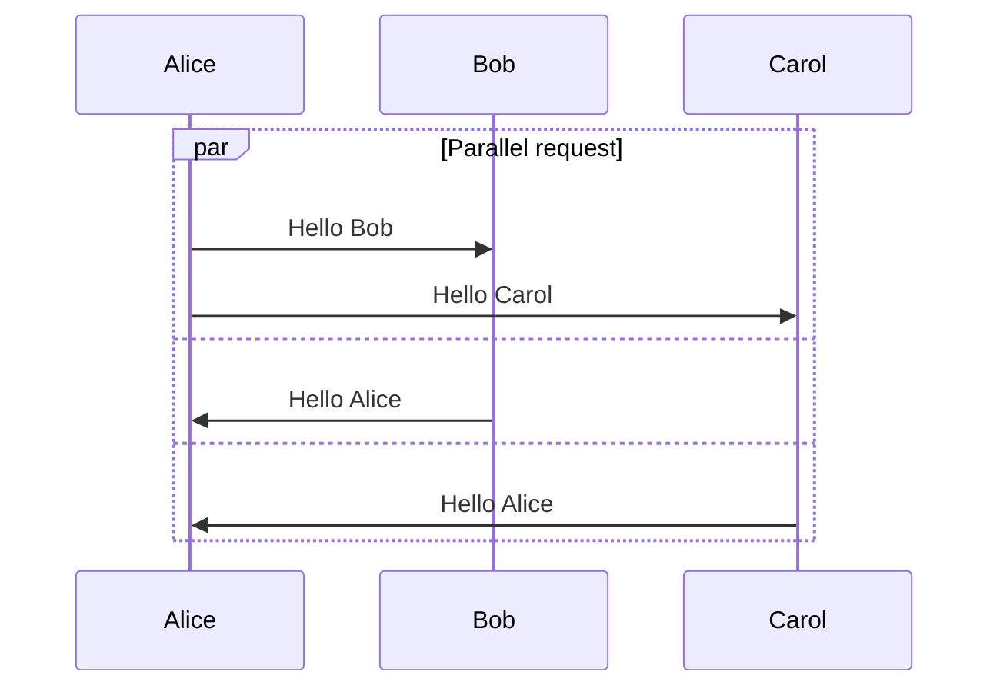

## Critical Region

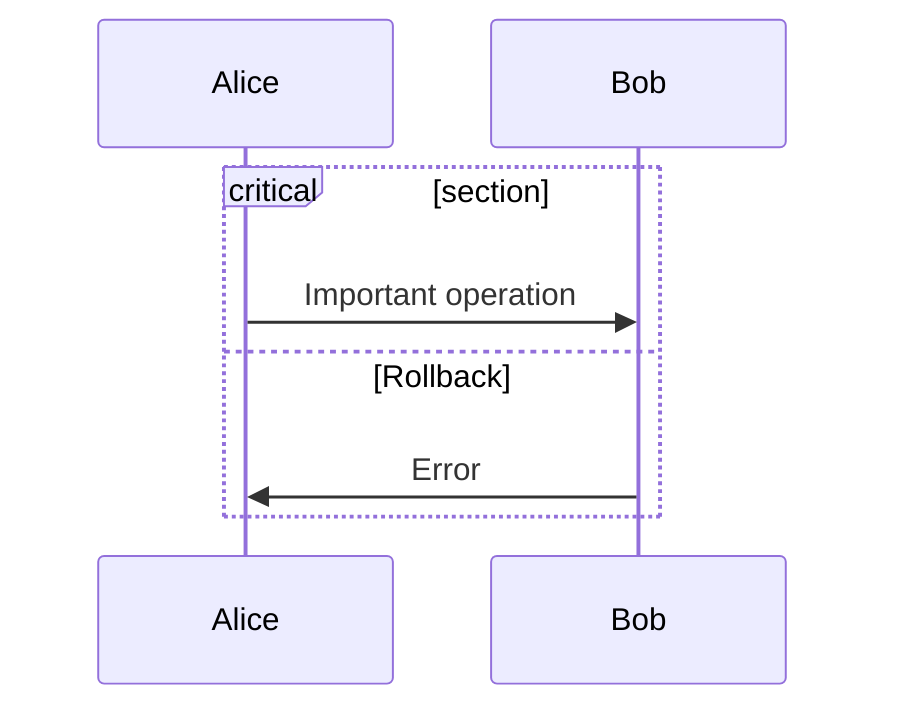

## Activations

### Auto-Activate/Deactivate

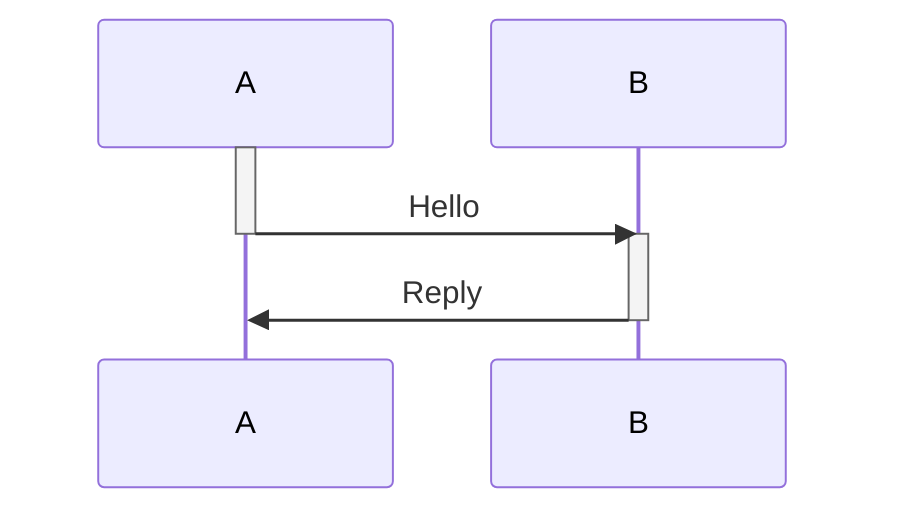

### Nested Activations

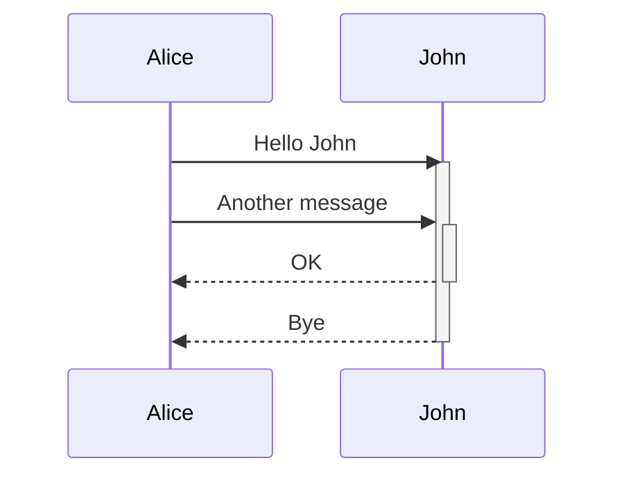

## Grouping / Boxes

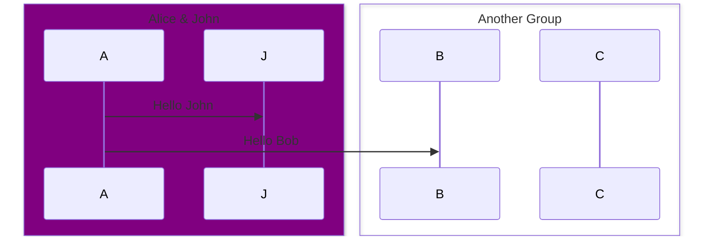

Box colors: `box Purple Title`, `box rgb(33,66,99)`, `box rgba(33,66,99,0.5)`, `box transparent Title`

## Comments

```mermaid
sequenceDiagram
    %% This is a comment
    Alice->>John: Hello John
    % Single-line comment
    John->>Alice: Hi
```

## Styling

### Class-based Styling

```mermaid
sequenceDiagram
    classDef active fill:#90EE90,stroke:#333,stroke-width:2px;
    classDef important stroke-dasharray: 5 5;
    Alice->>John: Hello
    John->>Alice: Hi
    class Alice,John active;
```

### Styling Activation Boxes

```mermaid
sequenceDiagram
    activate John
    Alice->>John: Hello
    deactivate John
    style activationBox1 fill:#f9f,stroke:#333
```

## Line Breaks in Messages

Use `<br/>` for line breaks:
```mermaid
sequenceDiagram
    Alice->>John: This is<br/>a multi-line message
```

## Configuration

```javascript
{
    sequence: {
        width: 200,
        height: 20,
        messageAlign: 'left' | 'center' | 'right',
        mirrorActors: true,
        useMaxWidth: false,
        rightAngles: true,
        showSequenceNumbers: false,
        wrap: false
    }
}
```

## Entity Codes for Special Characters

| Code | Character |
|---|---|
| `&lt;` | < |
| `&gt;` | > |
| `&amp;` | & |
| `&quot;` | " |
| `&#39;` | ' |
