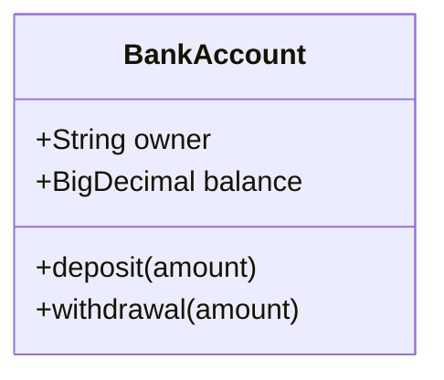
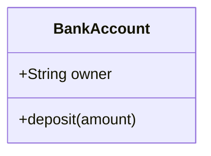
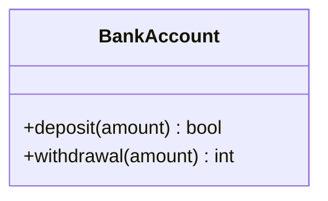
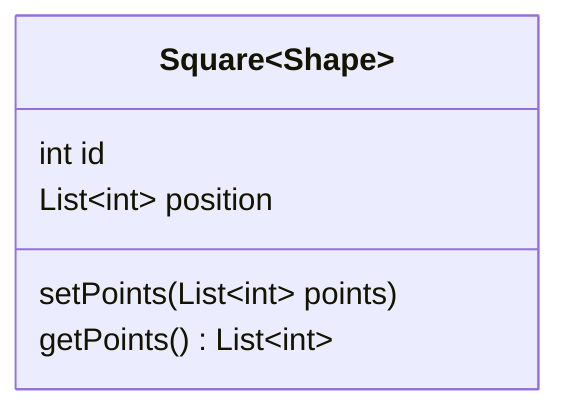
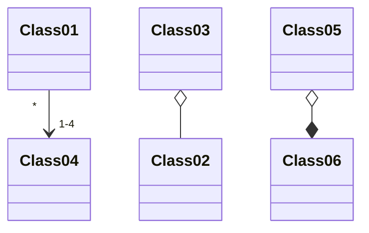
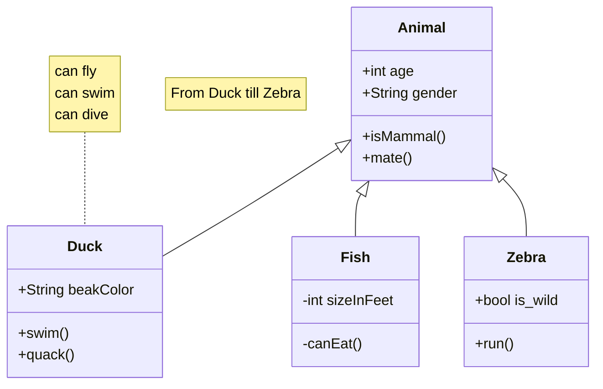
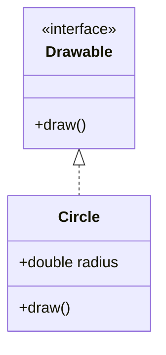
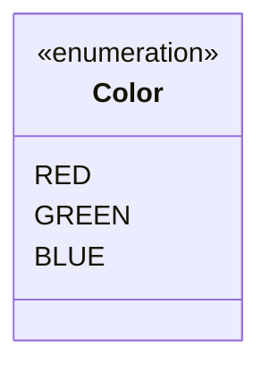

# Class Diagram Syntax

Class diagrams describe the structure of a system showing classes, attributes, operations, and relationships.

## Basic Class Definition



## Two Ways to Define Members

**Colon syntax (one at a time):**


**Brace syntax (grouped):**


## Visibility Modifiers

| Prefix | Meaning |
|---|---|
| `+` | Public |
| `-` | Private |
| `#` | Protected |
| `~` | Package/Internal |

## Class Member Classifiers

**Method classifiers** (after `()` or return type):
| Suffix | Meaning |
|---|---|
| `*` | Abstract e.g., `method()*` |
| `$` | Static e.g., `method()$` |

**Field classifiers** (at end):
| Suffix | Meaning |
|---|---|
| `$` | Static e.g., `String field$` |

## Return Types



## Generic Types

Use tilde `~` to denote generics:



> Note: Nested generics like `List<List<int>>` are supported. Generics with commas like `Map<K,V>` are not.

## Class Labels

```mermaid
classDiagram
    class Animal["Animal with a label"]
    class `Animal Class!`  --back:-- `Car Class`
```

## Relationships

| Syntax | Relationship |
|---|---|
| `A <|-- B` | Inheritance (B inherits A) |
| `A *-- B` | Composition |
| `A o-- B` | Aggregation |
| `A -- B` | Association |
| `A ..|> B` | Realization |
| `A ..> B` | Dependency |
| `A --> B` | General association |

### Cardinality



### Labels on Relationships

```mermer
classDiagram
    Class01 "1" <|--|"*" Class02 : extends
    Class03 *-- Class04 : contains
    Class05 "1" -->* "many" Class06
```

## Full Example



## Interfaces



## Enums


