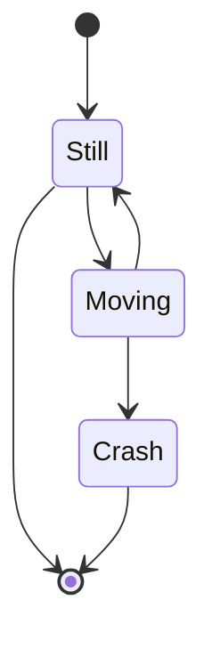
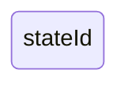
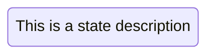
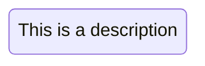
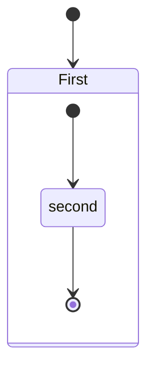
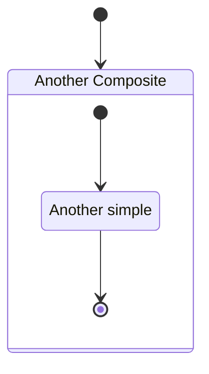
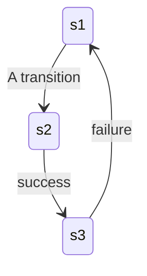
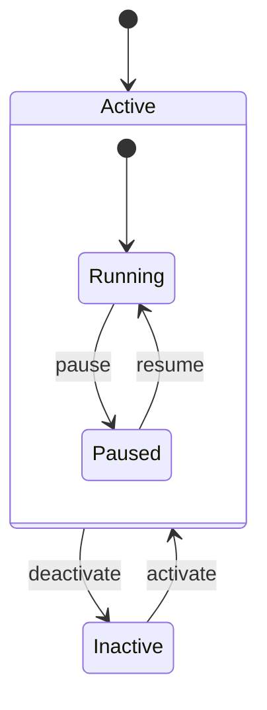
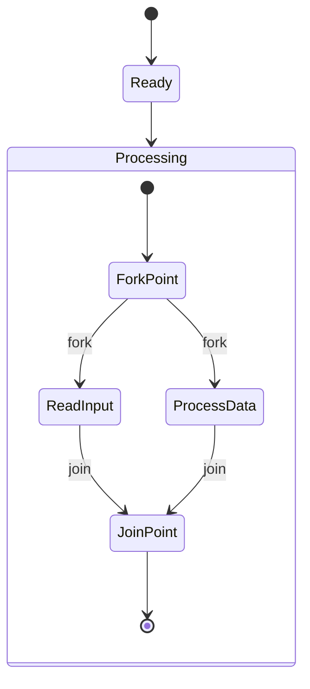

# State Diagram Syntax

State diagrams describe the behavior of systems in terms of states and transitions.

## Basic States & Transitions



> Note: `stateDiagram` (without `-v2`) is the older renderer. Use `stateDiagram-v2` for new diagrams.

## Declaring States

### Simple ID


### With Description (colon syntax)


### With State Keyword


## Start & End States

| Syntax | Meaning |
|---|---|
| `[*] --> s1` | Entry point |
| `s1 --> [*]` | Exit point |

## Composite (Nested) States



Named composite:


## Transitions with Labels



## Entry/Exit Actions



## Fork & Join



## Notes

```mermaid
stateDiagram-v2
    [*] --> State1
    State1 --> State2
    note right of State1 : This is a note
    note left of State2 : Another note
    note bottom of State2 : Third note
```

## Configuration

Sequence diagram-specific config:
```
sequence:
    width: number
    height: number
    messageAlign: left | center | right
    mirrorActors: boolean
    useMaxWidth: boolean
    rightAngles: boolean
    showSequenceNumbers: boolean
    wrap: boolean
```
