# State Diagram Syntax

State diagrams describe the behavior of systems in terms of states and transitions.

## Basic States & Transitions

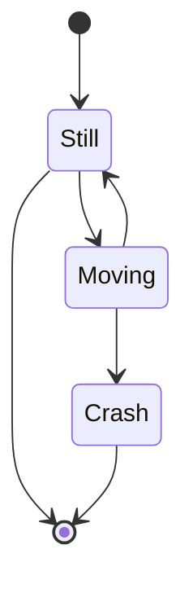

> Note: `stateDiagram` (without `-v2`) is the older renderer. Use `stateDiagram-v2` for new diagrams.

## Declaring States

### Simple ID
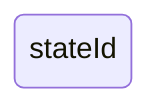

### With Description (colon syntax)
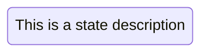

### With State Keyword
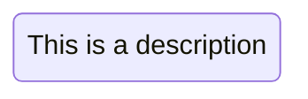

### Spaces in State Names

Use double quotes for names with spaces:
```mermaid
stateDiagram-v2
    "My State Name" : A state with spaces
```

## Setting Diagram Direction

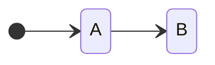

Supported directions: `TB`, `BT`, `LR`, `RL`.

## Start & End States

| Syntax | Meaning |
|---|---|
| `[*] --> s1` | Entry point |
| `s1 --> [*]` | Exit point |

## Composite (Nested) States

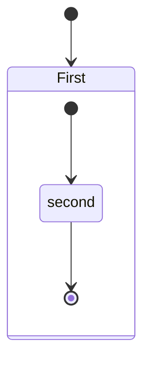

Named composite:
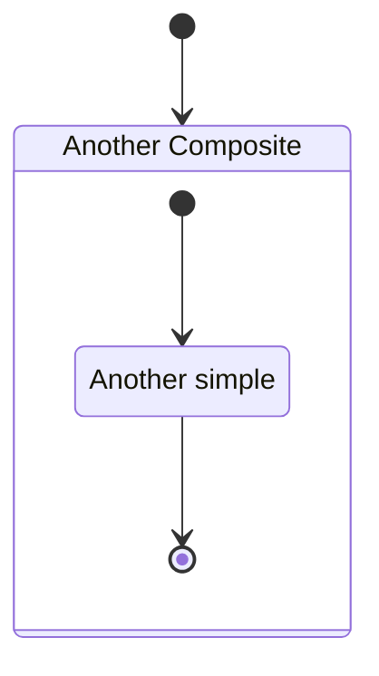

## Transitions with Labels

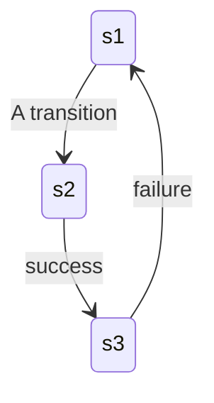

## Choice Nodes

Diamond-shaped decision points using `<<choice>>`:

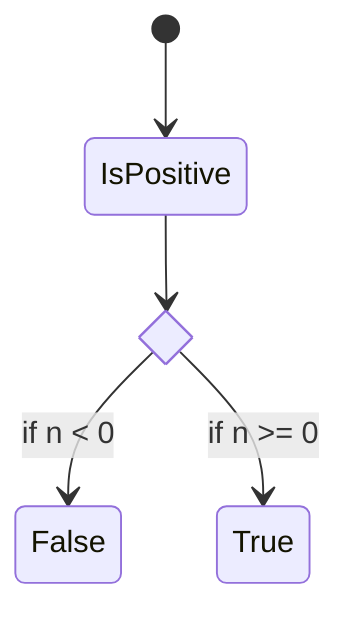

## Forks

Split execution into parallel paths:

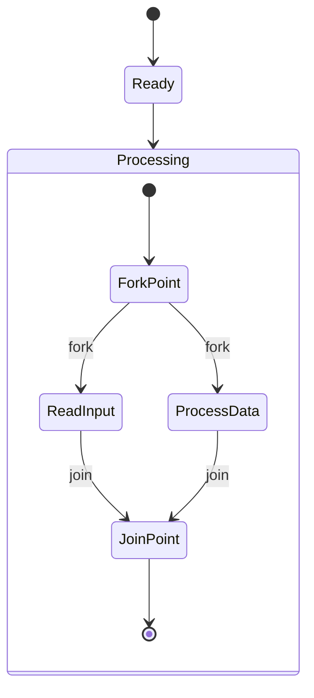

## Concurrency

Use `--` within composite states to define concurrent regions:

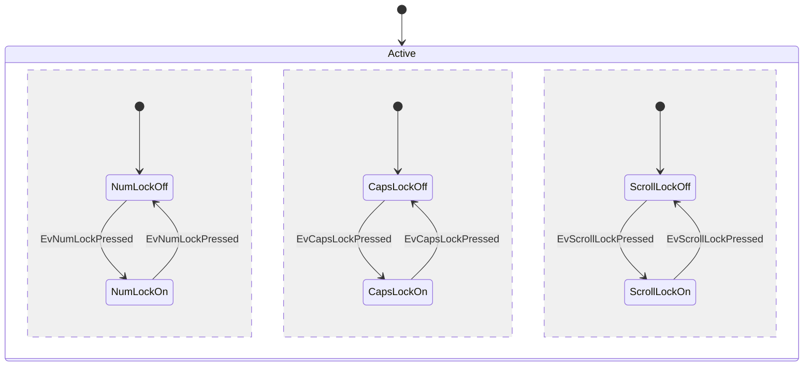

## Notes

```mermaid
stateDiagram-v2
    [*] --> State1
    State1 --> State2
    note right of State1 : This is a note
    note left of State2 : Another note
    note bottom of State2 : Third note
```

## Styling with classDefs

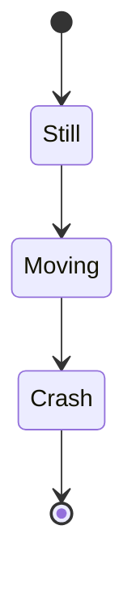

### classDef Syntax

```txt
classDef styleName property:value,property2:value2;
class state1,state2 styleName;
state :::styleName
```

**Limitations:**
- Cannot be applied to start/end states
- Cannot be applied within composite states

### Apply via `class` statement


### Apply via `:::` operator

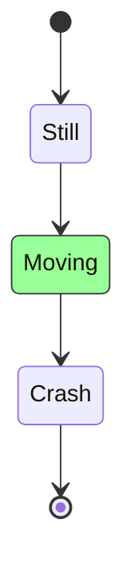

## Setting Diagram Direction


Supported directions: `TB`, `BT`, `LR`, `RL`.

## Comments

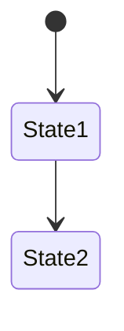

## Configuration

State diagram-specific config:
```
sequence:
    width: number
    height: number
    messageAlign: left | center | right
    mirrorActors: boolean
    useMaxWidth: boolean
    rightAngles: boolean
    showSequenceNumbers: boolean
    wrap: boolean
```
