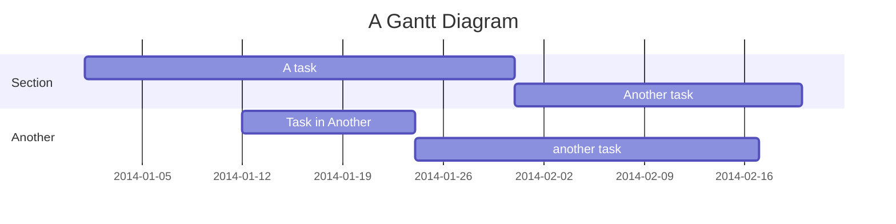
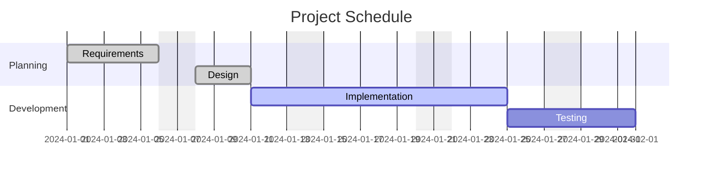
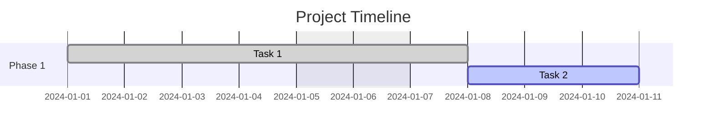

# Gantt Chart Syntax

A Gantt chart is a bar chart illustrating project schedule and task durations.

## Basic Example

## Task Status Tags

| Tag | Meaning |
|---|---|
| `done` | Completed task (checked) |
| `active` | Currently active task |
| `crit` | Critical path task |
| `milestone` | Zero-duration milestone |

## Task Metadata Syntax

| Syntax | Start Date | End Date | ID |
|---|---|---|---|
| `id, start, end` | explicit date | explicit date | `id` |
| `id, start, length` | explicit date | start + duration | `id` |
| `id, after otherId, end` | end of `otherId` | explicit date | `id` |
| `id, after otherId, length` | end of `otherId` | start + duration | `id` |
| `id, start, until otherId` | explicit date | start of `otherId` | `id` |
| `id, after a, until b` | end of `a` | start of `b` | `id` |
| `start, end` | explicit | explicit | auto |
| `start, length` | explicit | start + duration | auto |
| `after id, end` | end of `id` | explicit | auto |
| `after id, length` | end of `id` | start + duration | auto |
| `end` | end of preceding | explicit date | auto |
| `length` | end of preceding | start + duration | auto |
| `until id` | end of preceding | start of `id` | auto |

## Duration Format

| Unit | Suffix | Example |
|---|---|---|
| Milliseconds | `ms` | `500ms` |
| Seconds | `s` | `30s` |
| Minutes | `m` | `30m` |
| Hours | `h` | `4h` |
| Days | `d` | `3d` |
| Weeks | `w` | `2w` |
| Months | `M` | `1M` |
| Years | `y` | `1y` |

Decimal values supported (e.g., `1.5d`).

## Configuration Options

| Option | Description |
|---|---|
| `dateFormat` | Date format (default: `YYYY-MM-DD`) |
| `excludes` | Exclude dates/days (e.g., `weekends`, `sunday`, `2024-01-15`) |
| `weekend` | Weekend start day (`friday` or `saturday`, default: `saturday`) |
| `topMargin` | Top margin in pixels |
| `axisFormat` | Axis date format |
| `milestoneSymbol` | Custom milestone symbol |
