# Other Diagram Types

## Pie Chart

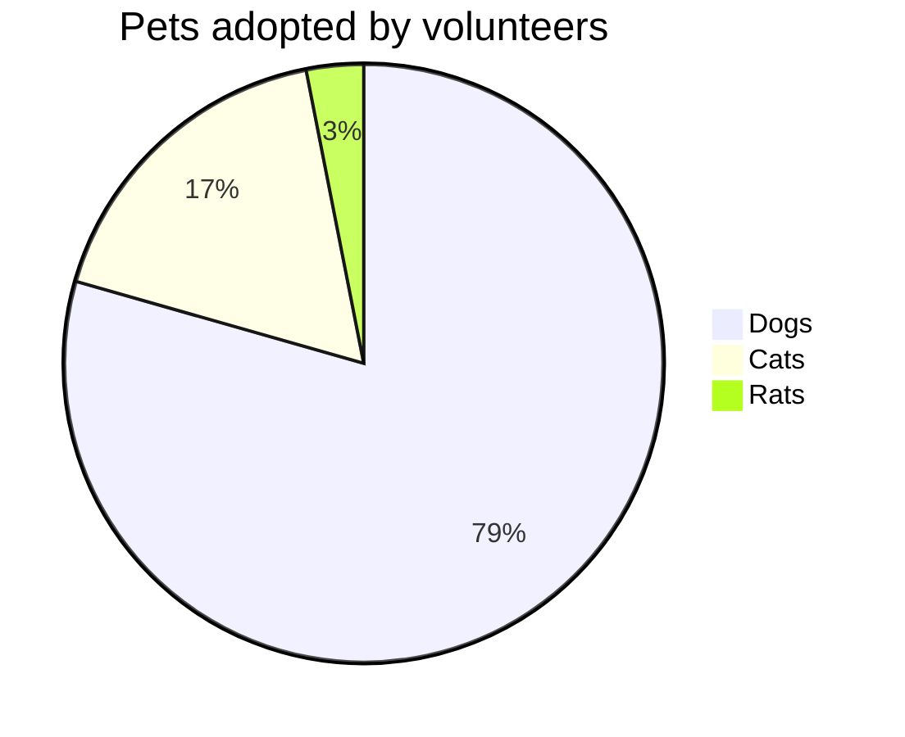

| Option | Description | Default |
|---|---|---|
| `showData` | Show data values in legend | hidden |
| `title` | Chart title | none |
| `textPosition` | Label position (0=center, 1=edge) | 0.75 |

> Values must be positive numbers > 0.

## Mindmap

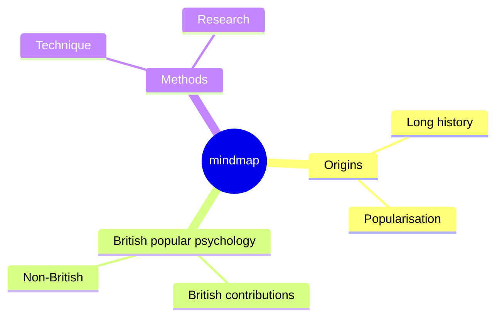

## Git Graph

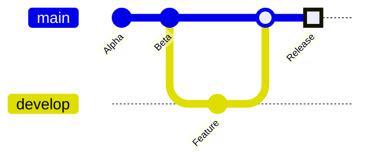

| Attribute | Syntax |
|---|---|
| Custom ID | `commit id: "custom_id"` |
| Type | `commit type: NORMAL \| REVERSE \| HIGHLIGHT` |
| Tag | `commit tag: "v1.0.0"` |

Commands: `commit`, `branch`, `checkout`/`switch`, `merge`

## C4 Diagrams

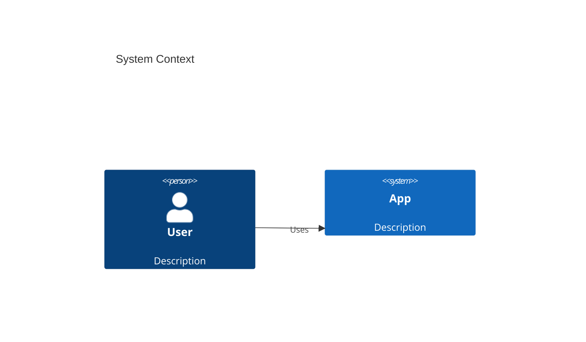

Types: `C4Context`, `C4Container`, `C4Component`, `C4Dynamic`, `C4Deployment`

## Block Diagram

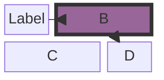

Blocks support nesting, column layout, and spanning.

## Timeline

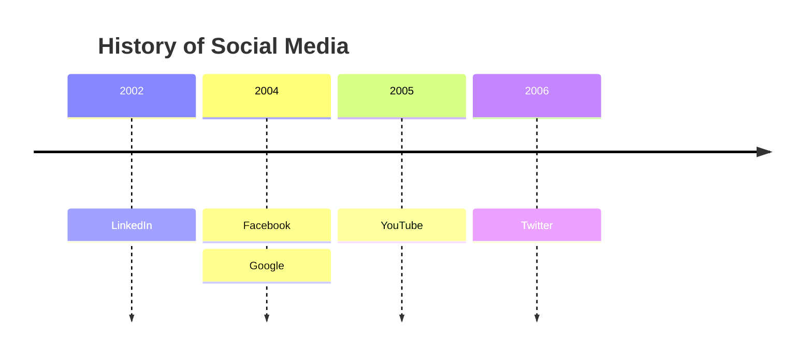

Sections: `section Name` groups time periods.

## Kanban

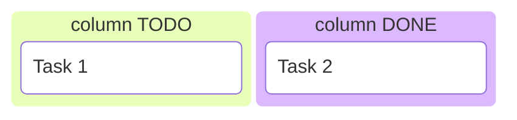

## Sankey (v10.3.0+)

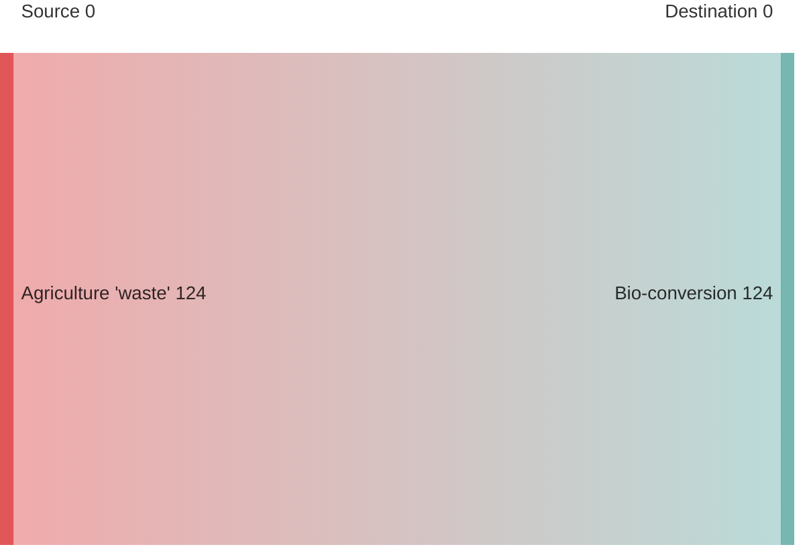

CSV-like format: `nodeA, nodeB, value`

## Radar Chart

```mermaid
radar
    title My Capabilities
    axis JavaScript, Python, Rust, Go, SQL
    axis React, Django, Tokio, Fiber, PostgreSQL
    a["Me", 90, 70, 50, 60, 80, 85, 60, 70, 75]
    b["Friend", 70, 80, 40, 70, 60, 75, 55, 65, 60]
```

## Venn Diagram

```mermaid
venn
    A, B, AB
```

Sets overlap to show intersections.

## XY Chart

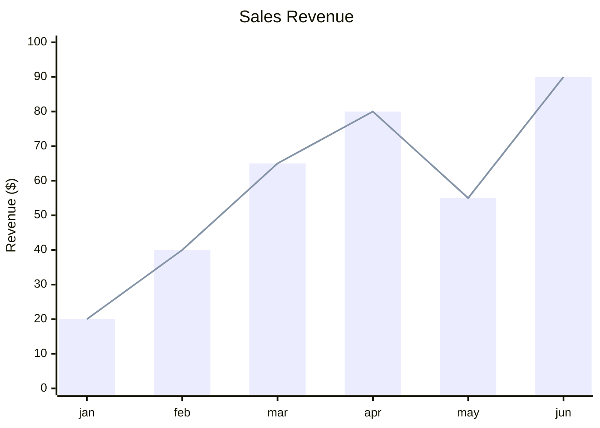

## Quadrant Chart

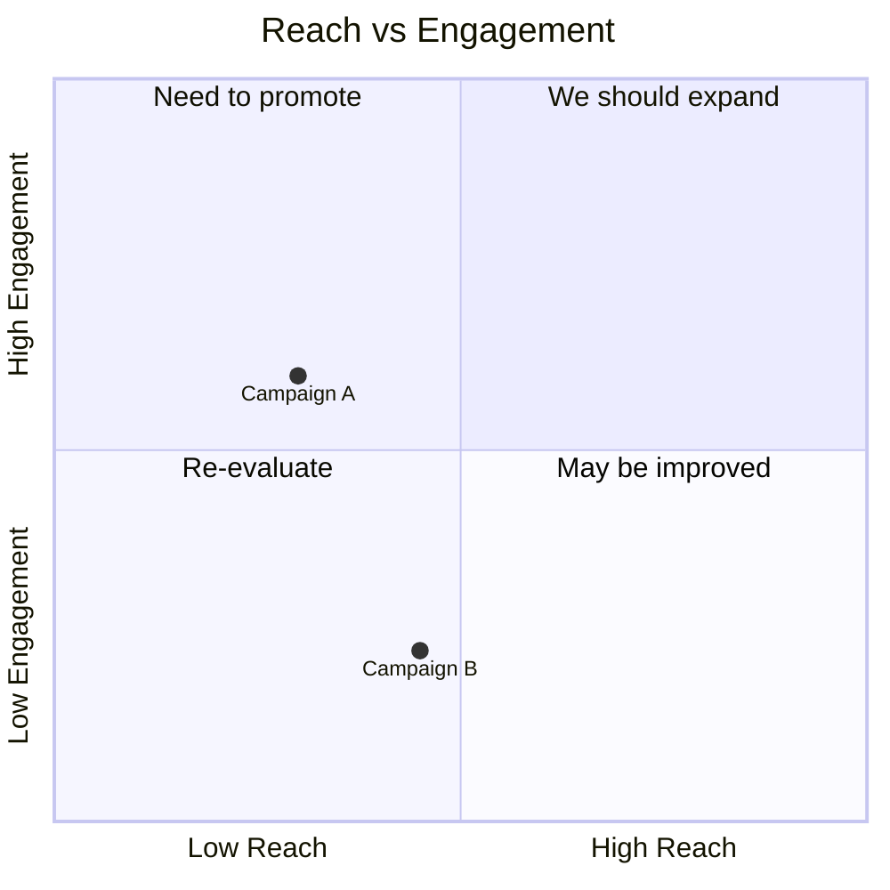

## User Journey

```mermaid
userJourney
    title My Day
    section Home
        Wake up: 5: Alice
        Breakfast: 4: Alice
    section Work
        Commute: 6: Bob
        Code: 8: Alice
```

Sections defined with `section Name`. Steps have priority (1-10) and actor.

## Requirement Diagram

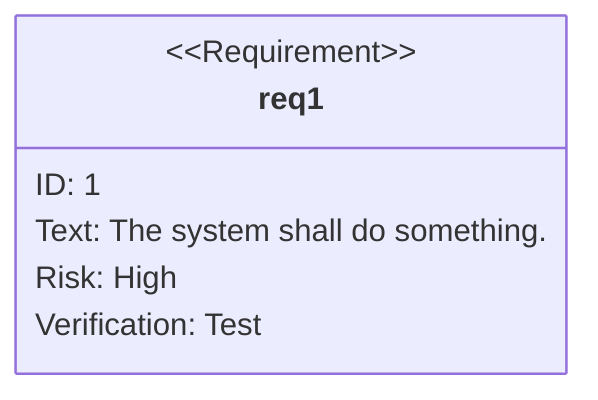

Types: `requirement`, `interface`, `performance`, `element`, `verification`

## Architecture Diagram

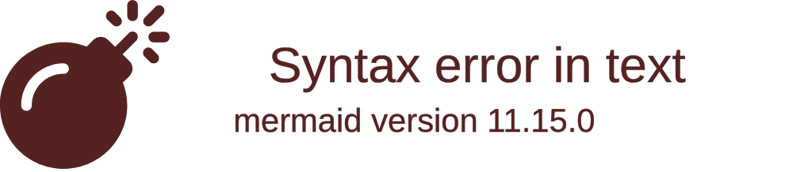

Supports AWS, Azure, GCP services.

## ZenUML

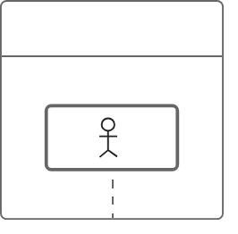

Simple linear interaction syntax.

## TreeView

```mermaid
tree
    root
        child1
            grandchild1
            grandchild2
        child2
```

## TreeMap


## Ishikawa (Fishbone)

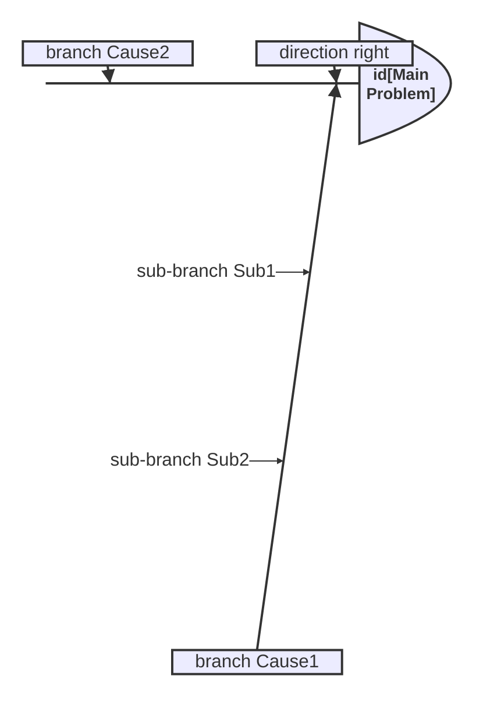

## Use Case Diagram

```mermaid
useCaseDiagram
    actor Customer
    rectangle "Online Shop" {
        Customer --> (Place Order)
        (Place Order) --> (Process Payment)
    }
```

## Waveform Plot

```mermaid
waveformPlot
    title Signal Waveform
    xaxis Time
    yaxis Amplitude
    plot sineWave
```

## Packet Diagram

```mermaid
packet
    title TCP Header
    0-15: Source Port
    16-31: Destination Port
    32-63: Sequence Number
    64-95: Acknowledgment Number
```

Binary packet layout visualization.
