# Other Diagram Types

## Pie Chart

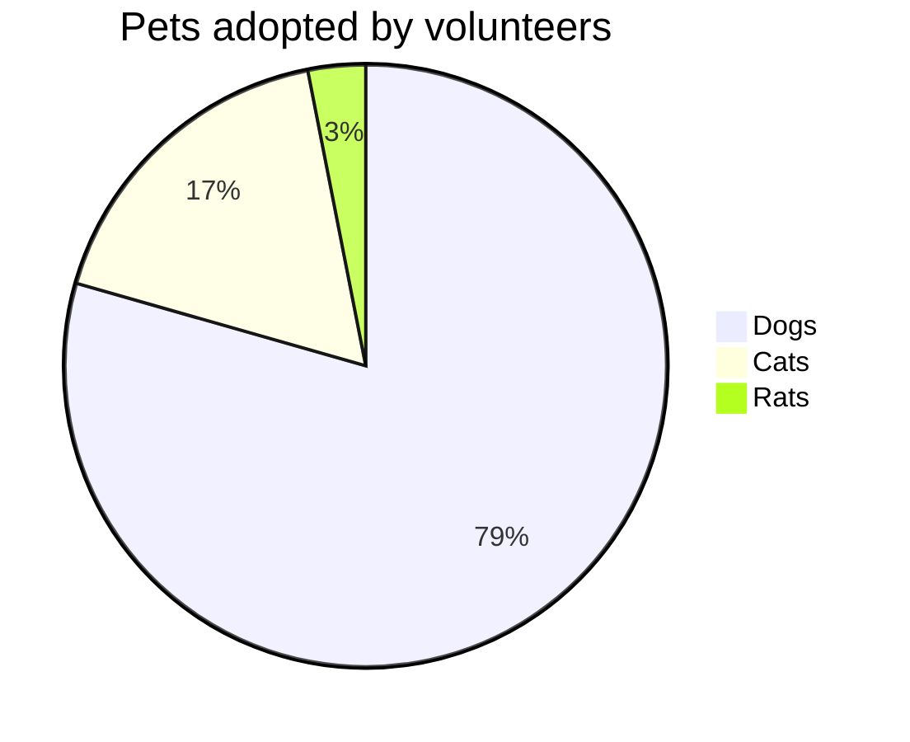
```mermaid
pie title Pets adopted by volunteers
    "Dogs" : 386
    "Cats" : 85
    "Rats" : 15
```

| Option | Description | Default |
|---|---|---|
| `showData` | Show data values in legend | hidden |
| `title` | Chart title | none |
| `textPosition` | Label position (0=center, 1=edge) | 0.75 |

> Values must be positive numbers > 0.

## Mindmap

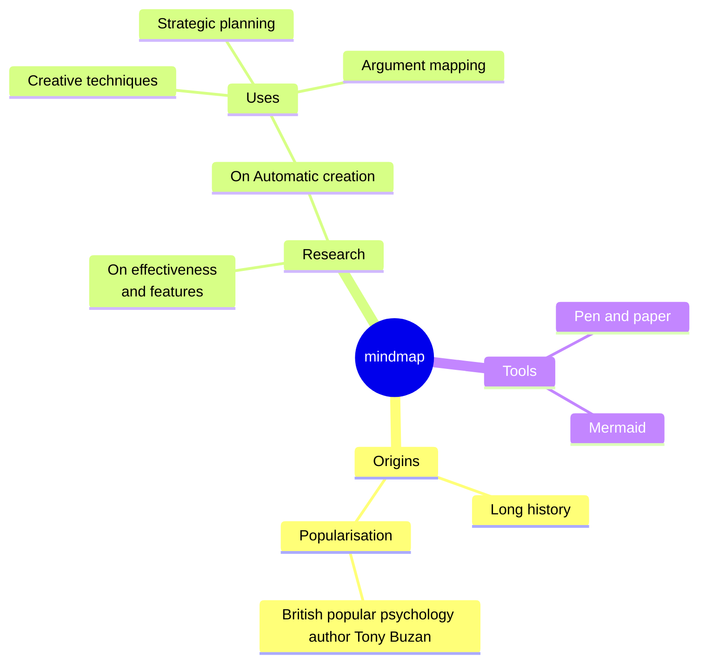
```mermaid
mindmap
    root((mindmap))
        Origins
            Long history
            ::icon(fa fa-book)
            Popularisation
                British popular psychology author Tony Buzan
        Research
            On effectiveness<br/>and features
            On Automatic creation
                Uses
                    Creative techniques
                    Strategic planning
                    Argument mapping
        Tools
            Pen and paper
            Mermaid
```

Indentation defines hierarchy. Use `::icon(icon-name)` for icons.

## Git Graph

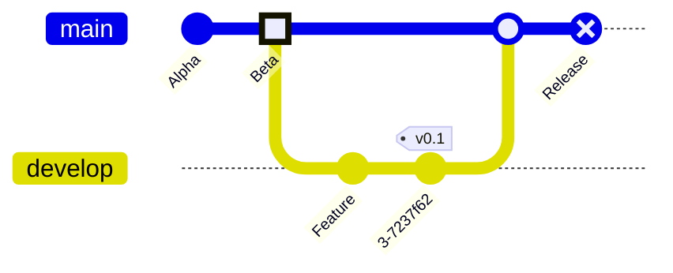
```mermaid
gitGraph
    commit id: "Alpha"
    commit id: "Beta" type: HIGHLIGHT
    branch develop
    checkout develop
    commit id: "Feature"
    commit tag: "v0.1"
    checkout main
    merge develop
    commit id: "Release" type: REVERSE
```

| Attribute | Syntax |
|---|---|
| Custom ID | `commit id: "custom_id"` |
| Type | `commit type: NORMAL \| REVERSE \| HIGHLIGHT` |
| Tag | `commit tag: "v1.0.0"` |
| Create branch | `branch name` (creates and switches) |
| Switch branch | `checkout name` or `switch name` |
| Merge | `merge name` |

## C4 Diagrams

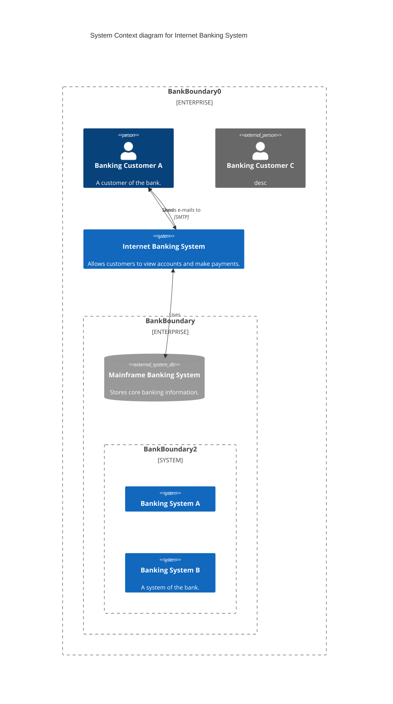
```mermaid
C4Context
    title System Context diagram for Internet Banking System
    Enterprise_Boundary(b0, "BankBoundary0") {
        Person(customerA, "Banking Customer A", "A customer of the bank.")
        Person_Ext(customerC, "Banking Customer C", "desc")
        System(SystemAA, "Internet Banking System", "Allows customers to view accounts and make payments.")
        Enterprise_Boundary(b1, "BankBoundary") {
            SystemDb_Ext(SystemE, "Mainframe Banking System", "Stores core banking information.")
            System_Boundary(b2, "BankBoundary2") {
                System(SystemA, "Banking System A")
                System(SystemB, "Banking System B", "A system of the bank.")
            }
        }
    }
    BiRel(customerA, SystemAA, "Uses")
    BiRel(SystemAA, SystemE, "Uses")
    Rel(SystemAA, customerA, "Sends e-mails to", "SMTP")
```

Types: `C4Context`, `C4Container`, `C4Component`, `C4Dynamic`, `C4Deployment`

Person types: `Person`, `Person_Ext`, `System`, `System_Ext`, `SystemDb`, `SystemDb_Ext`, `SystemQueue`, `SystemQueue_Ext`, `Enterprise_Boundary`, `Boundary`

## Block Diagram

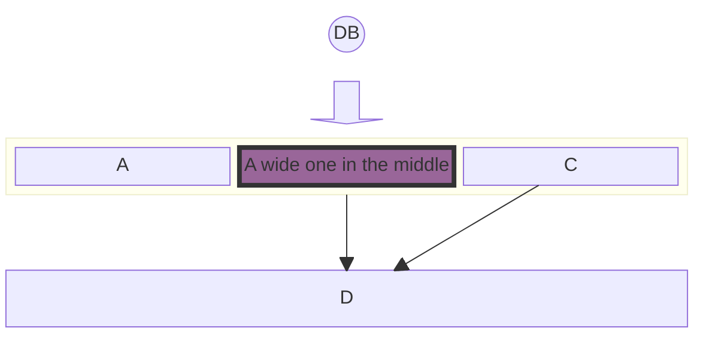
```mermaid
block
    columns 1
    db(("DB"))
    blockArrowId6<["&nbsp;&nbsp;&nbsp;"]>(down)
    block:ID
        A
        B["A wide one in the middle"]
        C
    end
    space
    D
    ID --> D
    C --> D
    style B fill:#969,stroke:#333,stroke-width:4px
```

Blocks support nesting with `block:ID { ... }`, column layout with `columns N`, spanning with `B:2`, and arrow syntax `blockArrowId<["label"]>(direction)`.

## Timeline

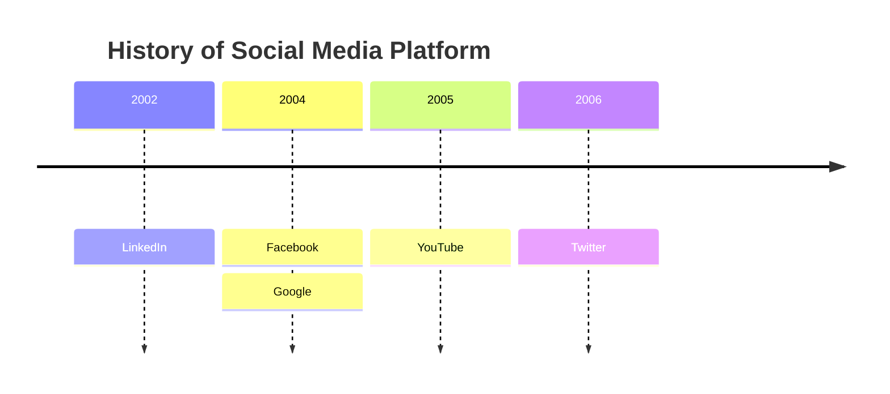
```mermaid
timeline
    title History of Social Media Platform
    2002 : LinkedIn
    2004 : Facebook
         : Google
    2005 : YouTube
    2006 : Twitter
```

Format: `{time period} : {event}` or `{time period} : {event1} : {event2}`

Multiple events per time period use continuation lines:
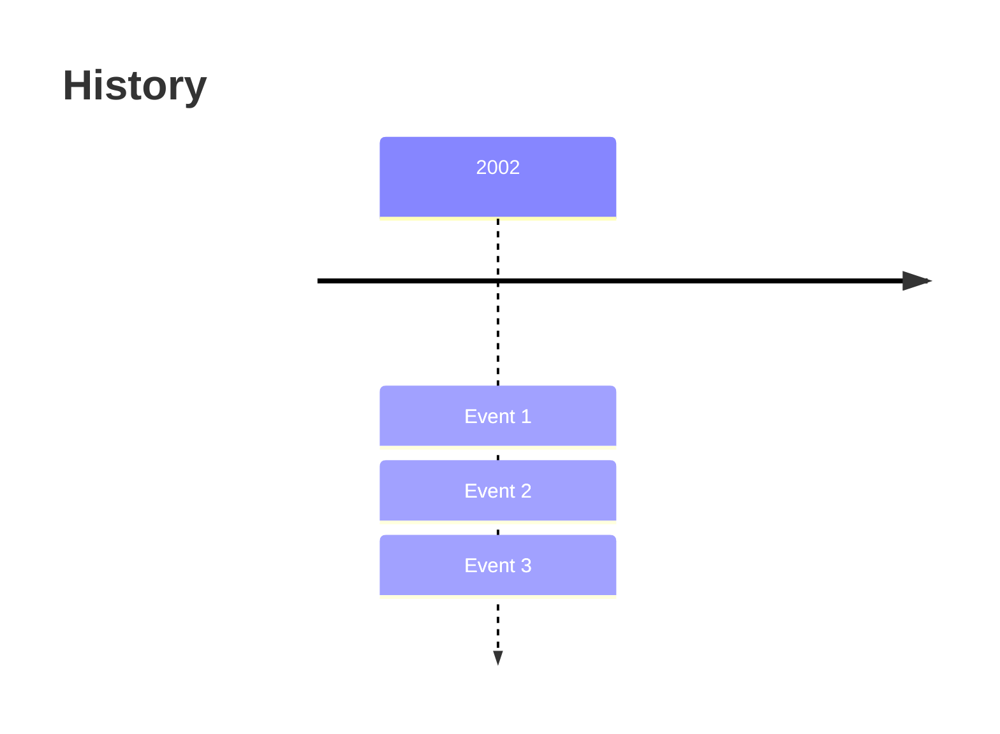
```mermaid
timeline
    title History
    2002 : Event 1
         : Event 2
         : Event 3
```

## Kanban

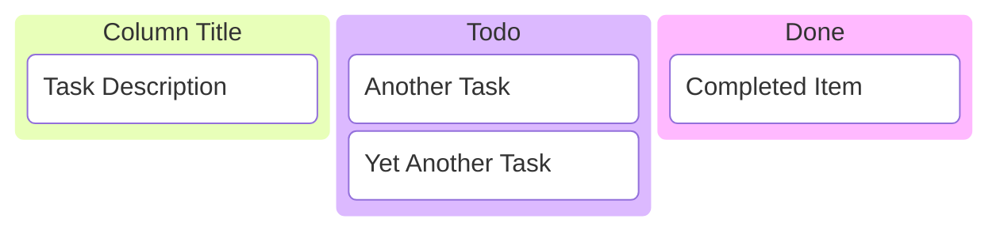
```mermaid
kanban
    column1[Column Title]
        task1[Task Description]
    column2[Todo]
        task2[Another Task]
        task3[Yet Another Task]
    column3[Done]
        task4[Completed Item]
```

| Attribute | Syntax |
|---|---|
| Priority | `task1["Task" priority:High]` |
| Assignee | `task1["Task" assignee:John]` |
| Ticket ID | `task1["Task" ticket:PROJ-123]` |
| Tag | `task1["Task" tag:red,blue]` |

## Sankey (v10.3.0+)

CSV-like format: `source, destination, value`

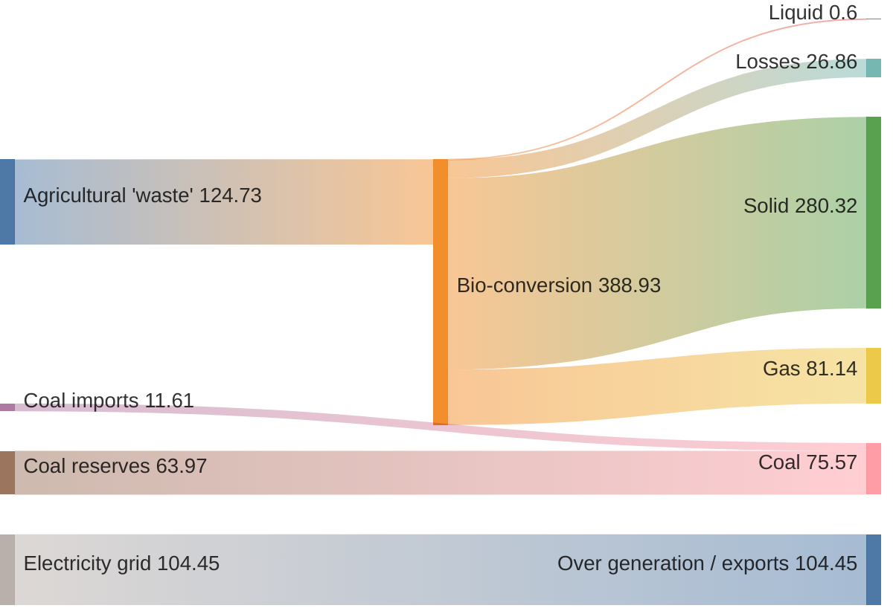
```mermaid
sankey

Agricultural 'waste',Bio-conversion,124.729
Bio-conversion,Liquid,0.597
Bio-conversion,Losses,26.862
Bio-conversion,Solid,280.322
Bio-conversion,Gas,81.144
Coal imports,Coal,11.606
Coal reserves,Coal,63.965
Electricity grid,Over generation / exports,104.453
```

## Radar Chart (v11.6.0+)

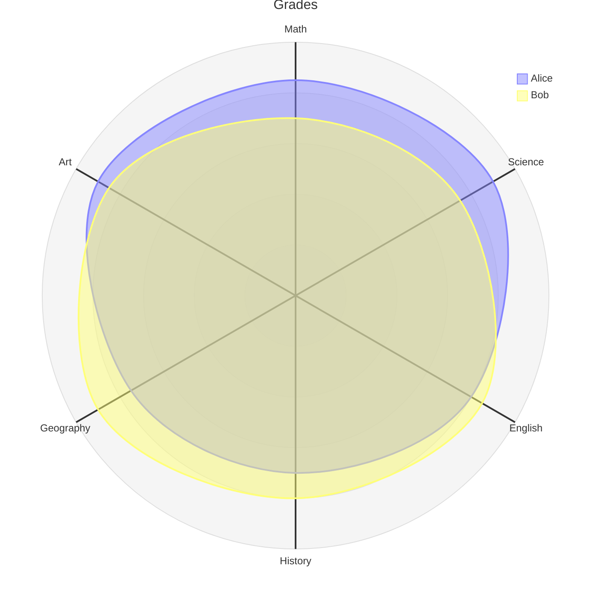
```mermaid
radar-beta
  title Grades
  axis m["Math"], s["Science"], e["English"]
  axis h["History"], g["Geography"], a["Art"]
  curve a["Alice"]{85, 90, 80, 70, 75, 90}
  curve b["Bob"]{70, 75, 85, 80, 90, 85}
  max 100
  min 0
```

| Option | Description |
|---|---|
| `axis` | Axis labels (comma-separated) |
| `curve` | Data series with values in braces |
| `max` / `min` | Value range |

## Venn Diagram

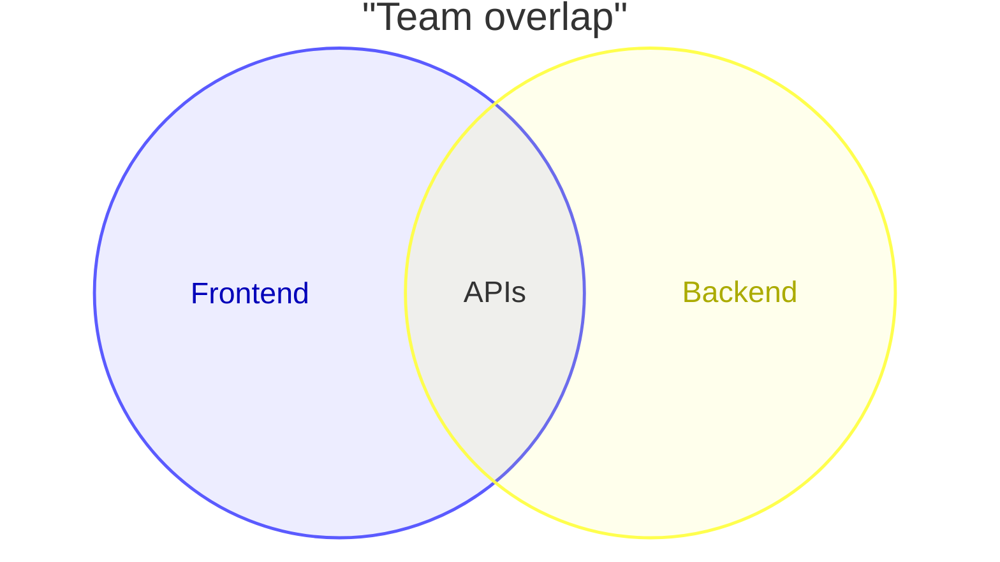
```mermaid
venn-beta
  title "Team overlap"
  set Frontend
  set Backend
  union Frontend,Backend["APIs"]
```

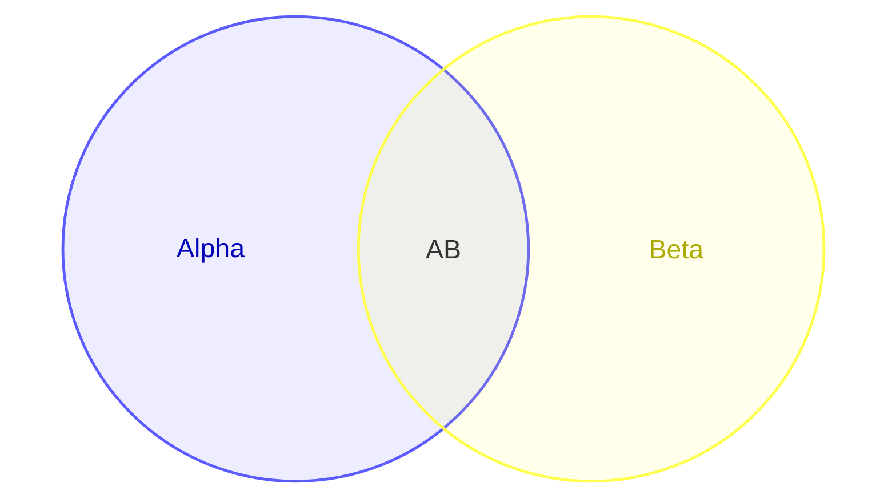
```mermaid
venn-beta
  set A["Alpha"]
  set B["Beta"]
  union A,B["AB"]
```

| Option | Description |
|---|---|
| `set` | Define a named set |
| `union` | Define overlap of sets with label |
| `:N` suffix | Set size (e.g., `set A:100`) |

## XY Chart

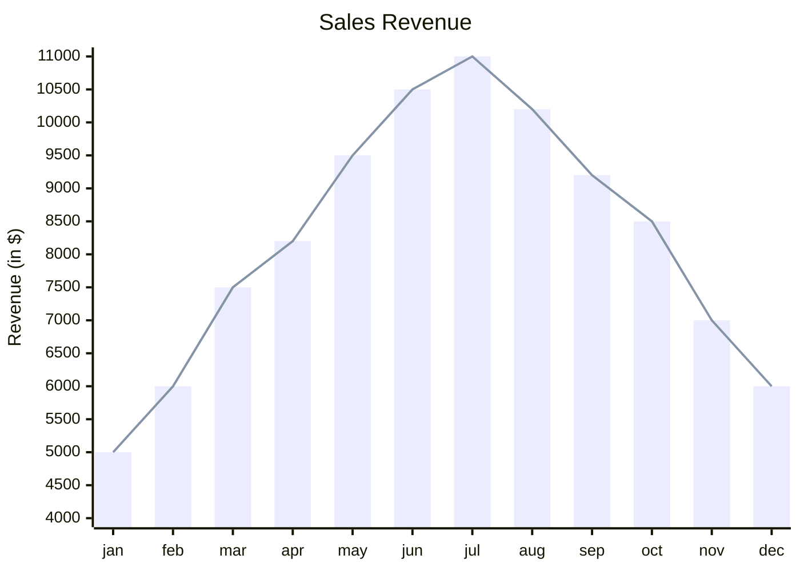
```mermaid
xychart
    title "Sales Revenue"
    x-axis [jan, feb, mar, apr, may, jun, jul, aug, sep, oct, nov, dec]
    y-axis "Revenue (in $)" 4000 --> 11000
    bar [5000, 6000, 7500, 8200, 9500, 10500, 11000, 10200, 9200, 8500, 7000, 6000]
    line [5000, 6000, 7500, 8200, 9500, 10500, 11000, 10200, 9200, 8500, 7000, 6000]
```

| Option | Description |
|---|---|
| `xychart horizontal` | Horizontal orientation (default: vertical) |
| `title` | Chart title |
| `x-axis` | X-axis labels in brackets |
| `y-axis` | Y-axis label with range (`min --> max`) |
| `bar` / `line` | Data series arrays |

## Quadrant Chart

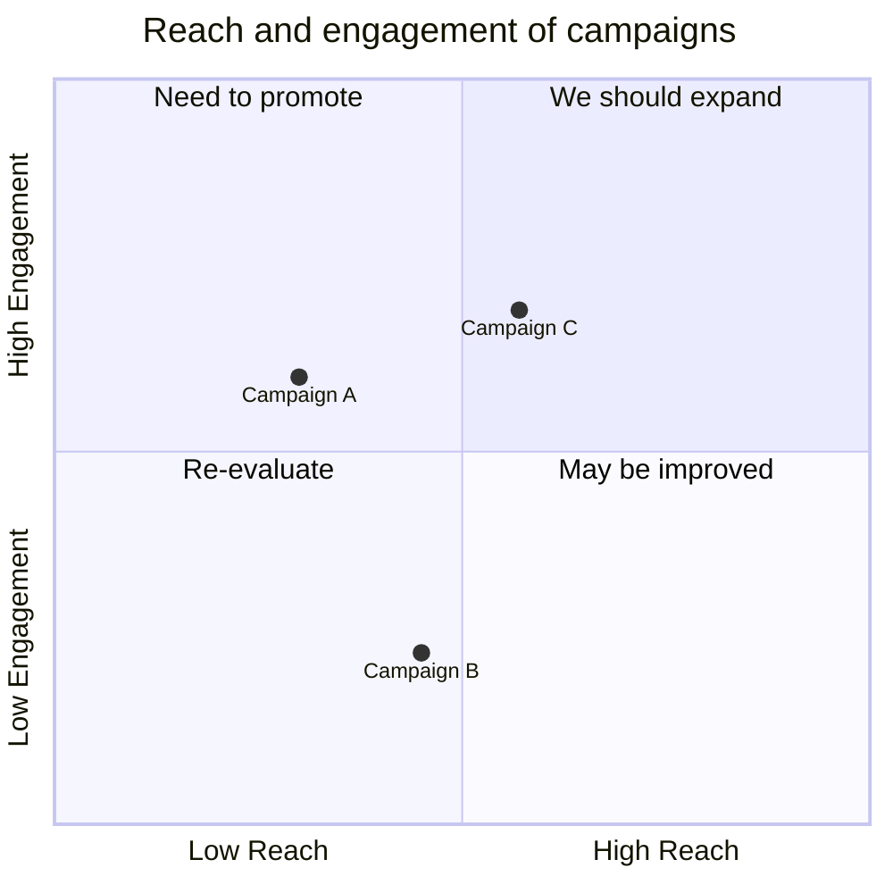
```mermaid
quadrantChart
    title Reach and engagement of campaigns
    x-axis Low Reach --> High Reach
    y-axis Low Engagement --> High Engagement
    quadrant-1 We should expand
    quadrant-2 Need to promote
    quadrant-3 Re-evaluate
    quadrant-4 May be improved
    Campaign A: [0.3, 0.6]
    Campaign B: [0.45, 0.23]
    Campaign C: [0.57, 0.69]
```

X and Y values range from 0 to 1.

## User Journey

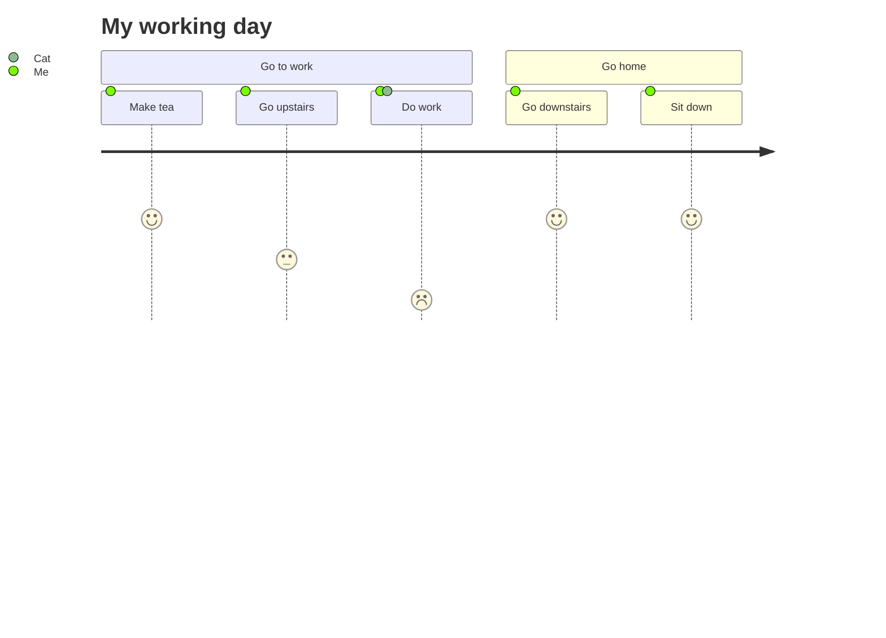
```mermaid
journey
    title My working day
    section Go to work
      Make tea: 5: Me
      Go upstairs: 3: Me
      Do work: 1: Me, Cat
    section Go home
      Go downstairs: 5: Me
      Sit down: 5: Me
```

Format: `Task name: <score (1-5)>: <comma-separated actors>`

## Requirement Diagram

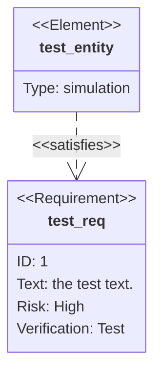
```mermaid
requirementDiagram
    requirement test_req {
        id: 1
        text: the test text.
        risk: high
        verifymethod: test
    }
    element test_entity {
        type: simulation
    }
    test_entity - satisfies -> test_req
```

Requirement types: `requirement`, `functionalRequirement`, `interfaceRequirement`, `performanceRequirement`, `physicalConstraint`

Risk levels: `Low`, `Medium`, `High`

Verify methods: `Analysis`, `Inspection`, `Test`, `Demonstration`

Relationships: `- satisfies ->`, `- verifies ->`, `- contains ->`, `- traces ->`, `- borrows ->`, `- derives ->`, `- refines ->`, `- copies ->`, `- validates ->`

## Architecture Diagram (v11.1.0+)

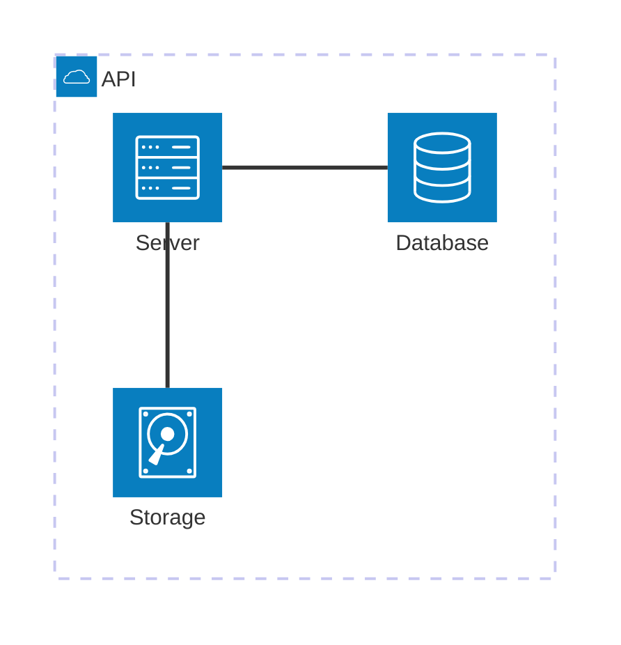
```mermaid
architecture-beta
    group api(cloud)[API]
    service db(database)[Database] in api
    service disk1(disk)[Storage] in api
    service server(server)[Server] in api
    db:L -- R:server
    disk1:T -- B:server
```

Building blocks: `group`, `service`, `edges` (with direction labels like `L`, `R`, `T`, `B`, `TL`, etc.), `junctions`.

Services and groups use icon in `()` and label in `[]`.

## ZenUML

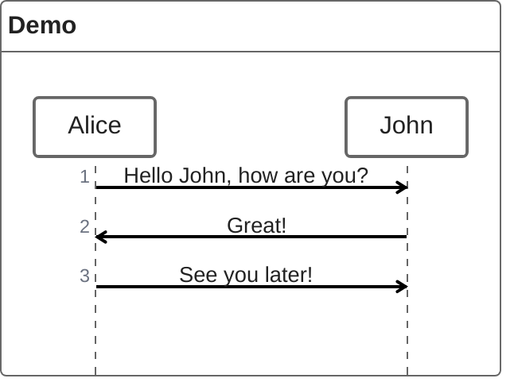
```mermaid
zenuml
    title Demo
    Alice->John: Hello John, how are you?
    John->Alice: Great!
    Alice->John: See you later!
```

Annotators: `@Actor`, `@Boundary`, `@Control`, `@Entity`, `@Database`, `@Queue`, `@Collection`

## TreeView (v11.14.0+)

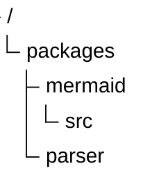
```mermaid
treeView-beta
    "packages"
        "mermaid"
            "src"
        "parser"
```

Hierarchy via indentation. Supports styling: `:::class`.

Config options: `rowIndent`, `lineThickness`, `labelFontSize`, `labelColor`, `lineColor`

## TreeMap

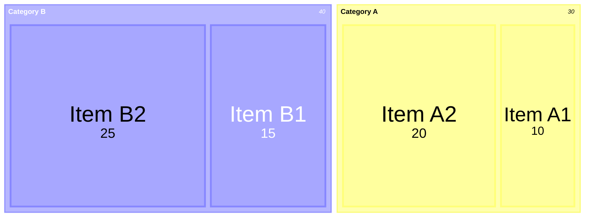
```mermaid
treemap-beta
"Category A"
    "Item A1": 10
    "Item A2": 20
"Category B"
    "Item B1": 15
    "Item B2": 25
```

Hierarchy via indentation. Leaf nodes: `"name": value`. Parent nodes: `"name"` (no value).

## Ishikawa / Fishbone (v11.12.3+)

```mermaid
ishikawa-beta
    Blurry Photo
    Process
        Out of focus
        Shutter speed too slow
    User
        Shaky hands
    Equipment
        LENS
            Inappropriate lens
            Dirty lens
    Environment
        Subject moved too quickly
        Too dark
```

First line is the problem. Indentation defines cause categories and sub-causes.

## Use Case Diagram

```mermaid
useCaseDiagram
    actor Customer
    rectangle "Online Shop" {
        Customer --> (Place Order)
        (Place Order) --> (Process Payment)
    }
```

## Waveform Plot

```mermaid
waveformPlot
    title Signal Waveform
    xaxis Time
    yaxis Amplitude
    plot sineWave
```

## Packet Diagram

```mermaid
packet
0-15: "Source Port"
16-31: "Destination Port"
32-63: "Sequence Number"
64-95: "Acknowledgment Number"
106: "URG"
107: "ACK"
```

Bit ranges: `start-end: "name"` or incremental: `+8: "name"` (starts after previous field).

## Wardley Map (v11.14.0+)

```mermaid
wardley-beta
title Tea Shop Value Chain

anchor Business [0.95, 0.63]
component Cup of Tea [0.79, 0.61]
component Tea [0.63, 0.81]
component Hot Water [0.52, 0.80]
component Kettle [0.43, 0.35]
component Power [0.10, 0.70]

Business -> Cup of Tea
Cup of Tea -> Tea
Hot Water -> Kettle
Kettle -> Power

evolve Kettle 0.62
evolve Power 0.89

note "Standardising power allows Kettles to evolve faster" [0.30, 0.49]
```

Two axes: **Visibility** (Y-axis, 0=infrastructure to 1=user-facing) and **Evolution** (X-axis, 0=novel to 1=commodity).

Components: `anchor`, `component`, `evolve`, `note`. Edges use `->` for dependencies.

## Diagram Breakers & Gotchas

| Issue | Cause | Solution |
|---|---|---|
| "end" in flowchart | Keyword conflict | Capitalize: "End" or "END" |
| "o" or "x" at start of node | Creates circle/cross edge | Add space: "dev --- ops" |
| `%%{}%%` in comments | Confuses with directives | Avoid "{}" in `%%` comments |
| Negative pie values | Invalid data | Use positive numbers only |
