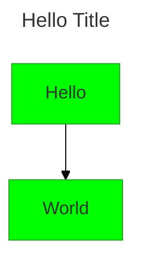
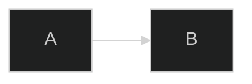
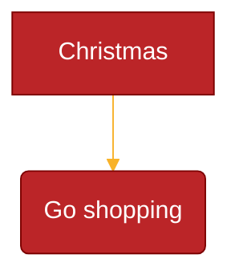

# Configuration & Theming

## Configuration Sources (applied in order)

1. **Default config** — built-in defaults
2. **Site config** — via `mermaid.initialize()` (affects all diagrams)
3. **Frontmatter config** — YAML at top of diagram (v10.5.0+)
4. **Directives** — inline `%%{init: {...}}%%` (deprecated, use frontmatter)

The **render config** is the final merged result used during rendering.

## mermaid.initialize()

```javascript
mermaid.initialize({
    startOnLoad: true,       // Auto-render <pre class="mermaid">
    theme: 'base',           // default | neutral | dark | forest | base
    securityLevel: 'strict', // strict | antiscript | loose | sandbox
    fontFamily: 'trebuchet ms, verdana, arial',
    fontSize: 16,
    logLevel: 5,             // trace(0), debug(1), info(2), warn(3), error(4), fatal(5)
    look: 'neo',             // neo | classic | handDrawn
    layout: 'dagre',         // dagre | elk
    maxTextSize: 9000,
    maxEdges: 200,
    handDrawnSeed: 0,        // Seed for reproducible handDrawn look
    deterministicIds: false, // True = stable IDs (for git compatibility)
    deterministicIDSeed: '', // Static seed string for deterministic IDs
});
```

> `initialize()` is called **only once**. Subsequent calls are ignored.

## Security Levels

| Level | HTML Tags | Click Events | Rendering |
|---|---|---|---|
| `strict` (default) | Encoded | Disabled | Normal |
| `antiscript` | Allowed (except `<script>`) | Enabled | Normal |
| `loose` | Allowed | Enabled | Normal |
| `sandbox` | Isolated in iframe | Blocked | Sandboxed iframe |

```javascript
mermaid.initialize({ securityLevel: 'loose' });
```

## Frontmatter Config (v10.5.0+)



The entire configuration (except secure configs) can be overridden per-diagram. Diagram-specific config keys (e.g., `gantt:`, `sequence:`) are also supported.

## Directives (Deprecated)



Single-line format: `%%{init: { 'key': 'value' } }%%`

Multiple directives combine into one JSON object. Last value wins for duplicates.

> Directives are deprecated from v10.5.0. Use frontmatter `config:` instead.

## Available Themes

| Theme | Description |
|---|---|
| `default` | Default light theme (auto-derived colors) |
| `neutral` | Black & white, print-friendly |
| `dark` | Dark mode compatible |
| `forest` | Green-shade themed |
| `base` | **Only modifiable theme** — customize via `themeVariables` |

## Theme Variables (Base Theme Only)

### General Variables

| Variable | Default | Description |
|---|---|---|
| `darkMode` | false | Affects derived color calculation |
| `background` | #f4f4f4 | Background color |
| `fontFamily` | trebuchet ms, verdana, arial | Font family |
| `fontSize` | 16px | Font size |
| `primaryColor` | #fff4dd | Base color for nodes |
| `primaryTextColor` | auto | Text in primary nodes |
| `secondaryColor` | auto-derived | Secondary color |
| `primaryBorderColor` | auto-derived | Primary node border |
| `secondaryBorderColor` | auto-derived | Secondary node border |
| `secondaryTextColor` | auto-derived | Text in secondary nodes |
| `tertiaryColor` | auto-derived | Tertiary color |
| `tertiaryBorderColor` | auto-derived | Tertiary node border |
| `tertiaryTextColor` | auto-derived | Text in tertiary nodes |
| `lineColor` | auto-derived | Default link/edge color |
| `textColor` | auto-derived | General text color |
| `mainBkg` | auto-derived | Main background |
| `errorBkgColor` | tertiaryColor | Error message bg |
| `errorTextColor` | tertiaryTextColor | Error message text |
| `noteBkgColor` | #fff5ad | Note background |
| `noteTextColor` | #333 | Note text color |
| `noteBorderColor` | auto-derived | Note border |

### Flowchart Variables

| Variable | Default | Description |
|---|---|---|
| `nodeBorder` | primaryBorderColor | Node border |
| `clusterBkg` | tertiaryColor | Subgraph background |
| `clusterBorder` | tertiaryBorderColor | Subgraph border |
| `defaultLinkColor` | lineColor | Default edge color |
| `titleColor` | tertiaryTextColor | Title color |
| `edgeLabelBackground` | auto-derived | Edge label bg |
| `nodeTextColor` | primaryTextColor | Node text color |

### Sequence Diagram Variables

| Variable | Default | Description |
|---|---|---|
| `actorBkg` | mainBkg | Actor background |
| `actorBorder` | primaryBorderColor | Actor border |
| `actorTextColor` | primaryTextColor | Actor text |
| `actorLineColor` | actorBorder | Actor line |
| `signalColor` | textColor | Signal color |
| `signalTextColor` | textColor | Signal text |
| `labelBoxBkgColor` | actorBkg | Label box bg |
| `labelBoxBorderColor` | actorBorder | Label box border |
| `labelTextColor` | actorTextColor | Label text |
| `loopTextColor` | actorTextColor | Loop text |
| `activationBorderColor` | auto-derived | Activation border |
| `activationBkgColor` | secondaryColor | Activation bg |
| `sequenceNumberColor` | auto-derived | Sequence number color |

### Pie Diagram Variables

| Variable | Default | Description |
|---|---|---|
| `pie1`-`pie12` | derived from primary/secondary/tertiary | Section fill colors |
| `pieTitleTextSize` | 25px | Title text size |
| `pieTitleTextColor` | taskTextDarkColor | Title text color |
| `pieSectionTextSize` | 17px | Section label size |
| `pieSectionTextColor` | textColor | Section label color |
| `pieLegendTextSize` | 17px | Legend text size |
| `pieLegendTextColor` | taskTextDarkColor | Legend text color |
| `pieStrokeColor` | black | Section border color |
| `pieStrokeWidth` | 2px | Section border width |
| `pieOuterStrokeWidth` | 2px | Outer circle border width |
| `pieOuterStrokeColor` | black | Outer circle border color |
| `pieOpacity` | 0.7 | Section opacity |

### State Diagram Variables

| Variable | Default | Description |
|---|---|---|
| `labelColor` | primaryTextColor | Label text color |
| `altBackground` | tertiaryColor | Deep composite state bg |

### Class Diagram Variables

| Variable | Default | Description |
|---|---|---|
| `classText` | textColor | Class diagram text color |

### User Journey Variables

| Variable | Default | Description |
|---|---|---|
| `fillType0`-`fillType7` | derived from primary/secondary | Section fill colors |

## Custom Theme Example



> Only hex colors are recognized (not color names like `red`). Colors are auto-derived from primaryColor unless explicitly overridden.

## Diagram-Specific Configuration

### Flowchart Config

```javascript
{
    flowchart: {
        htmlLabels: true,
        curve: 'basis',  // linear | basis | monotoneX | cardinal
        diagramPadding: 8,
        useMaxWidth: false,
        handDrawnSeed: 0,
        defaultRenderer: 'dagre-d3'
    }
}
```

### Sequence Diagram Config

```javascript
{
    sequence: {
        width: 200,
        height: 20,
        messageAlign: 'center',
        mirrorActors: true,
        useMaxWidth: false,
        rightAngles: true,
        showSequenceNumbers: false,
        wrap: false
    }
}
```

### Gantt Config

```javascript
{
    gantt: {
        useWidth: 900,
        height: 20,
        useMaxWidth: false
    }
}
```

### Mindmap Config

```javascript
{
    mindmap: {
        useMaxWidth: false,
        padding: 8
    }
}
```

### Class Diagram Config

```javascript
{
    class: {
        useMaxWidth: false,
        wordWrap: 50,
        arrowMarkerAbsolute: false
    }
}
```

### ER Diagram Config

```javascript
{
    er: {
        useMaxWidth: true,
        padding: 8
    }
}
```

### Pie Chart Config

```javascript
{
    pie: {
        textPosition: 0.75,
        useMaxWidth: false
    }
}
```

### Sankey Config

```javascript
{
    sankey: {
        showValues: true,
        useMaxWidth: false
    }
}
```

## Deterministic IDs

For files checked into git that should not change unless content changes:

```javascript
mermaid.initialize({
    deterministicIds: true,
    deterministicIDSeed: 'my-project'
});
```

Without this, node IDs are random (based on date/time), causing unnecessary git diffs.

## MathML / KaTeX

```javascript
{
    forceLegacyMathML: false,  // Force KaTeX stylesheet usage
    legacyMathML: false        // Fall back to legacy rendering if no MathML
}
```

## ELK Layout Configuration

When using the ELK layout algorithm:

```javascript
{
    elk: {
        considerModelOrder: 'NONE',  // NONE | NODES_AND_EDGES | PREFER_EDGES | PREFER_NODES
        cycleBreakingStrategy: 'GREEDY',
        forceNodeModelOrder: false,
        mergeEdges: false,
        nodePlacementStrategy: 'NETWORK_SIMPLEX'
    }
}
```
