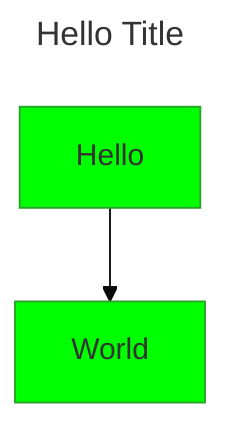
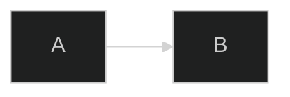
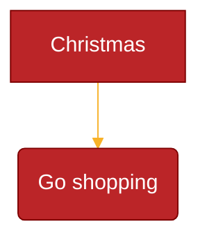

# Configuration & Theming

## Configuration Sources (applied in order)

1. **Default config** — built-in defaults
2. **Site config** — via `mermaid.initialize()` (affects all diagrams)
3. **Frontmatter config** — YAML at top of diagram (v10.5.0+)
4. **Directives** — inline `%%{init: {...}}%%` (deprecated, use frontmatter)

## mermaid.initialize()

```javascript
mermaid.initialize({
    startOnLoad: true,       // Auto-render <pre class="mermaid">
    theme: 'base',           // default | neutral | dark | forest | base
    securityLevel: 'strict', // strict | antiscript | loose | sandbox
    fontFamily: 'trebuchet ms, verdana, arial',
    fontSize: 16,
    logLevel: 5,             // 1=debug, 2=info, 3=warn, 4=error, 5=fatal-only
});
```

> Note: `initialize()` is called **only once**. Subsequent calls are ignored.

## Security Levels

| Level | HTML Tags | Click Events | Rendering |
|---|---|---|---|
| `strict` (default) | Encoded | Disabled | Normal |
| `antiscript` | Allowed (except `<script>`) | Enabled | Normal |
| `loose` | Allowed | Enabled | Normal |
| `sandbox` | Isolated in iframe | Blocked | Sandboxed iframe |

```javascript
mermaid.initialize({ securityLevel: 'loose' });
```

## Frontmatter Config (v10.5.0+)



The entire configuration (except secure configs) can be overridden per-diagram.

## Directives (Deprecated)



Single-line format: `%%{init: { 'key': 'value' } }%%`

Multiple directives combine into one JSON object. Last value wins for duplicates.

> Warning: Directives are deprecated from v10.5.0. Use frontmatter `config:` instead.

## Available Themes

| Theme | Description |
|---|---|
| `default` | Default light theme (auto-derived colors) |
| `neutral` | Black & white, print-friendly |
| `dark` | Dark mode compatible |
| `forest` | Green-shade themed |
| `base` | **Only modifiable theme** — customize via `themeVariables` |

## Theme Variables (Base Theme Only)

### General Variables

| Variable | Default | Description |
|---|---|---|
| `darkMode` | false | Affects derived color calculation |
| `background` | #f4f4f4 | Background color |
| `fontFamily` | trebuchet ms, verdana, arial | Font family |
| `fontSize` | 16px | Font size |
| `primaryColor` | #fff4dd | Base color for nodes |
| `primaryTextColor` | auto | Text in primary nodes |
| `secondaryColor` | auto-derived | Secondary color |
| `primaryBorderColor` | auto-derived | Primary node border |
| `lineColor` | auto-derived | Default link color |
| `textColor` | auto-derived | General text color |
| `mainBkg` | auto-derived | Main background |
| `errorBkgColor` | tertiaryColor | Error message bg |
| `errorTextColor` | tertiaryTextColor | Error message text |
| `noteBkgColor` | #fff5ad | Note background |
| `noteTextColor` | #333 | Note text color |

### Flowchart Variables

| Variable | Default | Description |
|---|---|---|
| `nodeBorder` | primaryBorderColor | Node border |
| `clusterBkg` | tertiaryColor | Subgraph background |
| `clusterBorder` | tertiaryBorderColor | Subgraph border |
| `defaultLinkColor` | lineColor | Default edge color |
| `titleColor` | tertiaryTextColor | Title color |
| `edgeLabelBackground` | auto-derived | Edge label bg |
| `nodeTextColor` | primaryTextColor | Node text color |

### Sequence Diagram Variables

| Variable | Default | Description |
|---|---|---|
| `actorBkg` | mainBkg | Actor background |
| `actorBorder` | primaryBorderColor | Actor border |
| `actorTextColor` | primaryTextColor | Actor text |
| `signalColor` | textColor | Signal color |
| `activationBkgColor` | secondaryColor | Activation bg |

### Pie Diagram Variables

| Variable | Default | Description |
|---|---|---|
| `pie1`-`pie12` | derived | Section fill colors |
| `pieTitleTextSize` | 25px | Title text size |
| `pieOuterStrokeWidth` | 2px | Outer border width |
| `pieOpacity` | 0.7 | Section opacity |

### Custom Theme Example



> Only hex colors are recognized (not color names like `red`).
