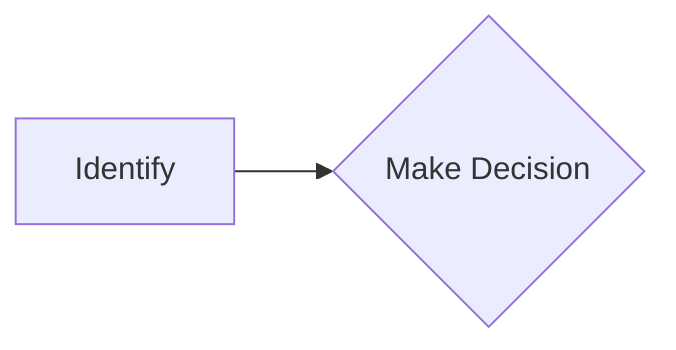
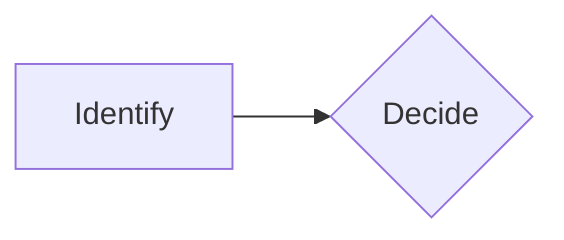
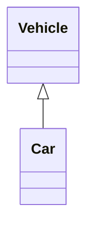
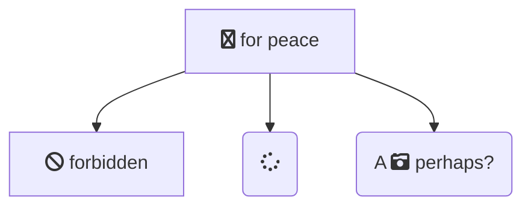
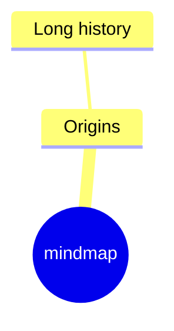
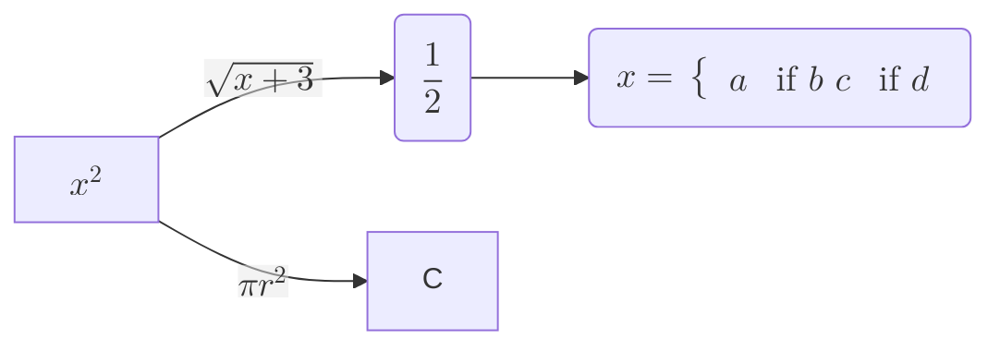
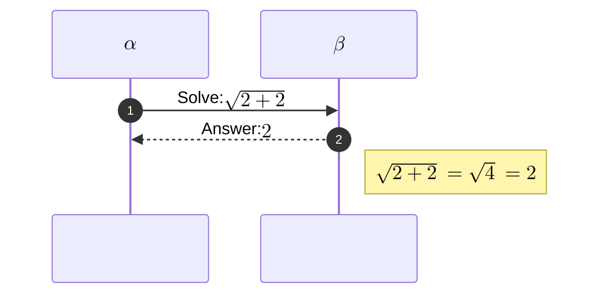
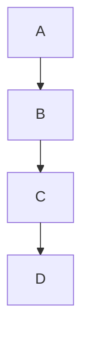
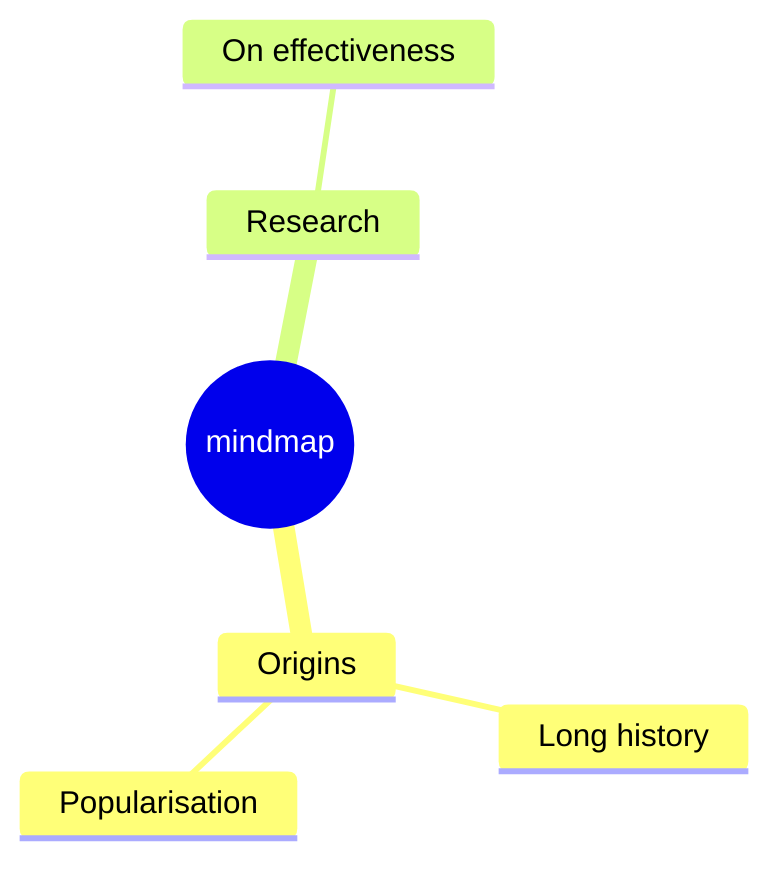

# Accessibility, Icons, Math & Layouts

## Accessibility

Mermaid supports WAI-ARIA attributes for assistive technologies.

### aria-roledescription

Automatically set on the SVG element to the diagram type key:

```html
<svg
  aria-roledescription="stateDiagram"
  class="statediagram"
  ...
>
```

### Accessible Title and Description

Add `<title>` and `<desc>` elements within the SVG, plus `aria-labelledby` and `aria-describedby` attributes.

#### accTitle (Single Line)



#### accDescr (Single Line)



#### accDescr (Multiple Lines)

No colon after `accDescr`, wrapped in curly braces:


#### All Diagram Types Support

Works with any diagram type:



## Icons & FontAwesome

### FontAwesome in Flowcharts

Syntax: `fa:#icon class name#`



Supported prefixes: `fa`, `fab`, `fas`, `far`, `fal`, `fad`.

Requires Font Awesome CSS on the page, or registered icon packs.

### Registering Icon Packs (v11.7.0+)

Register custom icon packs via JavaScript:

**Using CDN JSON:**
```javascript
import mermaid from 'CDN/mermaid.esm.mjs';
mermaid.registerIconPacks([
  {
    name: 'logos',
    loader: () =>
      fetch('https://unpkg.com/@iconify-json/logos@1/icons.json').then((res) => res.json()),
  },
]);
```

**Using bundler with lazy loading:**
```javascript
mermaid.registerIconPacks([
  {
    name: 'logos',
    loader: () => import('@iconify-json/logos').then((module) => module.icons),
  },
]);
```

**Without lazy loading:**
```javascript
import { icons } from '@iconify-json/logos';
mermaid.registerIconPacks([
  {
    name: icons.prefix,
    icons,
  },
]);
```

### Icons in Mindmaps

Use `::icon(icon-name)` syntax:



## Math / KaTeX (v10.9.0+)

Mermaid supports rendering math via [KaTeX](https://katex.org/).

### Flowchart Math



### Sequence Diagram Math



### Legacy MathML Fallback

For browsers without MathML support, use KaTeX stylesheets:

```html
<link rel="stylesheet" href="https://cdn.jsdelivr.net/npm/katex@VERSION/dist/katex.min.css" />
```

```javascript
mermaid.initialize({
    legacyMathML: true,       // Use KaTeX if no MathML
    forceLegacyMathML: false  // Always use KaTeX (recommended)
});
```

> Note: When using `legacyMathML`, you must include KaTeX's CSS yourself.

## Layout Algorithms

### Available Layouts

| Layout | Description | Best For |
|---|---|---|
| `dagre` (default) | Layered graph layout | General flowcharts, state diagrams |
| `elk` | Eclipse Layout Kernel | Complex/large diagrams, fewer edge crossings |
| `tidy-tree` | Hierarchical tree layout | Mindmaps, hierarchical data |
| `cose-bilkent` | Force-directed graph | Network/relationship diagrams |

### Using ELK Layout



ELK configuration:
```javascript
{
    elk: {
        considerModelOrder: 'NONE',       // NONE | NODES_AND_EDGES | PREFER_EDGES | PREFER_NODES
        cycleBreakingStrategy: 'GREEDY',   // GREEDY | DEPTH_FIRST | INTERACTIVE | MODEL_ORDER
        forceNodeModelOrder: false,
        mergeEdges: false,
        nodePlacementStrategy: 'NETWORK_SIMPLEX'
    }
}
```

> ELK support must be added when integrating Mermaid for sites/apps that want ELK layout.

### Using Tidy-Tree Layout



Currently primarily supported for mindmap diagrams.
