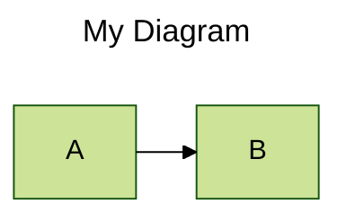
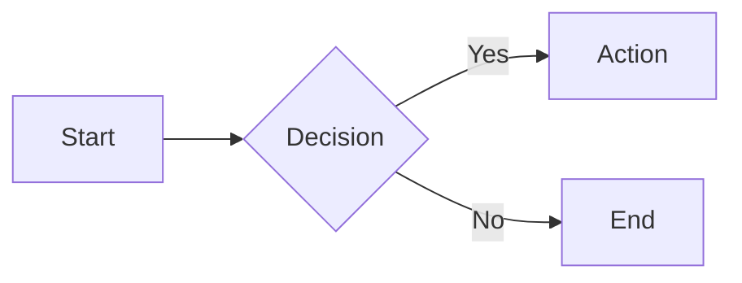

# Mermaid 11.15.0

## Overview

Mermaid is a JavaScript-based diagramming and charting tool that renders Markdown-inspired text definitions into SVG diagrams. It supports 29 diagram types covering flowcharts, UML diagrams, data visualizations, architecture diagrams, and more. Diagrams are defined as plain text, making them version-controllable, easily editable, and embeddable in any markdown-based documentation.

## When to Use

- Creating diagrams inline in Markdown files (GitHub, GitLab, Obsidian, Notion)
- Generating flowcharts, sequence diagrams, ER diagrams, Gantt charts, class diagrams, or state diagrams from text
- Embedding diagrams in web pages via CDN or npm package
- Producing visualizations for documentation that must stay in sync with code
- Building interactive diagrams with click events and tooltips
- Creating architecture diagrams (C4, block, wardley, event modeling)
- Visualizing git branching strategies

## Core Concepts

### Diagram Declaration

Every diagram begins with a keyword declaring its type:


The keyword (`flowchart`, `sequenceDiagram`, `gantt`, etc.) tells the parser which renderer to use. Use `graph` as an alias for `flowchart`.

### Frontmatter Configuration (v10.5.0+)

Override configuration per-diagram using YAML frontmatter:



Frontmatter replaces the older `%%{init: {...}}%%` directive syntax (deprecated).

### Comments and Accessibility

- Line comments: `%% this is a comment`
- Accessible title: `accTitle: Short descriptive title`
- Accessible description: `accDescr: Single line description.`
- Multi-line description uses `{ ... }` without colon

### Direction Keywords

| Keyword | Meaning        |
|---------|----------------|
| TB      | Top to bottom  |
| TD      | Top-down (same as TB) |
| BT      | Bottom to top  |
| LR      | Left to right  |
| RL      | Right to left  |

### Special Syntax Rules

- The word `end` breaks flowcharts and sequence diagrams — capitalize it (`End`) or quote it
- Use double quotes for text with special characters: `id["text (with) parens"]`
- Markdown strings use backticks: `id["\`**bold** and *italic*\`"]`
- Entity codes escape characters: `#quot;`, `#35;`

## Quick Start

### In Markdown (GitHub, GitLab, Obsidian)

````markdown

````

### On a Web Page (CDN)

```html
<pre class="mermaid">
flowchart LR
    A --> B
</pre>
<script type="module">
  import mermaid from 'https://cdn.jsdelivr.net/npm/mermaid@11/dist/mermaid.esm.min.mjs';
  mermaid.initialize({ startOnLoad: true });
</script>
```

### As npm Dependency

```bash
npm install mermaid
```

```javascript
import mermaid from 'mermaid';
mermaid.initialize({ startOnLoad: false });
const { svg } = await mermaid.render('myDiagram', 'flowchart LR\nA --> B');
element.innerHTML = svg;
```

### Key API Methods

- `mermaid.initialize(config)` — set site-wide configuration (call once)
- `mermaid.render(id, text)` — render diagram to SVG
- `mermaid.run(options)` — render diagrams by selector or node array (v10+)
- `mermaid.detectType(text)` — detect diagram type from text
- `mermaid.parse(text, options)` — validate syntax without rendering

## Advanced Topics

### Getting Started and Deployment

**Installation, CDN, npm, API usage, security levels, mermaid.run, Tiny Mermaid** → [Getting Started](reference/01-getting-started.md)

### Configuration

**Frontmatter config, initialize(), directives (legacy), parse(), render(), detectType()** → [Configuration](reference/02-configuration.md)

### Theming

**5 built-in themes, themeVariables customization, per-diagram and site-wide theming, color derivation** → [Theming](reference/03-theming.md)

### Accessibility

**accTitle, accDescr (single/multi-line), aria-roledescription, aria-labelledby examples for all diagram types** → [Accessibility](reference/04-accessibility.md)

### Layouts, Icons, Math, CLI

**Layout engines (dagre, elk, tidy-tree, cose-bilkent), icon packs, KaTeX math rendering, tidy-tree, mermaid CLI** → [Layouts and Icons](reference/05-layouts-and-icons.md)

### Diagram Types

| # | Diagram Type | Reference |
|---|---|---|
| 06 | Flowchart (2116 lines — node shapes, edges, subgraphs, styling, animations, 30+ expanded shapes) | [Flowchart](reference/06-flowchart.md) |
| 07 | GitGraph (branches, commits, merges, checkout, theme variables) | [GitGraph](reference/07-gitgraph.md) |
| 08 | Sequence Diagram (participants, messages, activations, loops, alt/opt/parallel/critical/break) | [Sequence Diagram](reference/08-sequence-diagram.md) |
| 09 | Class Diagram (classes, members, relationships, namespaces, annotations, notes, styling) | [Class Diagram](reference/09-class-diagram.md) |
| 10 | State Diagram (states, transitions, composite states, choice, forks, concurrency) | [State Diagram](reference/10-state-diagram.md) |
| 11 | Entity Relationship (entities, relationships, cardinality, attributes) | [Entity Relationship](reference/11-entity-relationship.md) |
| 12 | C4 Diagrams (Context, Container, Component, Dynamic, Deployment) | [C4 Diagrams](reference/12-c4-diagrams.md) |
| 13 | Gantt (sections, tasks, dependencies, milestones, dates, compact mode) | [Gantt](reference/13-gantt.md) |
| 14 | Block Diagram (blocks, edges, styling, shapes, configuration) | [Block Diagram](reference/14-block-diagram.md) |
| 15 | Wardley Map (value chains, components, regions, evolution stages) | [Wardley Map](reference/15-wardley-map.md) |
| 16 | Event Modeling (events, commands, aggregates, processes, sagas) | [Event Modeling](reference/16-event-modeling.md) |
| 17 | ZenUML (sequence-like with nesting, loops, alt/opt/parallel/try-catch) | [ZenUML](reference/17-zenuml.md) |
| 18 | Requirement Diagram (requirements, elements, relationships, styling) | [Requirement Diagram](reference/18-requirement-diagram.md) |
| 19 | Sankey (flows, nodes, links, configuration) | [Sankey](reference/19-sankey.md) |
| 20 | Timeline (time periods, sections/ages, styling, themes) | [Timeline](reference/20-timeline.md) |
| 21 | Architecture (components, connections, icons, randomization) | [Architecture](reference/21-architecture.md) |
| 22 | XY Chart (bar/line/area charts, axes, config, theme variables) | [XY Chart](reference/22-xy-chart.md) |
| 23 | Treemap (hierarchical data, styling, configuration, limitations) | [Treemap](reference/23-treemap.md) |
| 24 | Mindmap (nodes, shapes, icons, classes, markdown strings, layouts) | [Mindmap](reference/24-mindmap.md) |
| 25 | Radar (axes, values, configuration, theme variables) | [Radar](reference/25-radar.md) |
| 26 | Quadrant Chart (quadrants, axes, points, config, theme variables) | [Quadrant Chart](reference/26-quadrant-chart.md) |
| 27 | Packet (bit fields, syntax, configuration, theme variables) | [Packet](reference/27-packet.md) |
| 28 | Kanban (columns, tasks, metadata, configuration) | [Kanban](reference/28-kanban.md) |
| 29 | Venn (sets, intersections, syntax) | [Venn](reference/29-venn.md) |
| 30 | Pie (slices, percentages, configuration) | [Pie](reference/30-pie.md) |
| 31 | Tree View (hierarchical nodes, config variables) | [Tree View](reference/31-tree-view.md) |
| 32 | Ishikawa (fishbone diagram, causes, syntax) | [Ishikawa](reference/32-ishikawa.md) |
| 33 | User Journey (sections, events, actors, ratings) | [User Journey](reference/33-user-journey.md) |
