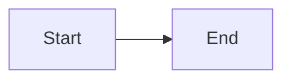

# mermaid 11.15.0

## Overview

Mermaid renders text-based diagram definitions into SVG/PNG visuals. Every diagram starts with a keyword declaring its type, followed by the content definition. Diagrams are embedded as ` ```mermaid ` code blocks in markdown, `<pre class="mermaid">` tags in HTML, or passed to the JS API / CLI.

**Core concepts:**
- Each diagram begins with a type keyword: `flowchart`/`graph`, `sequenceDiagram`, `classDiagram`, `gitGraph`, `gantt`, `stateDiagram-v2`, `erDiagram`, `C4Context`/`C4Container`/`C4Component`/`C4Dynamic`/`C4Deployment`, `block`, `architecture-beta`, `pie`, `quadrantChart`, `radar-beta`, `xychart`, `sankey`, `treemap-beta`, `venn-beta`, `mindmap`, `treeView-beta`, `timeline`, `journey`, `kanban`, `packet`, `requirementDiagram`, `ishikawa-beta`, `wardley-beta`, `eventmodeling`, `zenuml`
- Comments use `%%` prefix
- Frontmatter (`---`) between triple dashes sets title, config, theme per-diagram
- Line comments: `%% this is a comment`
- Unknown words and misspellings break diagrams; parameters silently fail

### Deployment Methods

| Method | Use Case |
|--------|----------|
| **Markdown code blocks** | Markdown renderer |
| **HTML + JS API** | `<pre class="mermaid">` + `mermaid.initialize({ startOnLoad: true })` |
| **npm package** | `npm install mermaid` — render via JS in Node/bun/deno or browser apps |
| **mermaid CLI (mmdc)** | `npx @mermaid-js/mermaid-cli -i input.mmd -o output.svg` |

### Frontmatter Config

```yaml
---
title: My Diagram
config:
  theme: dark
  look: handDrawn       # classic | handDrawn
  layout: elk           # dagre (default) | elk
---
flowchart LR
  A --> B
```

Supported top-level config keys: `theme`, `look`, `layout`, `themeVariables`, `htmlLabels`, `fontFamily`, `logLevel`. Diagram-specific config goes under the diagram's key (e.g., `gantt:`, `sequence:`).

## Usage

Each diagram type has its own syntax. Pick the right diagram for the job, then follow its reference file for detailed syntax rules and examples.

### Embedding in Markdown

````markdown

```mermaid
flowchart LR
  A[Start] --> B[End]
```
````

### Embedding in HTML

```html
<pre class="mermaid">
flowchart LR
  A[Start] --> B[End]
</pre>
<script type="module">
  import mermaid from 'https://cdn.jsdelivr.net/npm/mermaid@11/dist/mermaid.esm.min.mjs';
  mermaid.initialize({ startOnLoad: true });
</script>
```

### Configuration Reference

- Themes: `default`, `neutral`, `dark`, `forest`, `base` (modifiable via `themeVariables`)
- Looks: `classic` (default), `handDrawn`
- Layouts: `dagre` (default, bundled), `elk` (advanced, separate load)
- Math: `$$...$$` for KaTeX expressions in flowcharts and sequence diagrams
- Accessibility: `accTitle:` and `accDescr:` inside diagram code
- Icons: `::icon(pack name)` — experimental, iconify packs

### CLI Rendering

```bash
# Install mmdc
npx @mermaid-js/mermaid-cli -i diagram.mmd -o diagram.svg

# With config
npx @mermaid-js/mermaid-cli -i diagram.mmd -o diagram.png -c config.json
```

## Gotchas

- **The word `end` breaks flowcharts and sequence diagrams** — capitalize it (`End`, `END`) or wrap in quotes/brackets. This is the most common parsing error.
- **Single-letter nodes `o` or `x` as edge markers** — `A---oB` creates a circle edge, not a node named "o". Add a space or capitalize: `A--- oB` or `A---OB`.
- **Node IDs with special characters** — wrap in quotes: `id["node with spaces & symbols"]`.
- **Frontmatter `---` must be the only character on its line** — no leading/trailing whitespace.
- **Directives (`%%{init: {...}}%%`) are deprecated since v10.5.0** — use frontmatter `config:` instead.
- **Pie chart values must be positive numbers > 0** — zero and negative values cause errors.
- **Quadrant chart coordinates are 0–1 range** — values outside this range are clamped silently.
- **`stateDiagram-v2` is the modern syntax** — plain `stateDiagram` uses an older renderer with fewer features.
- **ELK layout is not bundled by default** — it must be loaded separately when integrating Mermaid in apps.
- **Math (KaTeX) requires `$$...$$` delimiters** — only supported in flowcharts and sequence diagrams currently.
- **Accessibility: use `accTitle:` and `accDescr:`** inside diagram code for screen-reader support.
- **Icon support (`::icon(fa fa-book)`) is experimental** — syntax may change between versions.

## References

Each reference file covers one diagram type with full syntax details, parameter tables, and working examples from the Mermaid demos.

- [01-flowchart.md](references/01-flowchart.md) — Flowcharts: nodes, edges, directions, shapes, subgraphs, styling
- [02-sequence-diagram.md](references/02-sequence-diagram.md) — Sequence diagrams: participants, messages, activations, notes
- [03-class-diagram.md](references/03-class-diagram.md) — Class diagrams: UML classes, inheritance, composition, members
- [04-gitgraph.md](references/04-gitgraph.md) — Git graphs: commits, branches, merges, rebases, cherry-picks
- [05-gantt.md](references/05-gantt.md) — Gantt charts: tasks, sections, milestones, dependencies, exclusions
- [06-state-diagram.md](references/06-state-diagram.md) — State diagrams: states, transitions, composite states, entry/exit
- [07-er-diagram.md](references/07-er-diagram.md) — ER diagrams: entities, attributes, crow's-foot relationships
- [08-c4-diagram.md](references/08-c4-diagram.md) — C4 model: context, container, component, dynamic, deployment
- [09-block-diagram.md](references/09-block-diagram.md) — Block diagrams: grid layout, blocks, connectors, styling
- [10-architecture-diagram.md](references/10-architecture-diagram.md) — Architecture: cloud/CI-CD services, groups, edges
- [11-pie-chart.md](references/11-pie-chart.md) — Pie charts: slices, labels, configuration
- [12-quadrant-chart.md](references/12-quadrant-chart.md) — Quadrant charts: axes, quadrants, data points
- [13-radar-chart.md](references/13-radar-chart.md) — Radar charts: axes, curves, min/max
- [14-xy-chart.md](references/14-xy-chart.md) — XY charts: bar, line, orientations, axes
- [15-sankey-diagram.md](references/15-sankey-diagram.md) — Sankey diagrams: nodes, links, CSV-like syntax
- [16-treemap.md](references/16-treemap.md) — Treemaps: hierarchical rectangles, values, styling
- [17-venn-diagram.md](references/17-venn-diagram.md) — Venn diagrams: sets, unions, text nodes, styling
- [18-mindmap.md](references/18-mindmap.md) — Mindmaps: hierarchy via indentation, shapes, icons
- [19-tree-view.md](references/19-tree-view.md) — Tree views: directory-like hierarchical structures
- [20-timeline.md](references/20-timeline.md) — Timelines: chronological events, sections, icons
- [21-user-journey.md](references/21-user-journey.md) — User journeys: sections, tasks, actors, scores
- [22-kanban.md](references/22-kanban.md) — Kanban boards: columns, tasks, metadata
- [23-packet-diagram.md](references/23-packet-diagram.md) — Packet diagrams: bit ranges, field labels
- [24-requirement-diagram.md](references/24-requirement-diagram.md) — Requirements: SysML requirements, elements, relationships
- [25-ishikawa-diagram.md](references/25-ishikawa-diagram.md) — Ishikawa (fishbone): cause-and-effect hierarchies
- [26-wardley-map.md](references/26-wardley-map.md) — Wardley maps: value chain, evolution, components
- [27-event-modeling.md](references/27-event-modeling.md) — Event modeling: timelines, triggers, commands, events
- [28-zenuml.md](references/28-zenuml.md) — ZenUML: alternative sequence diagram syntax with annotators
