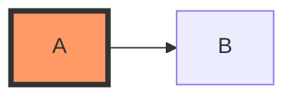

# mermaid 11.15.0

## Overview

Mermaid renders diagrams from markdown-like text inside ````mermaid` code blocks or `<pre class="mermaid">` HTML tags. Version 11.15.0 supports **28 diagram types** spanning flowcharts, sequence diagrams, Gantt charts, class diagrams, ER diagrams, mindmaps, pie charts, state machines, git graphs, C4 models, timelines, architecture diagrams, and more.

### Deployment modes

- **Live Editor**: <https://mermaid.live> — write code, preview instantly
- **Markdown embedding**: ```` ```mermaid` blocks in GitHub, GitLab, Obsidian, Notion, etc.
- **JavaScript API**: import `mermaid.esm.min.mjs` from CDN or npm package
- **CLI**: `npx @mermaid-js/mermaid-cli` for SVG/PNG export

### Configuration layers (applied in order)

1. Default configuration (built-in)
2. Site-level `mermaid.initialize()` overrides
3. Diagram frontmatter `config:` block (v10.5.0+, preferred)
4. Directives `%%{init: {...}}%%` (deprecated, still works)

### Frontmatter config example

```yaml
---
title: My Diagram
config:
  theme: forest
  themeVariables:
    primaryColor: "#BB2528"
---
flowchart TD
    A --> B
```

### Themes

| Theme   | Description                           |
| ------- | ------------------------------------- |
| default | Standard light theme                  |
| neutral | Black and white, print-friendly       |
| dark    | Dark mode                             |
| forest  | Green shades                          |
| base    | Only modifiable theme (use with `themeVariables`) |

### Layout algorithms

Specify via `config: { layout: <name> }`. Options: `dagre` (default), `elk` (better for large/complex diagrams), `cose-bilkent` (force-directed), `tidy-tree` (hierarchical).

## Usage

### Basic embedding in markdown

````markdown

```mermaid
flowchart LR
    A[Start] --> B[End]
```
````

### HTML with JS API

```html
<pre class="mermaid">
graph TD
    A --> B
</pre>
<script type="module">
  import mermaid from 'https://cdn.jsdelivr.net/npm/mermaid@11/dist/mermaid.esm.min.mjs';
  mermaid.initialize({ startOnLoad: true });
</script>
```

### CLI (PNG/SVG export)

```bash
npx @mermaid-js/mermaid-cli -i input.mmd -o output.svg
npx @mermaid-js/mermaid-cli -i input.mmd -o output.png -w 1200
```

### Diagram validation

Validate diagram syntax before rendering using the built-in validator:

```bash
# Validate a single file
mermaid.sh validate README.md

# Validate all diagrams in a directory
mermaid.sh validate docs/

# Validate from stdin
echo "graph TD; A-->B" | mermaid.sh validate -

# JSON output (for CI/CD)
mermaid.sh validate --json docs/

# Quiet mode (only errors)
mermaid.sh validate -q docs/
```

The validator uses `bun` to run `_mermaid.js`, which imports `mermaid`, `svgdom`, `jsdom`, and `dompurify` at runtime (no explicit install needed — bun resolves them from npm). It calls `mermaid.parse()` for syntax validation across all 28 diagram types.

Exit codes: `0` = all valid, `1` = syntax errors found, `2` = usage error.

### Styling nodes


```mermaid
flowchart LR
    A:::highlight --> B
    classDef highlight fill:#f96,stroke:#333,stroke-width:4px
```

### Comments

Use `%%` for single-line comments (must be on their own line).

## Gotchas

- **`mermaid.sh` requires `bun`**: The validator script invokes `bun` to run `_mermaid.js`. Install bun from https://bun.sh if not available.
- **"end" keyword**: Using lowercase `end` as a node label breaks parsing. Capitalize (`End`, `END`) or wrap in quotes/brackets.
- **Single-letter "o" or "x" at edge start**: `A---oB` creates a circle edge, not text. Add a space or capitalize: `A--- ops`.
- **External CSS doesn't work reliably**: Mermaid injects styles with `!important` and scoped SVG IDs. Use `classDef` instead of external CSS.
- **Frontmatter config is preferred over directives**: `%%{init: {...}}%%` is deprecated since v10.5.0. Use YAML frontmatter with `config:` key.
- **Subgraph direction ignored when linked externally**: If a subgraph's nodes are connected to outside nodes, it inherits the parent graph's direction instead of its own `direction` statement.
- **Pie chart values must be positive**: Zero and negative values cause errors.
- **Class name restrictions**: Alphanumeric, underscores, and dashes only. No special characters (use backticks or labels for those).
- **Generics with commas not supported**: `List~K, V~` fails. Avoid comma-separated generic types.
- **`htmlLabels: false` required for markdown in nodes**: When using markdown formatting inside node text (bold, italics), set `htmlLabels: false` in config.
- **FontAwesome requires CSS or icon pack registration**: Icons won't render unless Font Awesome CSS is loaded or icon packs are registered via the API.
- **Security level affects interactions**: Click events (`click nodeId href "url"`) require `securityLevel: 'loose'`. Default is `'strict'` which disables them.

## References

Each diagram type has a dedicated reference file with complete syntax, examples, and configuration options.

### Core diagrams

| Reference | Description |
| --------- | ----------- |
| [01-flowchart.md](references/01-flowchart.md) | Flowcharts: nodes, edges, shapes (50+), subgraphs, styling, animations, icons |
| [02-sequenceDiagram.md](references/02-sequenceDiagram.md) | Sequence diagrams: actors, messages, activations, loops, alt/opt/par/critical/break |
| [03-classDiagram.md](references/03-classDiagram.md) | Class diagrams: UML classes, inheritance, composition, namespaces, generics, annotations |
| [04-gitgraph.md](references/04-gitgraph.md) | Git graphs: commits, branches, merges, cherry-picks, styling |
| [05-stateDiagram.md](references/05-stateDiagram.md) | State diagrams: states, transitions, composite states, concurrency, history |

### Data visualization

| Reference | Description |
| --------- | ----------- |
| [06-pie.md](references/06-pie.md) | Pie charts: slices, showData, theming |
| [07-xyChart.md](references/07-xyChart.md) | XY charts: line/bar/area/scatter plots, axes config |
| [08-radar.md](references/08-radar.md) | Radar charts: multi-axis comparison |
| [09-sankey.md](references/09-sankey.md) | Sankey diagrams: flow/proportion visualization |
| [10-treemap.md](references/10-treemap.md) | Treemaps: hierarchical data as nested rectangles |
| [11-venn.md](references/11-venn.md) | Venn diagrams: set intersections |
| [12-quadrantChart.md](references/12-quadrantChart.md) | Quadrant charts: 2x2 matrix with scatter points |
| [13-block.md](references/13-block.md) | Block diagrams: manual layout, blocks, connectors, styling |

### Architecture & modeling

| Reference | Description |
| --------- | ----------- |
| [14-architecture.md](references/14-architecture.md) | Architecture diagrams: cloud-style nodes and connections |
| [15-c4.md](references/15-c4.md) | C4 model: Context, Container, Component, Dynamic, Deployment diagrams |
| [16-entityRelationshipDiagram.md](references/16-entityRelationshipDiagram.md) | ER diagrams: entities, attributes, crow's foot relationships |
| [17-packet.md](references/17-packet.md) | Packet diagrams: binary packet/protocol structure visualization |
| [18-treeView.md](references/18-treeView.md) | Tree views: file/folder hierarchy display |
| [19-zenuml.md](references/19-zenuml.md) | ZenUML: UML-like class diagrams with simplified syntax |
| [20-wardley.md](references/20-wardley.md) | Wardley maps: value chain, evolution stages, topology |

### Project management & process

| Reference | Description |
| --------- | ----------- |
| [21-gantt.md](references/21-gantt.md) | Gantt charts: tasks, sections, milestones, critical path, exclusions |
| [22-timeline.md](references/22-timeline.md) | Timelines: chronological events with grouping and icons |
| [23-kanban.md](references/23-kanban.md) | Kanban boards: columns, tickets, status tracking |
| [24-userJourney.md](references/24-userJourney.md) | User journey: steps, actors, satisfaction levels |
| [25-requirementDiagram.md](references/25-requirementDiagram.md) | Requirements: FR/NFR, traces, conflicts, hierarchy |
| [26-eventmodeling.md](references/26-eventmodeling.md) | Event modeling: events, commands, aggregates, policies |
| [27-ishikawa.md](references/27-ishikawa.md) | Ishikawa (fishbone): cause-and-effect analysis |
| [28-mindmap.md](references/28-mindmap.md) | Mindmaps: hierarchical ideas, indentation-based syntax, icons |

### Configuration

| Reference | Description |
| --------- | ----------- |
| [29-configuration.md](references/29-configuration.md) | Themes, frontmatter config, directives (deprecated), layouts, CLI, accessibility |
