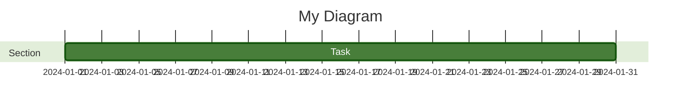

# Configuration

## Contents
- Configuration Sources and Priority
- Frontmatter Config (v10.5.0+)
- initialize() — Site-Wide Config
- Directives (Deprecated)
- Common Top-Level Options
- Diagram-Specific Config Keys

## Configuration Sources and Priority

Configuration is applied in this order (later sources override earlier):

1. **Default configuration** — built-in defaults
2. **Site config** — `mermaid.initialize()` overrides, applied to all diagrams
3. **Frontmatter** — per-diagram YAML block (v10.5.0+, replaces directives)
4. **Directives** — `%%{init: {...}}%%` (deprecated, still works)

Before each render, `configApi.reset()` resets to site config, then applies frontmatter/directives.

## Frontmatter Config (v10.5.0+)

YAML block between `---` delimiters at the top of diagram code. The triple dash must be the only character on its line.



Frontmatter supports the entire config except secure keys. It is the recommended way to configure individual diagrams.

### Diagram-Specific Config in Frontmatter

Diagram-specific settings go under the diagram type key:

```yaml
---
config:
  flowchart:
    curve: linear
  sequence:
    mirrorActors: true
    wrap: true
---
```

## initialize() — Site-Wide Config

Call once to set defaults for all diagrams on a page:

```javascript
mermaid.initialize({
  startOnLoad: true,
  theme: 'default',
  securityLevel: 'strict',
  htmlLabels: true,
  flowchart: { useMaxWidth: false, curve: 'cardinal' },
  sequence: { mirrorActors: false },
});
```

### Common Top-Level Options

| Option | Type | Default | Description |
|---|---|---|---|
| `startOnLoad` | boolean | true | Auto-render on page load |
| `theme` | string | 'default' | Color theme |
| `securityLevel` | string | 'strict' | Trust level for parsed diagrams |
| `htmlLabels` | boolean | true | Render labels as HTML |
| `logLevel` | number | 5 | 1=debug, 2=info, 3=warn, 4=error, 5=fatal only |
| `fontFamily` | string | 'trebuchet ms, verdana, arial' | Default font |
| `fontSize` | number | 16 | Font size in pixels |
| `look` | string | 'classic' | 'classic' or 'handDrawn' |
| `layout` | string | 'dagre' | Layout engine (dagre, elk, tidy-tree, cose-bilkent) |

## Directives (Deprecated)

Directives (`%%{init: {...}}%%`) are deprecated since v10.5.0. Use frontmatter instead.

Legacy syntax:

```
%%{init: { 'theme': 'dark', 'flowchart': { 'curve': 'linear' } }}%%
graph LR
    A --> B
```

Multiple directives are merged, with later values overriding earlier ones for the same key.

## Diagram-Specific Config Keys

Each diagram type has its own config namespace. Key examples:

### Flowchart
- `curve`: linear, cardinal, basis, bumpX, catmullRom, monotoneX, step, etc.
- `useMaxWidth`: boolean
- `defaultRenderer`: 'dagre' | 'elk'
- `diagramPadding`: number

### Sequence
- `mirrorActors`: boolean
- `wrap`: boolean
- `width` / `height`: number
- `messageAlign`: left, center, right
- `rightAngles`: boolean
- `showSequenceNumbers`: boolean

### Gantt
- `useWidth`: number
- `compact`: boolean
- `topPadding`: number

For a complete list of all config keys, refer to the source `defaultConfig.ts` in the Mermaid repository.
