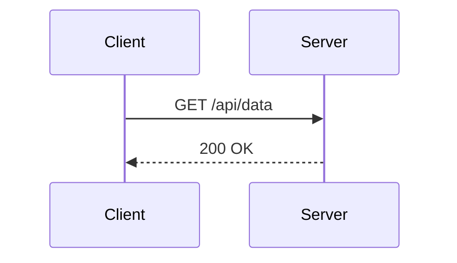
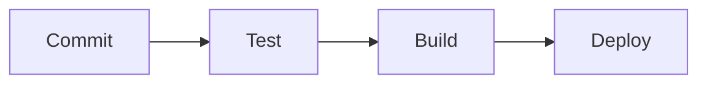
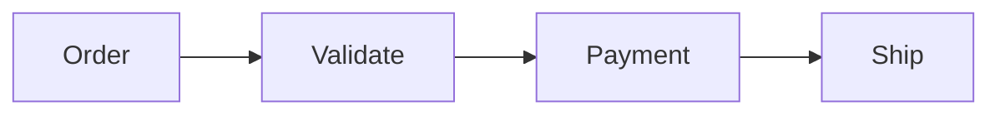
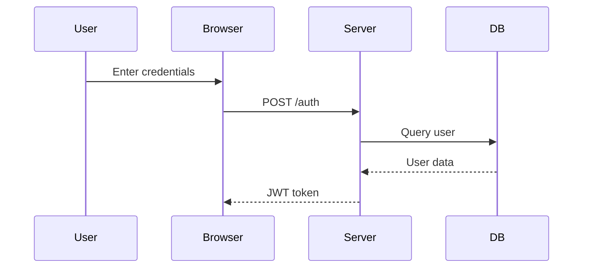
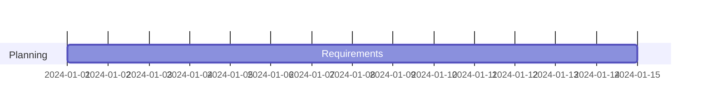
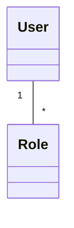
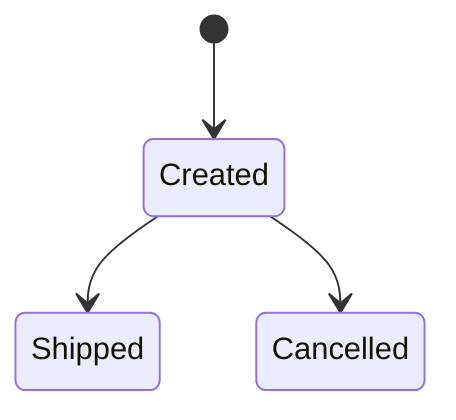
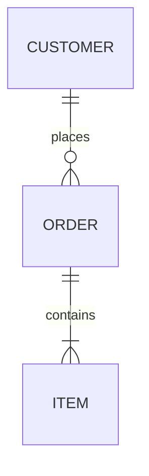
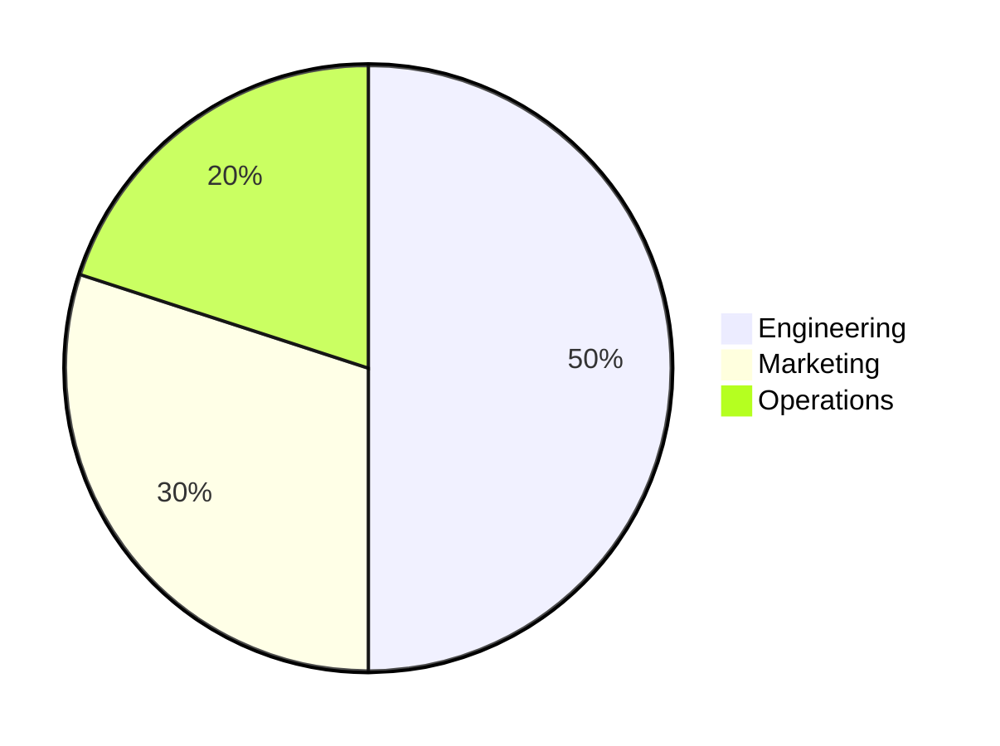

# Accessibility

## Contents
- accTitle (Short Descriptive Title)
- accDescr (Single-Line Description)
- accDescr (Multi-Line Description)
- aria-roledescription and aria-labelledby
- Per-Diagram Examples

## Overview

Mermaid supports accessibility attributes that generate proper ARIA tags in the rendered SVG, making diagrams accessible to screen readers. Use `accTitle` for a short title and `accDescr` for a detailed description.

## accTitle (Short Descriptive Title)

Place at the top of diagram code. Renders as `<title>` inside the SVG.

## accDescr (Single-Line Description)

Use `accDescr:` followed by a single line of text. Renders as `<desc>`.

## accDescr (Multi-Line Description)

Use `accDescr { ... }` without a colon for multi-line descriptions.

## aria-roledescription and aria-labelledby

Mermaid automatically adds `aria-roledescription="mermaid diagram"` to the SVG root element. The title is linked via `aria-labelledby`. This ensures screen readers announce the diagram type and read the title.

## Per-Diagram Examples

### Flowchart

### Sequence Diagram

### Gantt

### Class Diagram

### State Diagram

### ER Diagram

### Pie Chart

