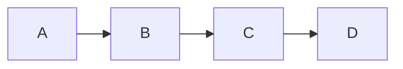
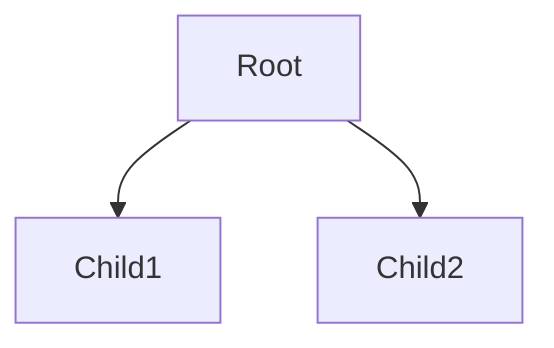
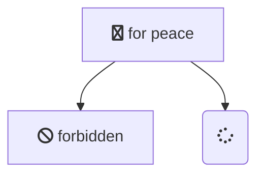
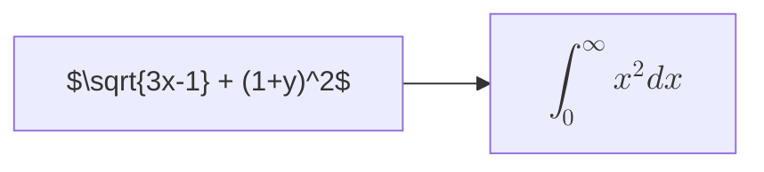

# Layouts, Icons, Math, and CLI

## Contents
- Layout Engines (dagre, elk, tidy-tree, cose-bilkent)
- Icon Packs
- KaTeX Math Rendering
- Mermaid CLI

## Layout Engines

Mermaid supports multiple layout engines that control how nodes are positioned. Set via `layout` config key or diagram-specific `defaultRenderer`.

### dagre (Default)

The default layout engine. Good for small to medium diagrams. Supports all flowchart features including subgraphs, wrapping, and animations.


### elk (Experimental, v9.4+)

Better for larger and more complex diagrams. Produces cleaner layouts with fewer edge crossings. Set via config:



Requires lazy-loading to be enabled on the site. Not all flowchart features are supported (e.g., some edge styles).

### tidy-tree

Tree-focused layout engine. Best for tree-like hierarchical structures. Supports `direction` keyword. Set via:



### cose-bilkent

Force-directed layout. Good for organic, network-style layouts. Set via:

```mermaid
---
config:
  layout: cose-bilkent
---
flowchart LR
    A --> B
    B --> C
    C --> A
```

## Icon Packs

### FontAwesome Icons (Basic)

Use `fa:#icon class#` syntax in node labels:



Supported prefixes: `fa`, `fab`, `fas`, `far`, `fal`, `fad`. Custom icons use `fak` prefix (paid FontAwesome feature).

### Registering Icon Packs (v11.7.0+)

Register icon packs programmatically:

```javascript
import { iconPacks } from 'mermaid';
import { faBrands } from '@fortawesome/free-brands-svg-icons';
import { fas } from '@fortawesome/free-solid-svg-icons';

await iconPacks.addIconPacks([faBrands, fas]);
```

Fallback to FontAwesome CSS if packs are not registered.

### Custom Icons in Architecture Diagrams

Architecture diagrams support custom icons via URL:


## KaTeX Math Rendering (v10.9.0+)

Render LaTeX math expressions in diagram labels using `$...$` (inline) or `$$...$$` (block):



Requires KaTeX to be loaded on the page. Enable via config:

```javascript
mermaid.initialize({
  katex: {
    throwOnError: false,
    maxSize: 10000,
    maxExpand: 1000,
  },
});
```

## Mermaid CLI

`@mermaid-js/mermaid-cli` renders diagrams to SVG/PNG from command line.

```bash
npx @mermaid-js/mermaid-cli -i input.mmd -o output.svg
```

Supports:
- `-i` input file (`.mmd`, `.md`, or text)
- `-o` output file (`.svg`, `.png`)
- `-w` width in pixels
- `-t` theme name
- `-c` config file path
