# Flowchart

## Contents
- Node Shapes (Standard and Expanded)
- Edges (Links)
- Subgraphs
- Markdown Strings
- Interaction (Click Events)
- Styling and Classes
- Configuration
- Animations
- Comments

## Overview

Flowcharts are the most feature-rich diagram type in Mermaid. They support 30+ node shapes, multiple edge styles, subgraphs, styling, classes, animations, markdown strings, and interactivity. Use `flowchart` or `graph` keyword.

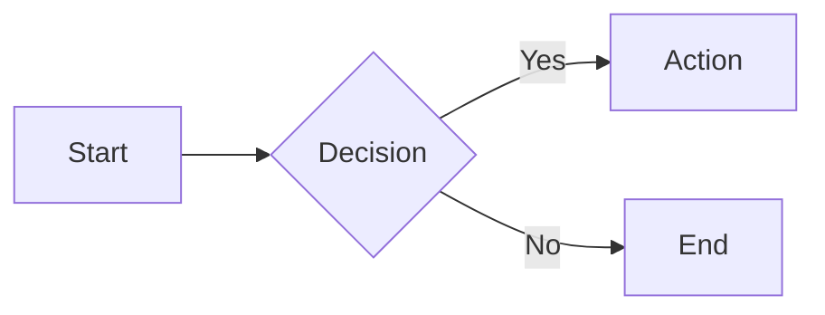

## Node Shapes

### Standard Shapes

| Syntax | Shape | Description |
|---|---|---|
| `A` | Plain | Text only, no shape |
| `A(text)` | Round | Rounded rectangle |
| `A[text]` | Rect | Rectangle |
| `A{text}` | Rhombus | Decision/diamond |
| `A[text]` | Hexagon | *(see expanded below)* |
| `A((text))` | Circle | Circle (double parens) |
| `A((text))` | Stadium | *(v10.9.0+ — see expanded)* |
| `A[(text)]` | Cylinder | Database/cylinder |
| `A([text])` | AsymRect | Assembly/parallelogram-ish |
| `A>text}` | Tag | Right-pointing tag (left open) |
| `A{text<` | Tag | Left-pointing tag (right open) |
| `A[[text]]` | Parallelogram | *(v10.9.0+)* |
| `A{{text}}` | Double Circle | *(v10.9.0+)* |
| `A{text` | Card | Subroutine/card (flat left) |
| `A[/"text"/]` | Lean Right | Parallelogram leaning right |
| `A[\"text"\]` | Lean Left | Parallelogram leaning left |
| `A[-text-]` | Step | Stepped shape |
| `A=[text]=` | Home | House/home icon shape |
| `A{text` | Subroutine | Flat top/bottom subroutine |

### Expanded Node Shapes (v10.9.0+)

30+ additional shapes for precise diagramming:

| Syntax | Shape |
|---|---|
| `A(((text)))` | Double Circle (triple paren) |
| `A(text)` | Stadium (rounded ends) |
| `A[[text]]` | Parallelogram |
| `A{{text}}` | Double Circle |
| `A[/text\]` | Skewed top parallelogram |
| `A[\text/]` | Skewed bottom parallelogram |
| `A[/"text"/]` | Lean right |
| `A[\"text"\]` | Lean left |
| `A[-text-]` | Step |
| `A=[text]=` | Home (house) |
| `A{text` | Subroutine |
| `A>text}` | Tag right |
| `A{text<` | Tag left |
| `A[[text]]` | Parallelogram |

### Node with ID and Label

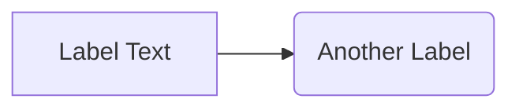

Use double quotes for labels with special characters:

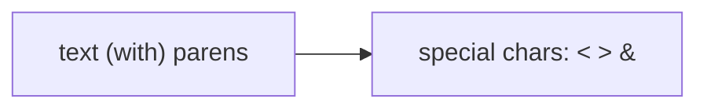

## Edges (Links)

### Edge Types

| Syntax | Line Style | Arrowhead |
|---|---|---|
| `-->` | Solid | Arrow |
| `-.->` or `-.-.` | Dotted | Arrow |
| `==>` | Thick solid | Arrow |
| `X-->` or `--X>` | Solid | Cross at end |

### Edge Labels

```mermaid
flowchart LR
    A -->|label| B
    A -- label --> B
    A --> "label" B
```

### Attaching an ID to Edges (v11.10.0+)

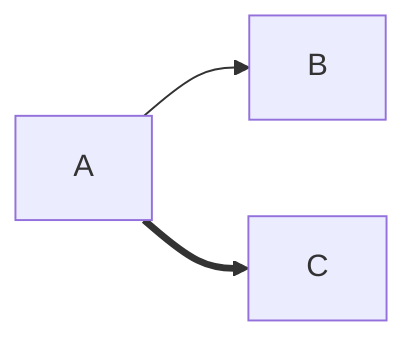

### Edge Styling via Edge IDs


### Multiple Edges Between Same Nodes

Use edge IDs to distinguish:

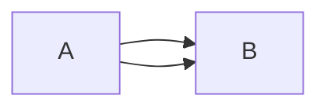

## Subgraphs

Group nodes into labeled containers:

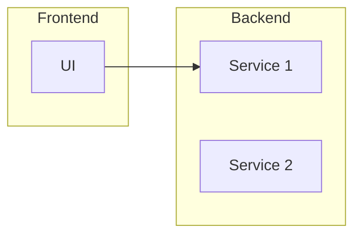

### Subgraph Direction

Override direction within a subgraph:

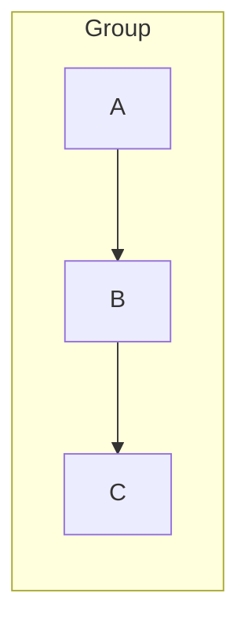

### Nested Subgraphs

Subgraphs can be nested to any depth:

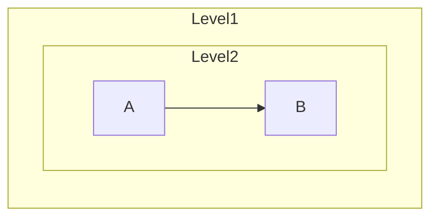

## Markdown Strings

Use backticks for formatted text in labels (bold, italic, auto-wrap):

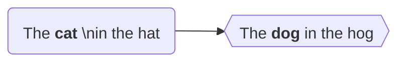

- `**bold**` for bold text
- `*italic*` for italic text
- Newlines auto-wrap (no `<br>` needed)

Disable auto-wrap: `config: { markdownAutoWrap: false }`

## Interaction (Click Events)

Bind click events to nodes. Requires `securityLevel: 'loose'`.


Target options: `_self`, `_blank`, `_parent`, `_top`.

## Styling and Classes

### Direct Node Styling

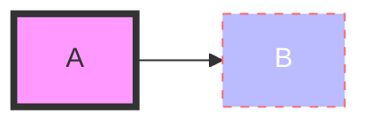

### classDef (Define Style Classes)

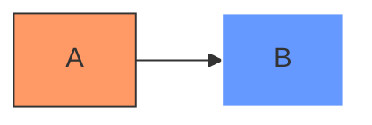

Apply to multiple nodes:

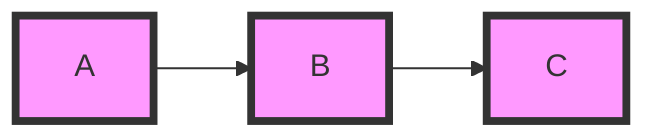

### Default Class

`classDef default` applies to all nodes without specific classes.

### Styling Links (linkStyle)

By index (0-based order of definition):

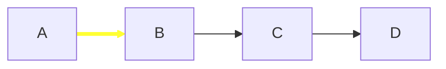

### Line Curves

Set curve style at diagram level or edge level:


Available curves: `basis`, `bumpX`, `bumpY`, `cardinal`, `catmullRom`, `linear`, `monotoneX`, `monotoneY`, `natural`, `step`, `stepAfter`, `stepBefore`.

## Configuration

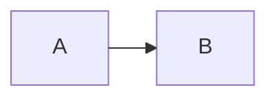

| Option | Default | Description |
|---|---|---|
| `curve` | cardinal | Edge curve style |
| `defaultRenderer` | dagre | Layout engine (dagre, elk) |
| `useMaxWidth` | true | Use max width for SVG |
| `diagramPadding` | 8 | Padding around diagram |

## Animations (v11.4.0+)

Add motion to nodes and edges:

```mermaid
flowchart LR
    A{start} -anim--> B{end}
    B -.anim.- > C
    B anim ==> D
```

Animation types: `pulse`, `travel`, `trail`. Default is `pulse` (node) / `travel` (edge).

```mermaid
flowchart LR
    A -pulse.--> B
    C -travel.--> D
    E -trail.--> F
```

## Comments

Use `%%` for line comments:

```mermaid
flowchart LR
%% This is a comment
    A --> B
```
