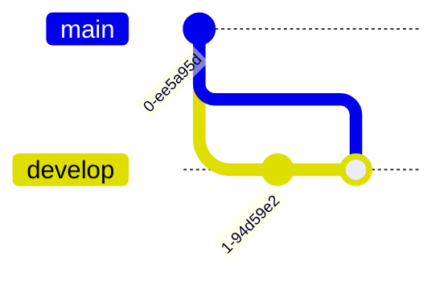
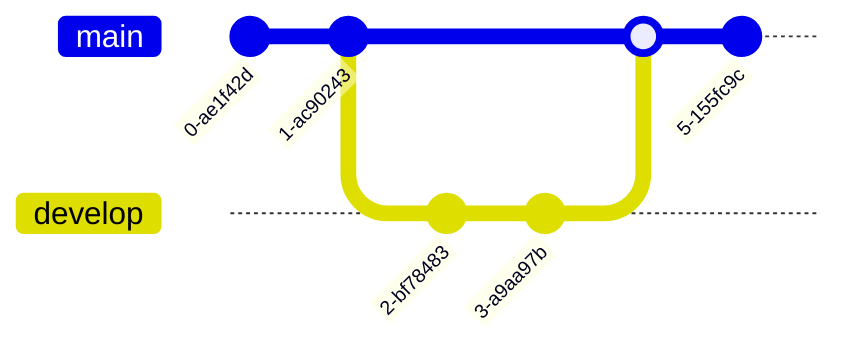
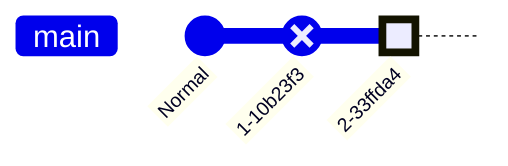
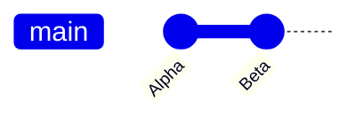
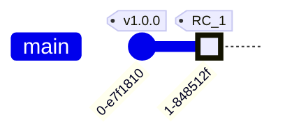
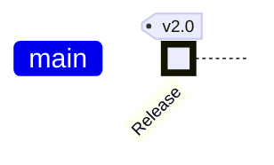
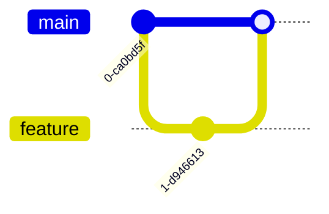
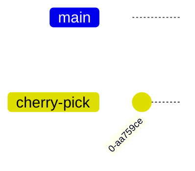
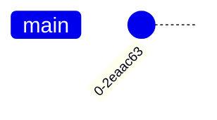

# GitGraph Diagram

## Contents
- Basic Syntax
- Commit Types
- Custom Commit IDs and Tags
- Branches (Create, Checkout, Merge)
- Cherry-Pick
- Theme Variables
- Configuration

## Overview

GitGraph diagrams visualize git branching strategies, commits, merges, and checkout operations. Useful for documenting Git Flow, GitHub Flow, or any branching model.

## Basic Syntax

Declare with `gitgraph` keyword. Starts on `main` branch by default. Each command is executed in order (insertion order).

### Core Commands

| Command | Description |
|---|---|
| `commit` | Add a commit to current branch |
| `branch <name>` | Create and switch to new branch |
| `checkout <name>` | Switch to existing branch |
| `merge <name>` | Merge branch into current |
| `cherry-pick <name>` | Cherry-pick from another branch |

`checkout` and `switch` are interchangeable.

### Simple Example

## Commit Types

| Type | Appearance | Description |
|---|---|---|
| `NORMAL` (default) | Solid circle | Regular commit |
| `REVERSE` | Crossed circle | Revert/undo commit |
| `HIGHLIGHT` | Filled rectangle | Important/milestone commit |

## Custom Commit IDs and Tags

### Custom ID

### Tags

Attach git-style tags to commits:

Combine attributes:

## Branches

### Create and Checkout

`branch` creates and switches to the new branch:

### Quoting Branch Names

Names that conflict with keywords must be quoted:

## Cherry-Pick

## Theme Variables

| Variable | Default | Description |
|---|---|---|
| `commitBackground` | #fff | Commit circle fill |
| `commitBorderColor` | calculated | Commit circle border |
| `commitFontColor` | calculated | Text in commit labels |
| `branchFontSize` | 14px | Branch label font size |
| `tagFontSize` | 13px | Tag label font size |
| `mainBranchBkg` | #ff6 | Main branch line color |
| `branch0Background`–`branch9Background` | calculated | Per-branch colors (0-9) |
| `reverseCommitBackground` | calculated | Reverse commit fill |
| `highlightTextColor` | calculated | Highlight commit text |

## Configuration

