# Sequence Diagram

## Contents
- Participants and Actors
- Participant Types (boundary, control, entity, database, queue, collections)
- Aliases
- Actor Creation/Destruction
- Grouping (Boxes)
- Message Types
- Central Connections (v11.12.3+)
- Activations
- Notes
- Line Breaks
- Loops, Alt, Parallel, Critical, Break
- Styling
- Configuration

## Overview

Sequence diagrams show interactions between participants over time. Messages flow top-to-bottom along lifelines.

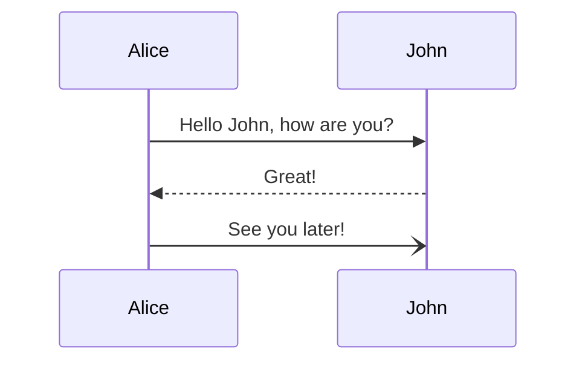

## Participants and Actors

### Implicit Declaration

Participants are created on first mention in messages. Rendered in order of first appearance.

### Explicit Declaration

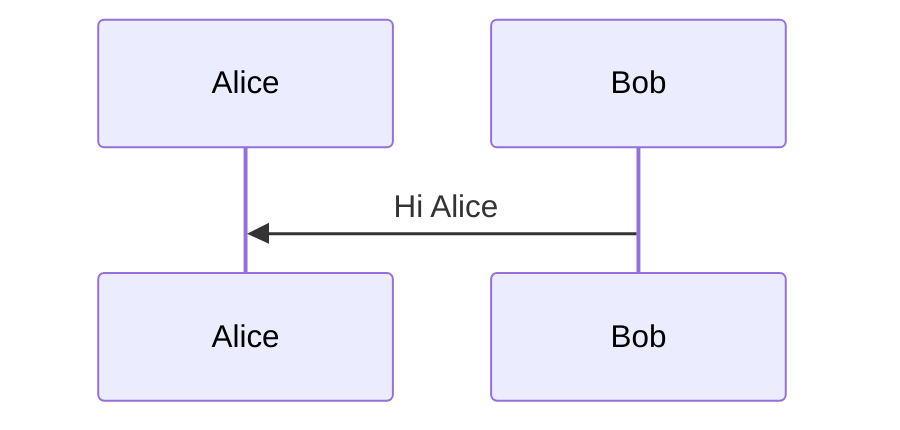

### Actor Symbol

Use `actor` keyword for stick-figure representation:

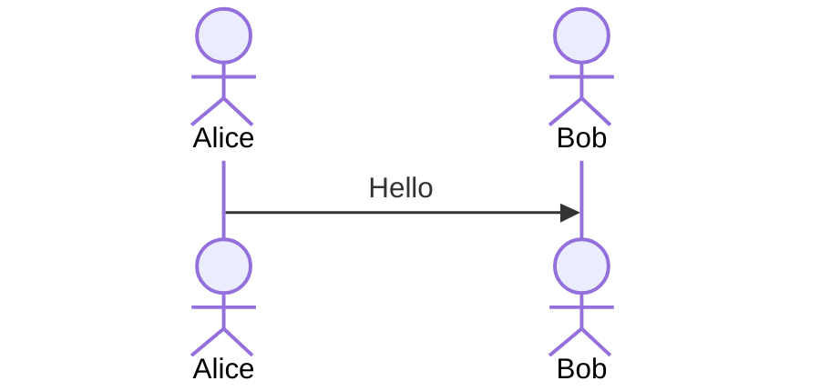

### Participant Types

Specify special shapes via inline config:

| Type | Syntax | Shape |
|---|---|---|
| boundary | `participant A@{ "type": "boundary" }` | Boundary symbol |
| control | `participant A@{ "type": "control" }` | Control symbol (circle + arrow) |
| entity | `participant A@{ "type": "entity" }` | Entity (circle with bar) |
| database | `participant A@{ "type": "database" }` | Database cylinder |
| collections | `participant A@{ "type": "collections" }` | Collections symbol |
| queue | `participant A@{ "type": "queue" }` | Queue symbol |

## Aliases

### External Alias (`as` keyword)

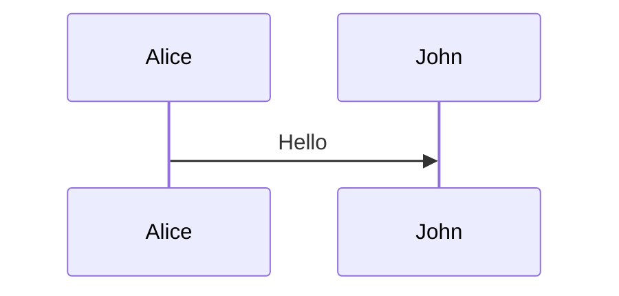

Combine with type:

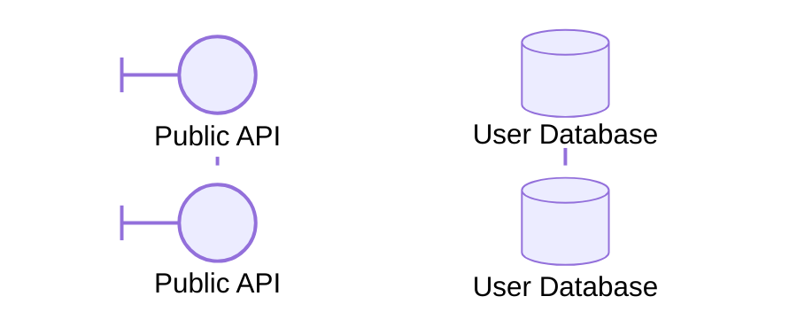

### Inline Alias

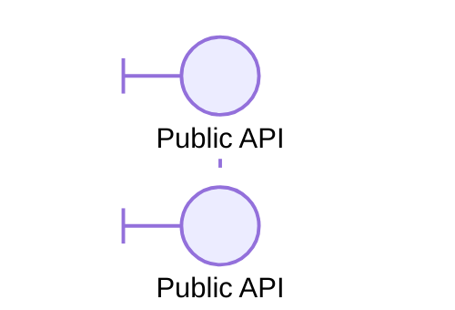

External alias (`as`) takes precedence over inline `"alias"`.

## Actor Creation/Destruction (v10.3.0+)

```mermaid
sequenceDiagram
    Alice->>Bob: Hello
    create participant Carl
    Alice->>Carl: Hi Carl!
    create actor D as Donald
    destroy Carl
    Alice-xCarl: Too many
```

Only recipients can be created; senders or recipients can be destroyed.

## Grouping (Boxes)

Group participants in colored boxes:

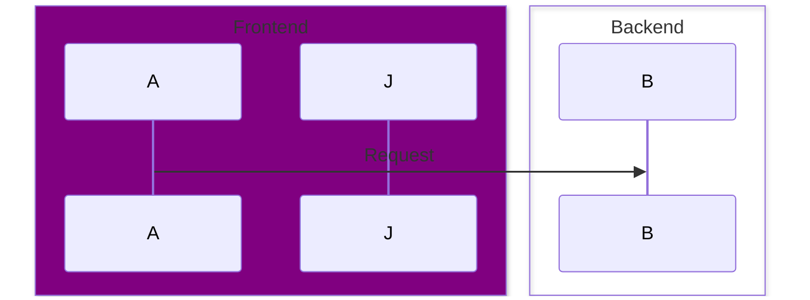

Use `transparent` to force no color when name matches a color keyword.

## Message Types

| Syntax | Line | Arrowhead | Description |
|---|---|---|---|
| `->>` | Solid | Arrow | Synchronous call |
| `-->>` | Dotted | Arrow | Return message |
| `->` | Solid | None | Simple line |
| `--` | Dotted | None | Simple dotted |
| `-x` | Solid | Cross | Destroy/dead letter |
| `--x` | Dotted | Cross | Dotted destroy |
| `-)` | Solid | Open arrow | Async message |
| `--)` | Dotted | Open arrow | Dotted async |
| `<<->>` | Solid | Bidirectional | Both directions (v11.0.0+) |
| `-->>` | Dotted | Bidirectional | Dotted both directions |

### Half-Arrows (v11.12.3+)

Top/bottom half-arrowheads for more expressive diagrams:

| Syntax | Description |
|---|---|
| `-\|/` | Top half arrowhead |
| `-\/` | Bottom half arrowhead |
| `/\|-` | Reverse top half |
| `\\-` | Reverse bottom half |

Add `--` for dotted variants.

## Central Connections (v11.12.3+)

Connect messages to central lifeline points using `()`:

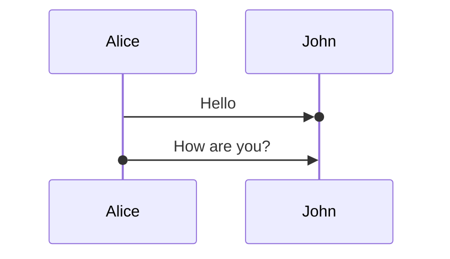

## Activations

Show when participants are active:

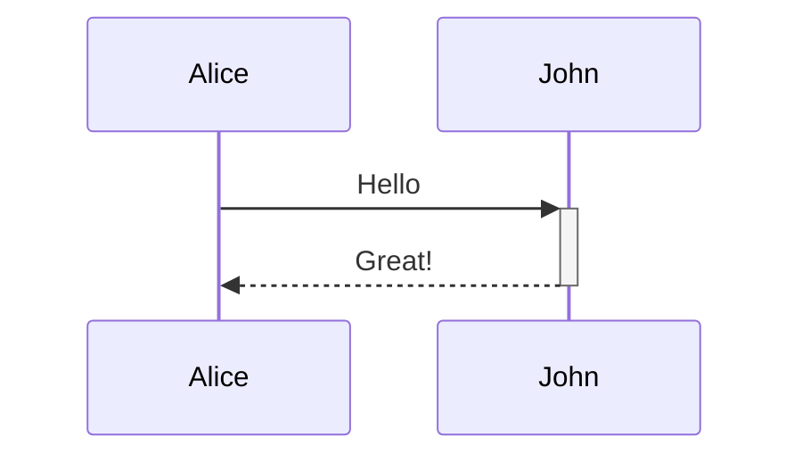

Shortcut: `+` activates, `-` deactivates. Stacking supported:

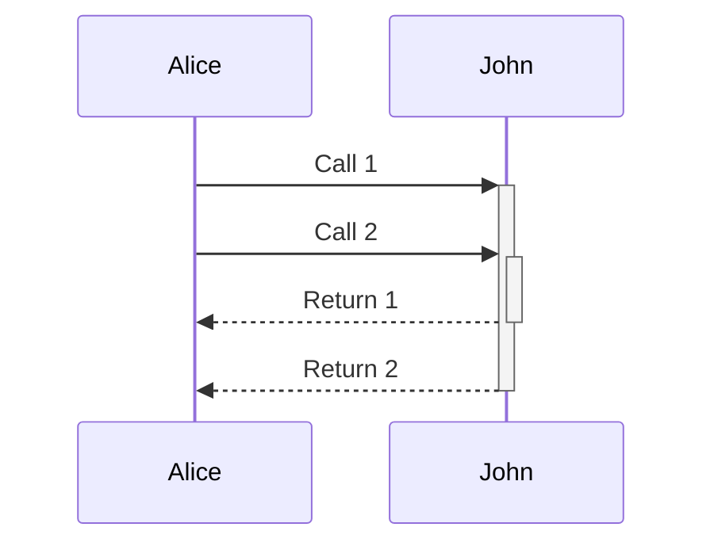

Or explicit declarations:

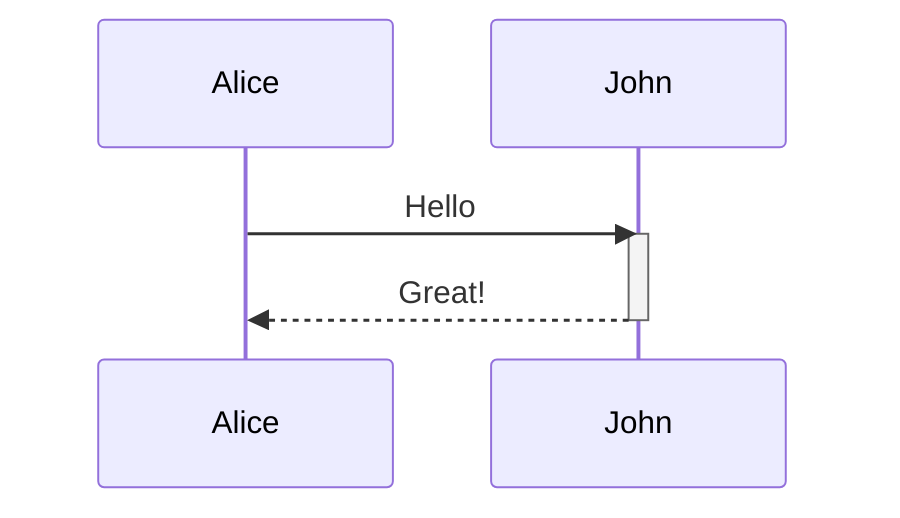

## Notes

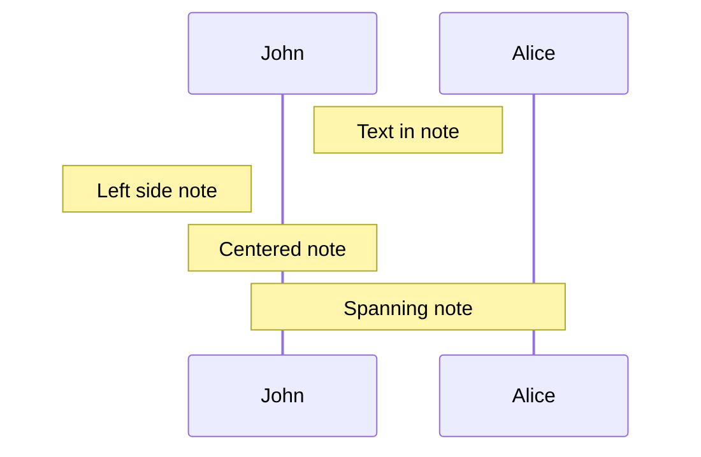

## Line Breaks

Use `<br/>` in messages and notes. For actor names, use aliases:

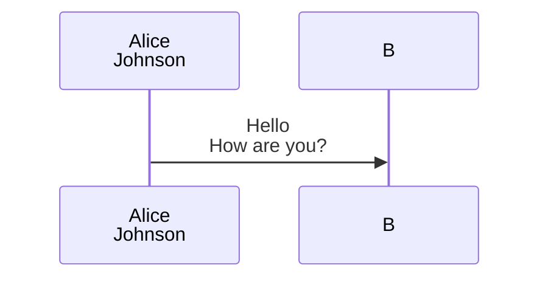

## Loops, Alt, Parallel, Critical, Break

### Loop

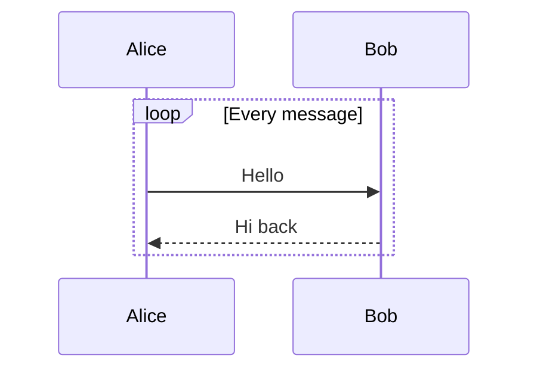

### Alt / Else

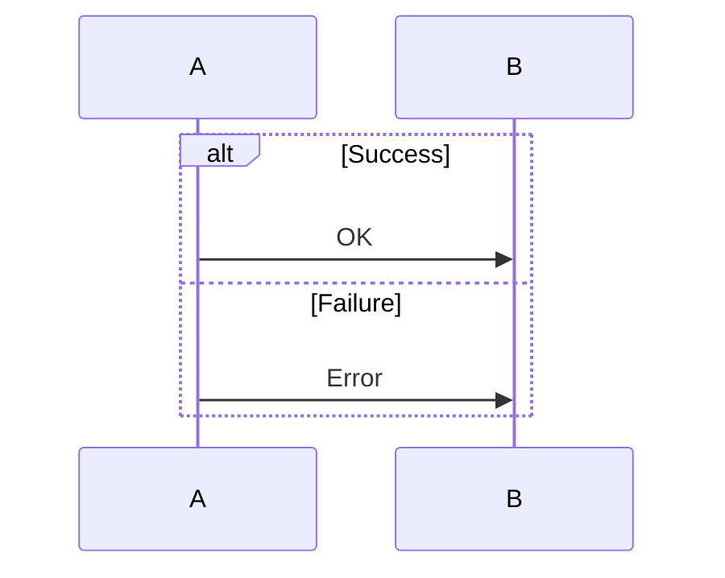

### Opt (Optional)

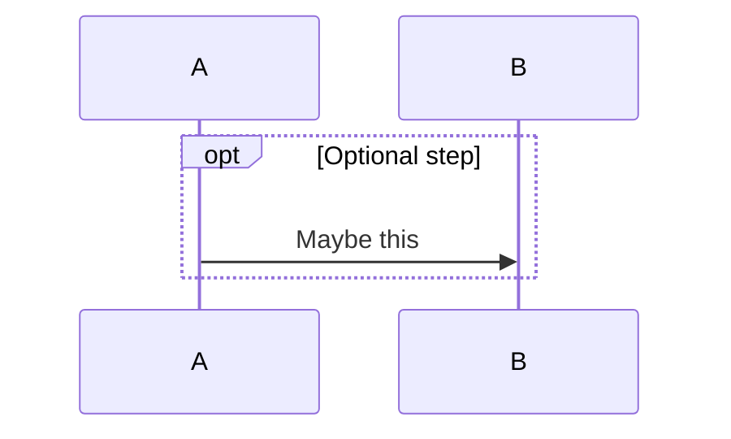

### Parallel

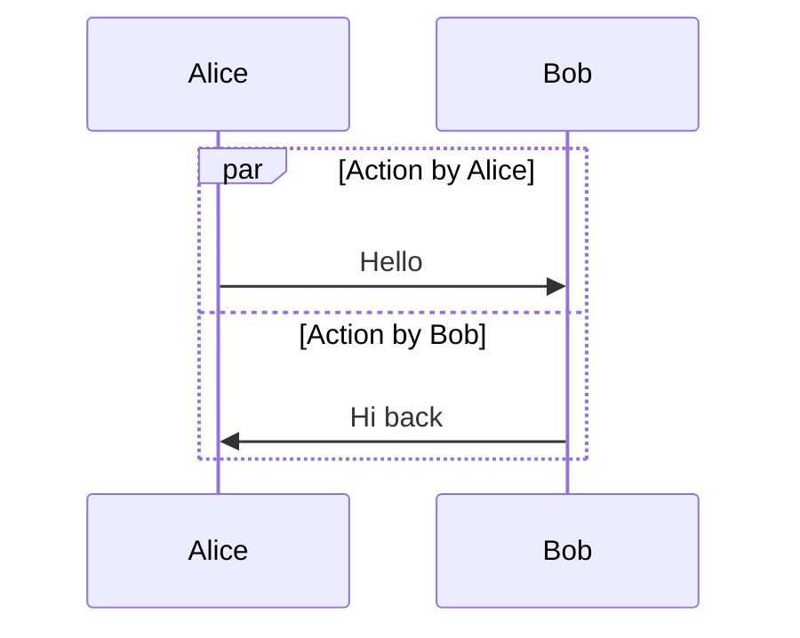

### Critical Region

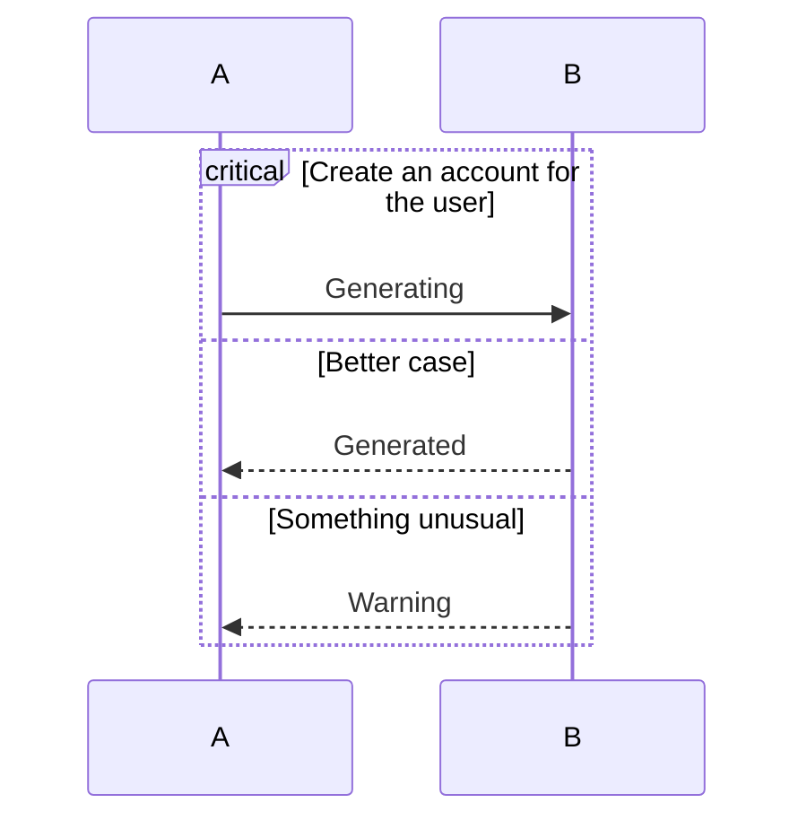

### Break

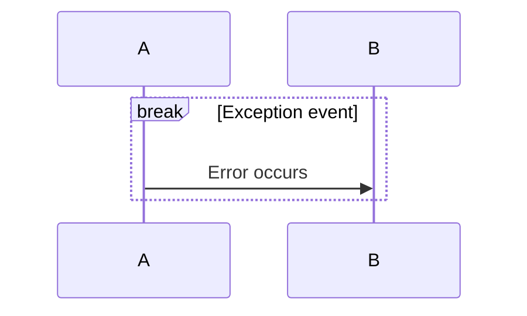

## Styling

Use `rect` for background highlighting:

```mermaid
sequenceDiagram
    rect rgb(0, 255, 0)
    Alice->>Bob: All good
    end
    rect rgb(255, 0, 0)
    Alice->>Bob: Error!
    end
```

## Configuration

```mermaid
---
config:
  sequence:
    mirrorActors: true
    wrap: true
    width: 300
    height: 50
    messageAlign: center
    rightAngles: false
    showSequenceNumbers: true
---
sequenceDiagram
    A->>B: Hello
```

| Option | Default | Description |
|---|---|---|
| `mirrorActors` | false | Show actors at bottom too |
| `wrap` | false | Wrap long messages |
| `width` / `height` | auto | Actor box dimensions |
| `messageAlign` | left | Message label alignment |
| `rightAngles` | false | Right-angle message lines |
| `showSequenceNumbers` | false | Show message numbers |
