# Class Diagram

## Contents
- Defining Classes
- Members (Fields and Methods)
- Relationships
- Cardinality/Multiplicity
- Namespaces
- Annotations
- Notes
- Direction
- Interaction
- Styling
- Configuration

## Overview

Class diagrams model the structure of systems using classes, interfaces, enums, and their relationships.

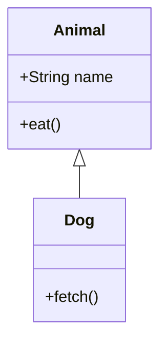

## Defining Classes

### Basic Class

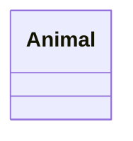

### With Members

List fields and methods after the class declaration:

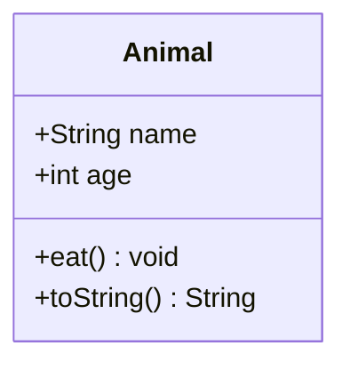

Or inline shorthand (one per line):

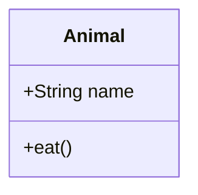

### Visibility Prefixes

| Symbol | Meaning |
|---|---|
| `+` | Public |
| `-` | Private |
| `#` | Protected |
| `~` | Package/internal |

### Static and Abstract

Underscore prefix for static, strikethrough (double underscore) for abstract:

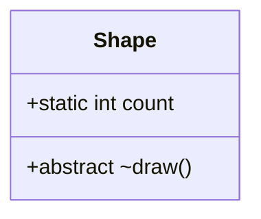

### Types (Class, Interface, Enum)

```mermaid
classDiagram
    class NormalClass
    interface Drawable
    enum Color { RED, GREEN, BLUE }
```

## Relationships

| Syntax | Line | Arrowhead | Meaning |
|---|---|---|---|
| `--` | Solid | None | Association |
| `*--` | Solid | Diamond | Composition |
| `o--` | Solid | Hollow diamond | Aggregation |
| `|--` | Solid | None | Same as association |
| `<|--` | Solid | Hollow triangle | Inheritance (generalization) |
| `..>` | Dotted | Open arrow | Dependency |
| `..|>` | Dotted | Hollow triangle | Realization (implements) |
| `*..` | Dotted | Diamond | Shared composition |
| `o..` | Dotted | Hollow diamond | Shared aggregation |

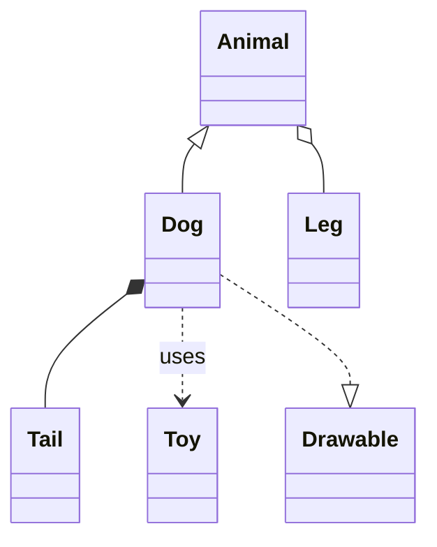

## Cardinality/Multiplicity

Add multiplicity to relationship ends:

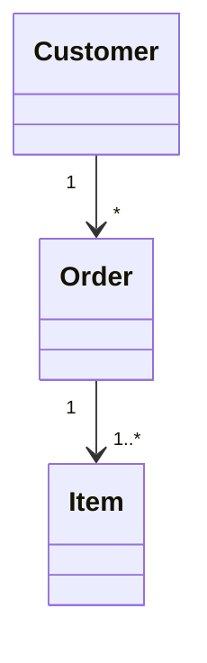

Supported values: `0..1`, `0..*`, `1..*`, `1`, `*`, `0`, and specific ranges like `2..5`.

## Namespaces

Group classes in namespaces:

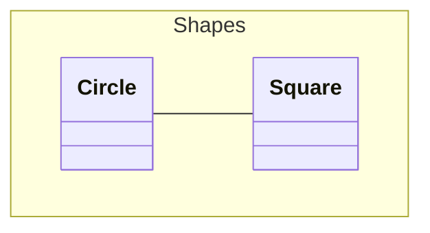

## Annotations

Annotate relationships with text labels:

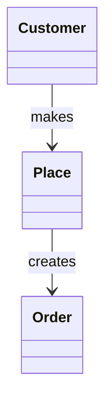

## Comments

Use `%%` for line comments:

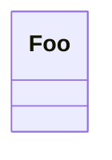

## Direction

Set layout direction:

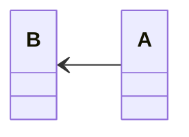

Valid directions: `TB`, `BT`, `LR`, `RL`.

## Notes

Add notes to classes:

```mermaid
classDiagram
    note "This is a note for Animal" as N1
    class Animal
    N1 .. Animal
```

## Interaction (Click Events)


Requires `securityLevel: 'loose'`.

## Styling

### Direct Styling

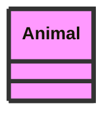

### Classes

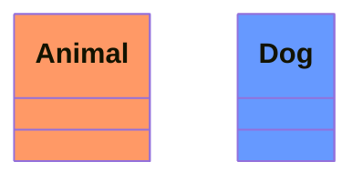

## Configuration

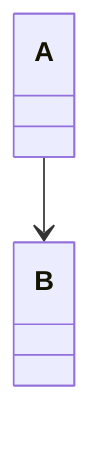
