# State Diagram

## Contents
- States and Transitions
- Start and End States
- Composite States
- Choice Points
- Forks and Joins
- Concurrency
- Notes
- Direction
- Styling (classDefs)
- Comments

## Overview

State diagrams model system behavior in terms of states and transitions between them. Use `stateDiagram-v2` (recommended) or legacy `stateDiagram`.

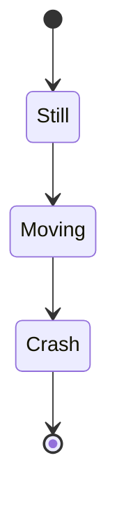

## States

### Simple State

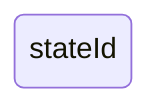

### Named State with Description

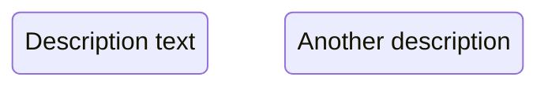

## Transitions

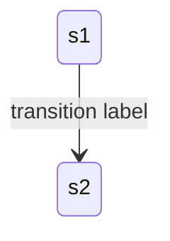

Undefined states in transitions are auto-created.

## Start and End States

`[*]` represents the special start/end state. Direction determines role:

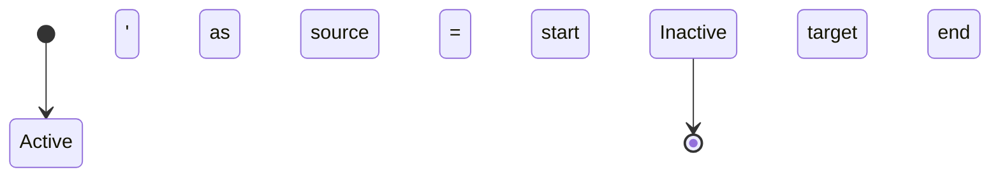

## Composite States

Nest states within states using `state ... { }`:

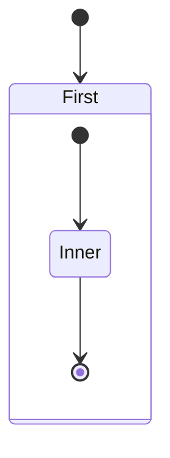

Supports unlimited nesting depth. Transitions between composite states are allowed, but not between internal states of different composites.

## Choice Points

Model decision points with `<<choice>>`:

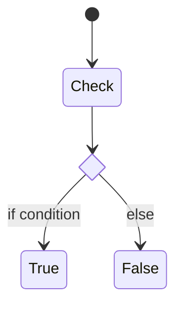

## Forks and Joins

Split and merge flows with `<<fork>>` and `<<join>>`:

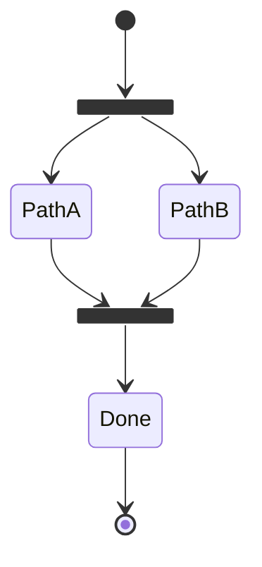

## Concurrency

Use `--` separator inside composite states for concurrent regions:

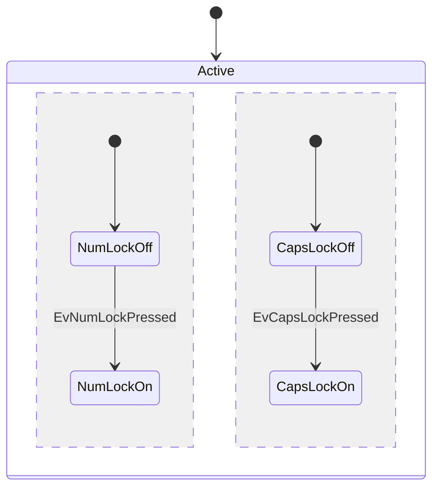

## Notes

```mermaid
stateDiagram-v2
    State1
    note right of State1
        Multi-line note text
    end note
    note left of State2 : Single line note.
```

## Direction

Set layout direction (global and per-composite-state):

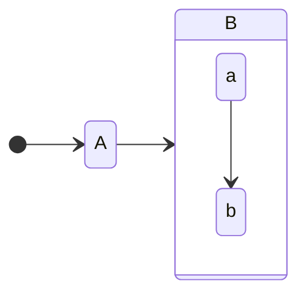

Valid: `TB`, `BT`, `LR`, `RL`.

## Styling with classDefs

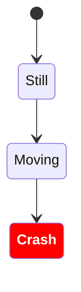

Or inline with `:::`:


Limitations: cannot apply to start/end states or within composite states.

## Comments

Use `%%` for line comments (own line or end-of-statement):

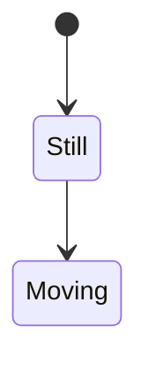
