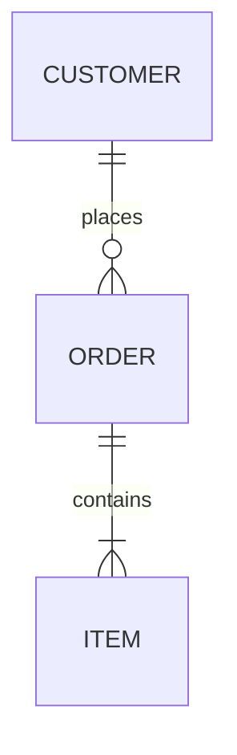
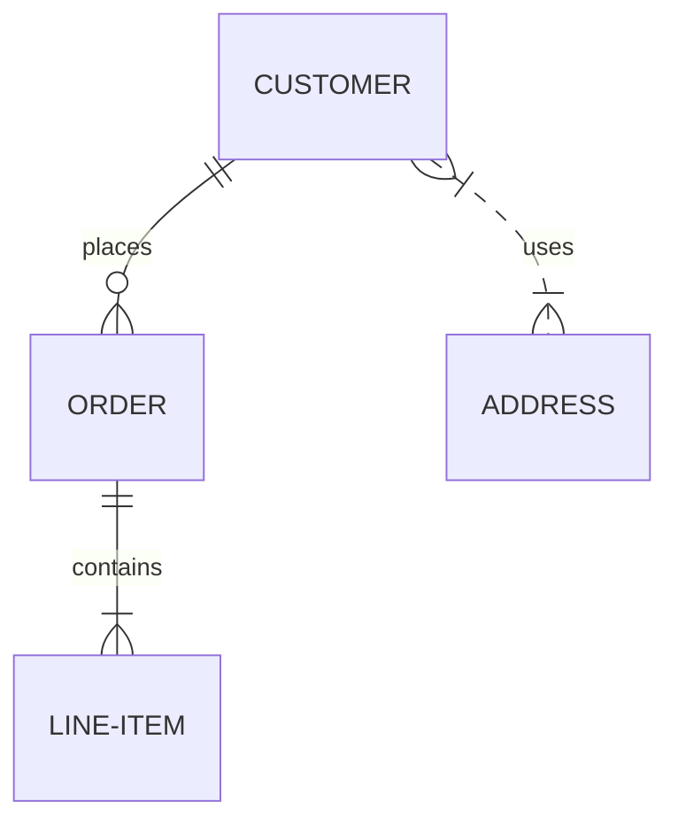
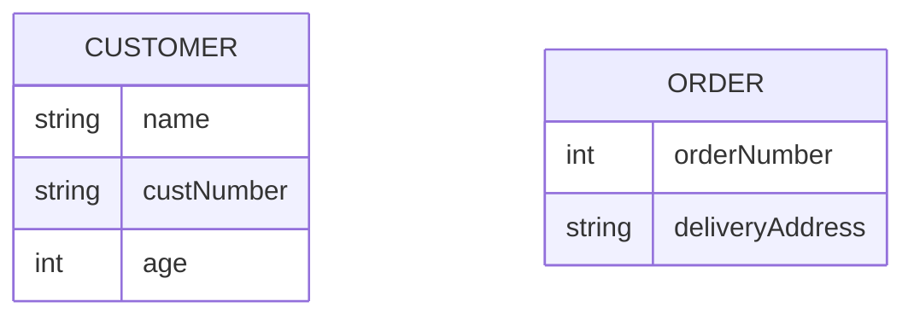
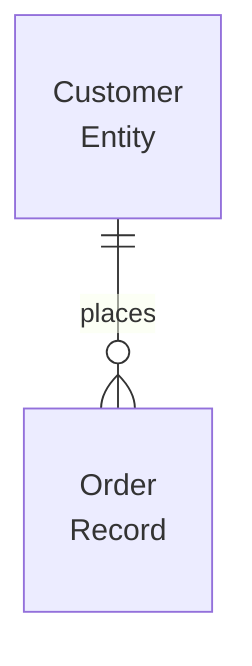
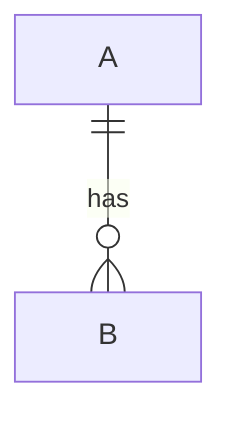

# Entity Relationship Diagram

## Contents
- Entities and Relationships
- Cardinality Notation
- Identifying vs Non-Identifying
- Attributes
- Multiline Labels
- Configuration

## Overview

ER diagrams model entity types and their relationships using crow's foot notation. Compatible with PlantUML syntax.



## Entities and Relationships

### Basic Relationship Statement

```
<first-entity> [<relationship> <second-entity> : <label>]
```

Only `first-entity` is mandatory (shows entity with no relationships). If any other part is present, all parts are required.



Entity names support unicode and double-quoted spaces. Markdown formatting (`**bold**`, `_italic_`) is supported in labels.

## Cardinality Notation

| Left | Right | Meaning |
|---|---|---|
| `\|o` | `o\|` | Zero or one |
| `\|\|` | `\|\|` | Exactly one |
| `}o` | `o{` | Zero or more |
| `}\|` | `\|{` | One or more |

### Cardinality Aliases

| Alias | Meaning |
|---|---|
| `one or zero` / `zero or one` | Zero or one |
| `one or more` / `one or many` / `1+` | One or more |
| `zero or more` / `zero or many` / `0+` | Zero or more |
| `only one` / `1` | Exactly one |

## Identifying vs Non-Identifying

- `--` (solid line): identifying — child cannot exist without parent
- `..` (dashed line): non-identifying — both entities independent

```mermaid
erDiagram
    CAR ||--o{ NAMED-DRIVER : allows    ' identifying
    PERSON }o..o{ NAMED-DRIVER : is     ' non-identifying
```

Aliases: `to` = identifying, `optionally to` = non-identifying.

## Attributes

Define entity attributes with type and name inside `{ }`:



Foreign keys are optional — include only if modeling physical database schema.

## Multiline Labels

Wrap entity names or relationship labels with double quotes and use `<br>` for line breaks:



## Configuration



| Option | Default | Description |
|---|---|---|
| `diagramPadding` | 8 | Padding around diagram |
| `minLen` | 50 | Minimum entity box length |
| `maxLen` | 200 | Maximum entity box length |
