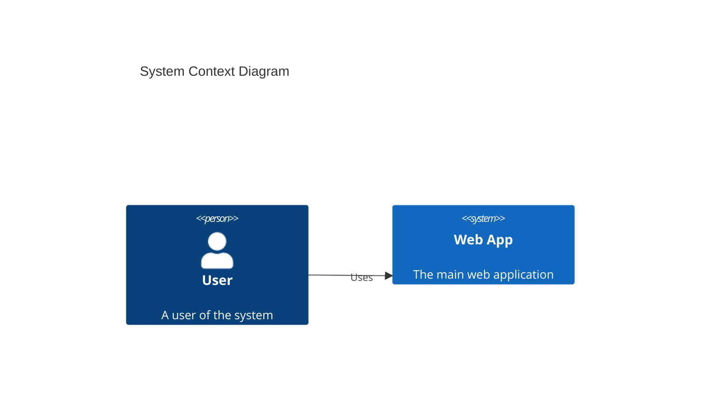
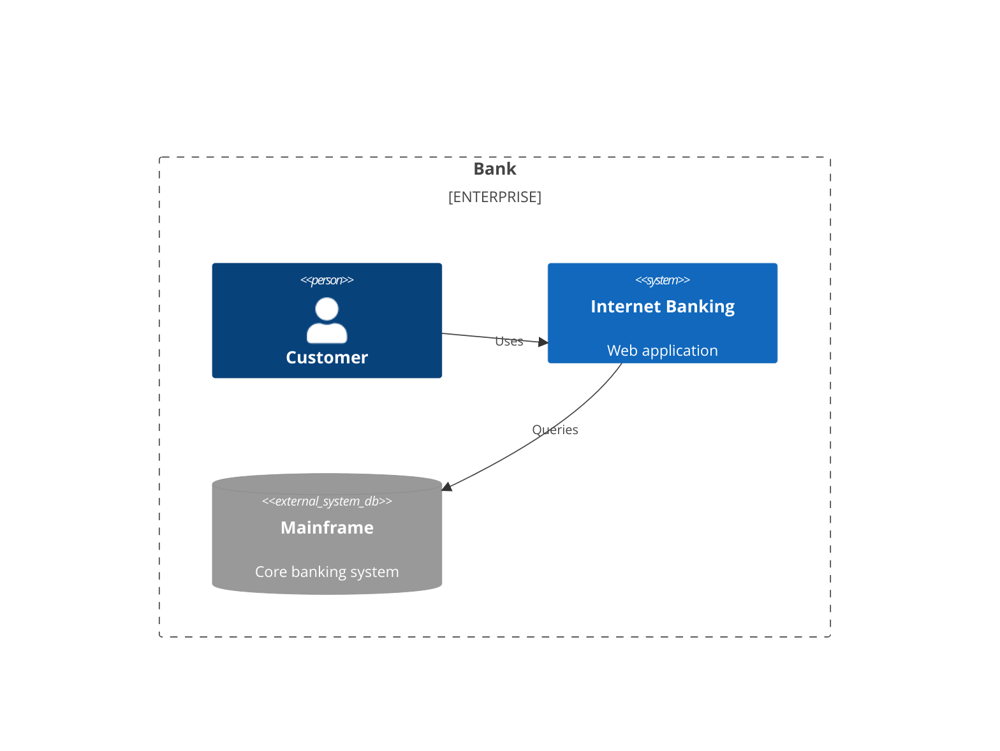
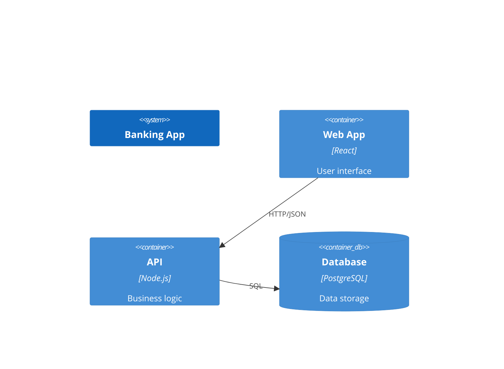
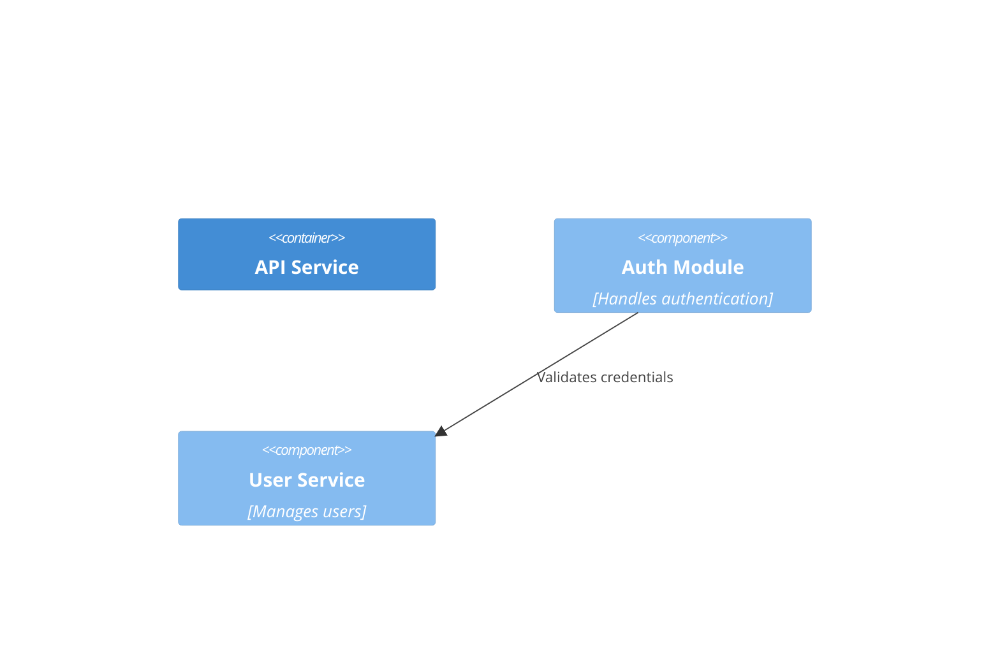
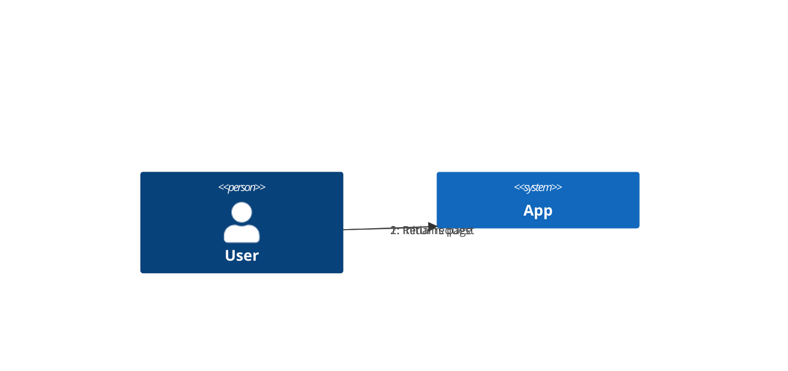
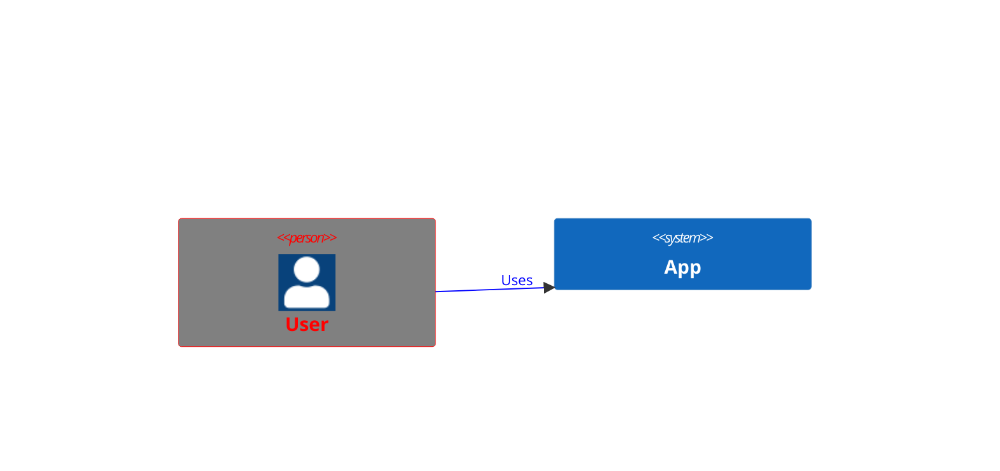

# C4 Diagrams

## Contents
- C4 Context (C4Context)
- C4 Container (C4Container)
- C4 Component (C4Component)
- C4 Dynamic (C4Dynamic)
- C4 Deployment (C4Deployment)
- Relationships
- Styling and Layout

## Overview

C4 diagrams model software architecture at multiple abstraction levels. Syntax is PlantUML-compatible. Five diagram types are supported.



## C4 Context (C4Context)

Highest-level view: system and its users.

### Elements

| Element | Syntax | Description |
|---|---|---|
| Person | `Person(id, "label", "desc")` | User/actor |
| Person_Ext | `Person_Ext(...)` | External person |
| System | `System(id, "label", "desc")` | Software system |
| SystemDb | `SystemDb(...)` | System with database icon |
| SystemQueue | `SystemQueue(...)` | System with queue icon |
| System_Ext | `System_Ext(...)` | External system |
| SystemDb_Ext | `SystemDb_Ext(...)` | External system + DB |
| SystemQueue_Ext | `SystemQueue_Ext(...)` | External system + queue |
| Boundary | `Boundary(id, "label", "type")` | Logical grouping |
| Enterprise_Boundary | `Enterprise_Boundary(id, "label")` | Enterprise boundary |
| System_Boundary | `System_Boundary(id, "label")` | System boundary |



## C4 Container (C4Container)

Shows containers (runtime technologies) within a system.

### Elements

| Element | Syntax | Description |
|---|---|---|
| Container | `Container(id, "label", "tech", "desc")` | Runtime container |
| ContainerDb | `ContainerDb(...)` | Container with DB icon |
| ContainerQueue | `ContainerQueue(...)` | Container with queue icon |
| Container_Ext | `Container_Ext(...)` | External container |
| Container_Boundary | `Container_Boundary(id, "label")` | Container boundary |



## C4 Component (C4Component)

Details components within a container.

### Elements

| Element | Syntax |
|---|---|
| Component | `Component(id, "label", "desc")` |
| ComponentDb | `ComponentDb(...)` |
| ComponentQueue | `ComponentQueue(...)` |
| Component_Ext | `Component_Ext(...)` |



## C4 Dynamic (C4Dynamic)

Shows interactions between elements over time.



`RelIndex` ignores the index parameter — order is determined by statement sequence.

## C4 Deployment (C4Deployment)

Shows deployment topology.

### Elements

| Element | Syntax |
|---|---|
| Deployment_Node | `Deployment_Node(id, "label", "type", "desc")` |
| Node | `Node(...)` — shorthand |
| Node_L / Node_R | Left/right aligned variants |

```mermaid
C4Deployment
    title Deployment Diagram
    Deployment_Node(cloud, "AWS Cloud", "Cloud") {
        Deployment_Node(vpc, "VPC", "Network") {
            Node(web1, "Web Server 1", "EC2")
            Node(web2, "Web Server 2", "EC2")
            NodeDb(db1, "Database", "RDS")
        }
    }
```

## Relationships

| Syntax | Description |
|---|---|
| `Rel(from, to, "label")` | Unidirectional relationship |
| `Rel(from, to, "label", "tech")` | With technology note |
| `BiRel(from, to, "label")` | Bidirectional |
| `Rel_Back(to, from, "label")` | Backwards relationship |
| `Rel_U/D/L/R` | Up/Down/Left/Right variants |

## Styling and Layout

### UpdateElementStyle



### UpdateLayoutConfig

```mermaid
C4Context
    UpdateLayoutConfig($c4ShapeInRow="3", $c4BoundaryInRow="1")
```

| Parameter | Default | Description |
|---|---|---|
| `$c4ShapeInRow` | 4 | Shapes per row |
| `$c4BoundaryInRow` | 2 | Boundaries per row |

### Unsupported Features

Sprites, tags, links, legend, `AddElementTag`, `AddRelTag`, custom shapes (`RoundedBoxShape`, `EightSidedShape`), and line styles (`DashedLine`, `DottedLine`, `BoldLine`) are not yet supported.
