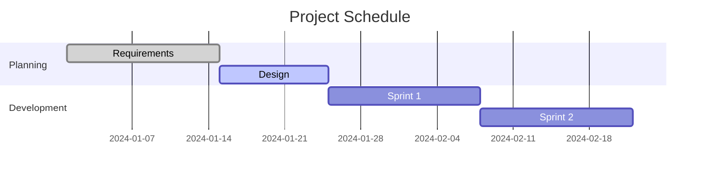
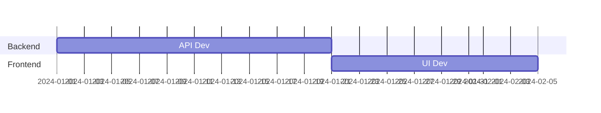
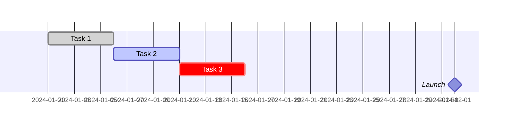
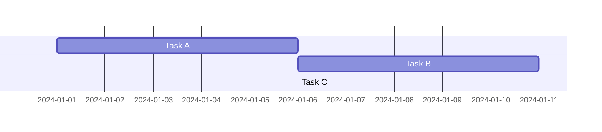
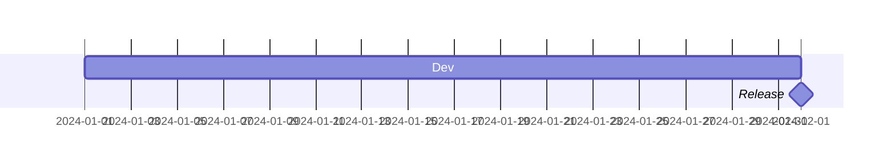
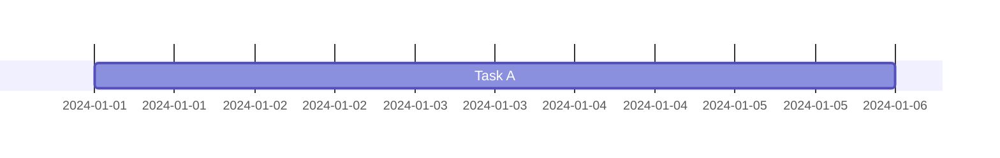
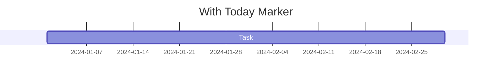
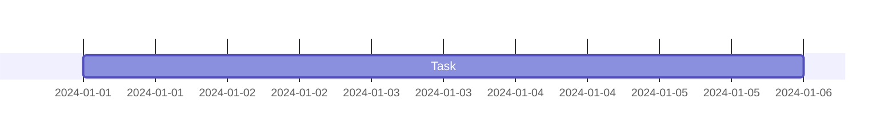

# Gantt Diagram

## Contents
- Syntax and Task Format
- Date Formats
- Exclusions
- Task Tags (done, active, crit, milestone)
- Dependencies (after, until)
- Compact Mode
- Today Marker
- Styling
- Configuration

## Overview

Gantt charts visualize project schedules with tasks as horizontal bars along a timeline.



## Syntax

### Title

Optional `title` at the top of the diagram.

### Sections

Group tasks with `section <name>`:



### Task Format

`<label> :<metadata>`

Colon separates label from metadata. Metadata items are comma-separated.

```
<tag>, <id>, <start>, <end/duration>
```

Tags and ID are optional. Order of remaining items:
1. Single item = end date or duration
2. Two items = start + end/duration
3. Three items = id + start + end/duration

### Duration Units

| Unit | Suffix | Example |
|---|---|---|
| Milliseconds | ms | 500ms |
| Seconds | s | 30s |
| Minutes | m | 30m |
| Hours | h | 4h |
| Days | d | 3d |
| Weeks | w | 2w |
| Months | M | 1M |
| Years | y | 1y |

Decimals supported: `1.5d`.

## Date Formats

Set with `dateFormat`:

```mermaid
gantt
    dateFormat YYYY-MM-DD
```

Common formats: `YYYY-MM-DD`, `DD.MM.YYYY`, `Do Y`, `MM/DD/YYYY`.

## Exclusions

Exclude dates from duration calculations:

```mermaid
gantt
    excludes weekends
    %% or: excludes 2024-01-15, sunday
```

Configure weekend days (v11.0.0+):

```mermaid
gantt
    excludes weekends
    weekend friday
```

## Task Tags

| Tag | Description |
|---|---|
| `done` | Completed task (grayed out) |
| `active` | Currently active (highlighted) |
| `crit` | Critical path (red bar) |
| `milestone` | Zero-duration milestone (diamond) |



## Dependencies

### after

Start after another task ends:



### until (v10.9.0+)

Run until another task starts:



## Compact Mode

Reduce row height:



## Today Marker

Show a vertical "today" line:



## Styling

Use `classDef` and `class` for custom styling (same as flowcharts):

```mermaid
gantt
    Task A :a1, 2024-01-01, 5d
    classDef custom fill:#69f
    class a1 custom
```

## Configuration


