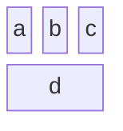
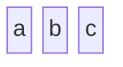
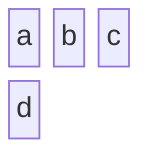
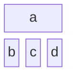
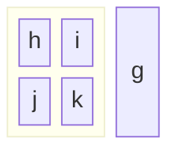
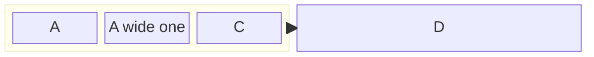
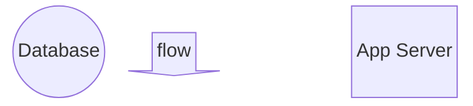
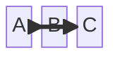
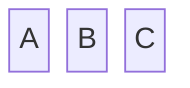

# Block Diagram

## Contents
- Basic Structure
- Columns and Layout
- Block Widths
- Composite (Nested) Blocks
- Block Shapes
- Edges
- Styling
- Configuration

## Overview

Block diagrams give authors full control over block positioning in a grid layout. Unlike flowcharts where the auto-layout decides positions, block diagrams use explicit column/row placement.

## Basic Structure

### Simple Blocks

Blocks are placed left-to-right in rows.

### Columns Declaration

With 3 columns, `d` wraps to the next row.

## Block Widths

Span multiple columns with `:N`:

Block `a` spans all 3 columns.

## Composite (Nested) Blocks

Nest blocks within blocks using `block ... end`:

Composite blocks can have their own column layout.

### Named Composite Blocks

## Block Shapes

| Syntax | Shape |
|---|---|
| `a` | Default (rectangle) |
| `a["label"]` | Rectangle with label |
| `a(("DB"))` | Cylinder/database |
| `a(["text"])` | Asymmetric shape |
| `a>"tag"` | Right tag |
| `a<"tag"` | Left tag |
| `a("round")` | Rounded rectangle |
| `a{{"double"}}` | Double circle |
| `a{"diamond"}` | Rhombus |
| `space` | Empty space placeholder |
| `arrowId<["label"]>(direction)` | Arrow block (up/down/left/right) |

## Edges

Connect blocks with standard flowchart edge syntax:

Edges connect block IDs (or composite block IDs).

## Styling

Use `style` and `classDef` as in flowcharts:

```mermaid
block
    A B
    style A fill:#f9f,stroke:#333,stroke-width:4px
    classDef cls fill:#69f
    class B cls
```

## Configuration

