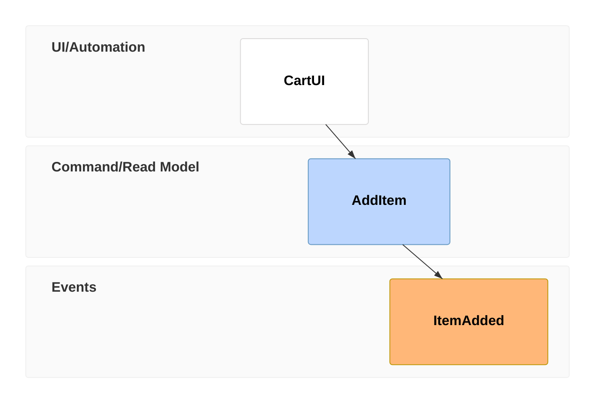
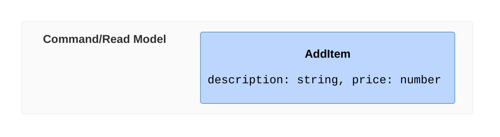
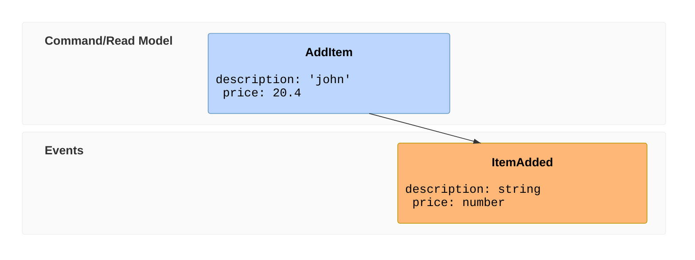
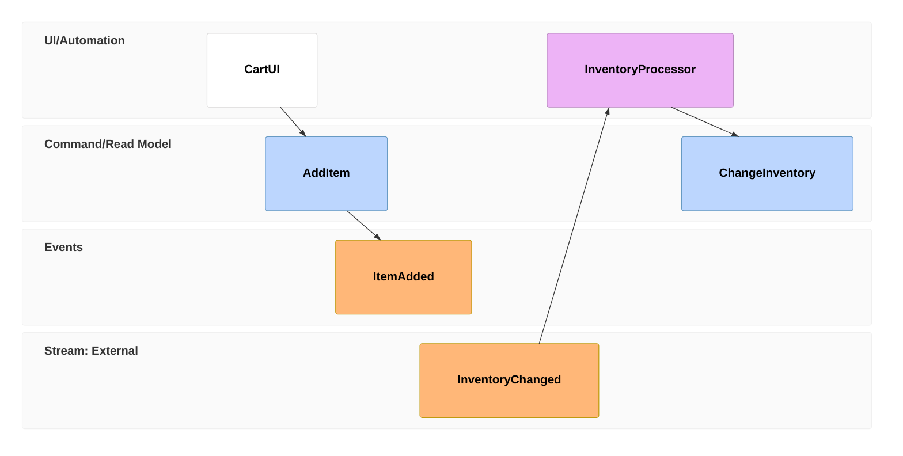
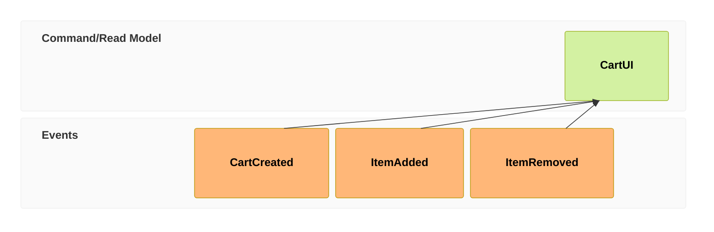
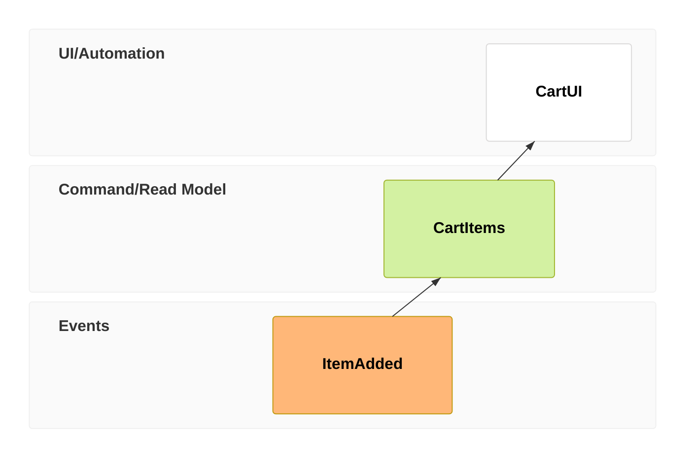
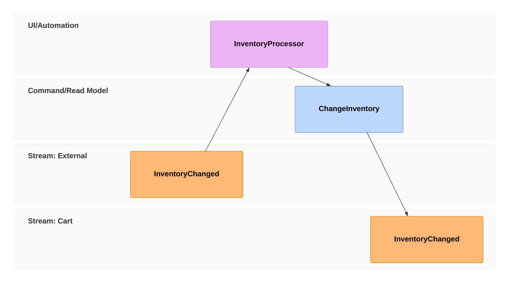
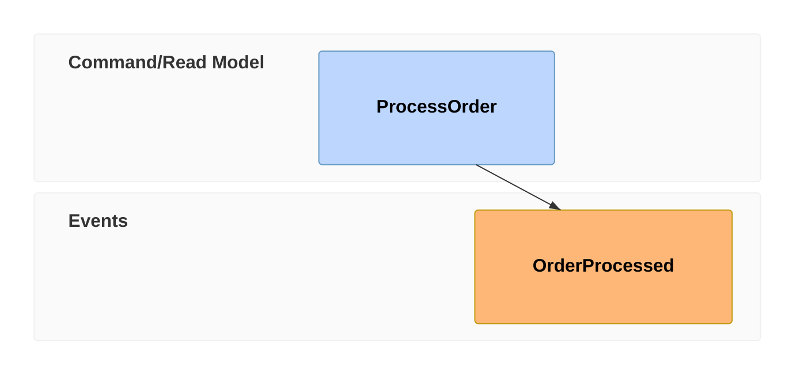

# Event Modeling Diagram

## Contents
- Timeline and Time Frames
- Entity Types
- Inline Data and Data Blocks
- Reset Frames
- Multiple Relations
- Patterns (State Change, State View, Translation, Automation)

## Overview

Event Modeling diagrams describe system behavior through time-based information flow. Available since v11.15.0.

## Timeline and Time Frames

The timeline is composed of Time Frame definitions. Each frame has a unique number, entity type, and identifier.

### Compact Notation

| Token | Entity Type |
|---|---|
| `ui` | User Interface (Trigger) |
| `cmd` | Command |
| `evt` | Event |
| `rmo` | Read Model / View |
| `pcr` | Processor |

### Relaxed Notation

## Inline Data

Add data examples inline with `{ }`:

## Data Blocks

Define complex data separately and reference with `[[id]]`:

## Reset Frames

Break inference chain with `rf` / `resetframe`:

## Multiple Relations

Use `->>` to link a read model to multiple events:

## Patterns

### State Change

UI triggers command which produces event:

### State View

Event feeds read model which feeds UI:

### Translation

External event processed into internal command:

### Automation

Command directly produces event (no UI):

